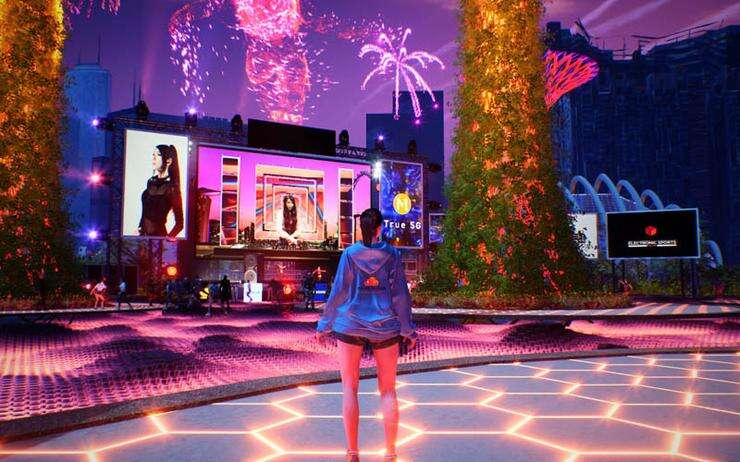

# M1 和 ESPL 为新加坡滨海湾花园提供 5G 和虚拟世界

M1 已与滨海湾花园和电子竞技 (ESPL) 签署了一份谅解备忘录，以在新加坡标志性地点的室内场所提供快速 5G 连接和身临其境的虚拟世界体验。

该合作伙伴关系旨在实现与新加坡景点的实体产品相辅相成的元宇宙体验，特别是在花园中的“实体”（物理和数字的混合）活动的新机会，并在开发的元宇宙中重新创建版本被 ESPL 称为数字双胞胎。

“通过增强的 5G 连接，我们期待与 M1 和 ESPL 合作，在滨海湾花园创造更多互动和身临其境的体验，为活动组织者提供一个 phygital 选择，将他们的影响范围扩大到场馆的物理范围之外，让来自世界各地的人们参与进来，”滨海湾花园副首席执行官 Lee Kok Fatt 说。

在发布会上展示的一个示例中，在数字双胞胎中举行了一场元宇宙音乐会，新加坡艺人 DJ Red 的化身在 Supertree Grove 的虚拟背景下与观众互动。

因此，拥有 5G 移动设备的观众可以访问虚拟世界并在实时沉浸式环境中体验表演。

DJ Red 的 Metaverse 音乐会

M1 首席企业销售和解决方案官 Willis Sim 补充说：“提供元界体验是我们真正的 5G 推出路线图中的一个激动人心的里程碑。”M1 不断凭借我们的 5G 功能推动标准，我们为推出 5G 感到自豪在滨海湾花园内，并为我们的合作伙伴 ESPL 制作的数字娱乐提供动力。

“为观众提供身临其境的身临其境体验的能力具有巨大的潜力，可以在旅途中提供丰富的内容。我们很高兴能够为娱乐、会展和旅游业带来新的元宇宙机会，并帮助滨海湾花园成为未来的花园。”

在会议、奖励、会议和展览 (MICE) 行业用例中，M1 设想为物理事件添加“新维度”，并允许来自世界各地的参与者与内容进行交互，并在元宇宙中与其他人进行交互。

同时，针对教育领域，M1 表示，5G 的高速和低延迟连接还支持教育技术，通过扩展现实和游戏化将课程带入生活并激发学生的想象力。
