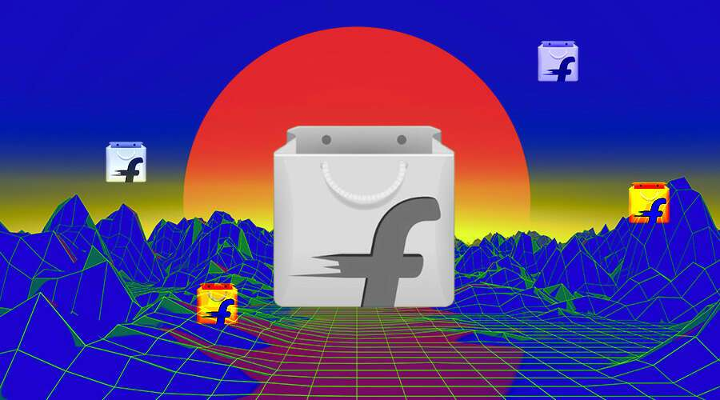

# FLIPKART 计划在这个排灯节与 FLIPVERSE 一起加入 METAVERSE！

Flipkart 宣布推出 Flipverse，这是一个交互式虚拟世界主题的虚拟购物目的地。

据报道，电子商务巨头 Flipkart 计划在正在进行的 Big Billion Days Sale 期间宣布在印度推出 Flipverse，这是一个以元宇宙为主题的交互式虚拟购物目的地。

据报道，Flipkart 已与社交媒体巨头 Meta 和以太坊 Layer-2 扩展初创公司 Polygon 合作完成这项任务。此外，Flipkart 提到 Metaverse 任务很可能会在排灯节时尽快启动。

全新的服务将允许客户在数字购买中心漫步，并与数字零售商合作。Polygon 的联合创始人 Sandeep Nailwal 还在推特上发布了关于“Flipverse by Flipkart”的推文，称它由 Polygon 和 eDAO 提供支持。

**Flipkart 计划加入元界：**

Flipverse 预计将使用多种 Web3.0 技术来增强当前的虚拟现实用户体验。Flipkart Labs 项目计划利用 Flipkart 的内部能力创建基于技术的解决方案来重新定义电子商务。Flipkart Labs 正在协助其集团公司使用真实世界的应用程序测试创新的 Web3 和 Metaverse 用例。例如 NFT 相关用例、虚拟沉浸式店面、Play to Earn 和其他区块链相关用例。

在社交媒体巨头 Facebook 将自己更名为 Meta 之后，Metaverse 空间进入了超速发展状态。大多数 IT 巨头都准备进入元界、Web 3 和电子商务。Meta、Microsoft 和 Apple 都拥抱了 Web3 世界。该公司还推出了 FireDrops，以发现与 NFT 相关的用例并将 Web3.0 传达给更广泛的观众。Metaverse 提供的服务可能是 Flipkart 吸引更多客户的一部分。

Flipverse 购物体验有望将电子商务从 2D 静态产品目录转变为实时体验，使用户能够在商店中“走动”，享受 3D 渲染的商店展示。新服务将允许用户浏览虚拟购物中心并与数字店面互动。Flipverse 将提供游戏、竞赛、掉落、NFT、品牌激活、产品发布和神秘盒子。Flipkart 将加入越来越多的印度公司，这些公司部署 Metaverse 来开展业务并吸引用户。
