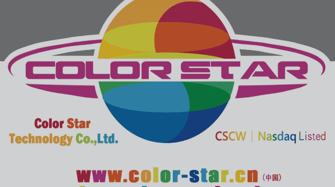
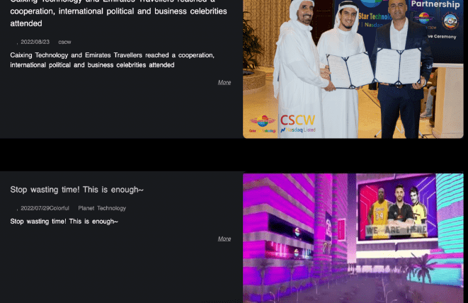
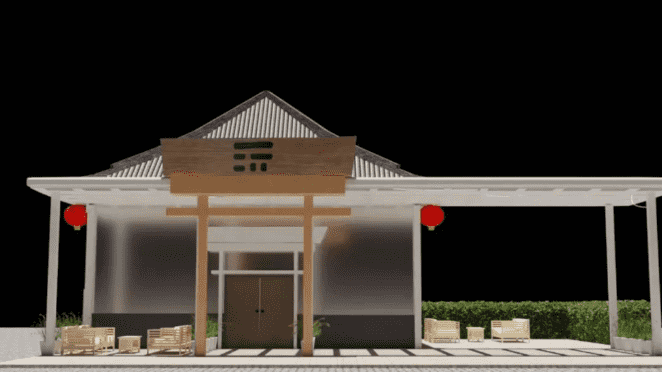

# Color Star 的 Metaverse 冒险继续承诺制造智能手机

Color Star Technology Co., Ltd.，在开曼群岛注册，可能位于迪拜的预拌混凝土公司，该公司放弃了原有业务，最近推出了自己的极其简陋的数字虚拟世界，继续与高管人员流动作斗争。8 月 5 日，Color Star 悄悄地向美国证券交易委员会提交了文件，指出 Biao Lu 和 Jehan Zeb Khan 同时辞去了这家奇怪公司的联合首席执行官一职，并由一个名叫 Farhan Qadir 的人接任。即使按照在短短两年内已经拥有七位 CEO 的 Color Star 的标准，这也很突然：Lu 和 Khan 一起工作不到两个月，并没有重新担任支持角色，但似乎完全离开公司。郑重声明，这已经是同时辞去公司董事长职务的彪路第二次辞去彩星CEO一职。

这个极其正常的商业故事的追随者会记得，Color Star 迷人的年轻首席执行官 Lucas Capetian 爵士是该公司标志性*Color World*应用程序的带头人，他在 6 月突然辞职并因“个人原因”离开公司。在 Defector，这是一个令人心碎的发展：我们在几个月的时间里努力工作以与 Capetian 建立联系，但除了几封简洁的电子邮件和诉讼的威胁之外，没有收到任何回报。

现在，突然之间，卡佩恩完全脱离了我们的生活，在这家奇怪公司的最高层被*两个人取代*新的公司官员。我们度过了多么美好的时光：在 Capetian 的多事管理期间，Color Star 与费城 76 人队建立了现在臭名昭著的赞助合作伙伴关系，正是 Capetian 从 76 人队的交易转向与西班牙西甲的比利亚雷亚尔合作。正是卡佩恩本人向世界宣布，彩星与一家超级真实的生物技术公司建立了战略合作伙伴关系，最终可以让*彩世界*的用户获得“人类克隆器官”。看到这个有远见的人被他领导的公司抛弃，走向如此多疯狂的新方向，就像看着夜空中的一颗美丽的星星突然永远地闪烁。

Biao Lu 和 Jehan Zeb Khan 并没有立即表现出他们前任对 Slick Business 的天赋。两人在 6 月份被收购后，发布到该公司异常崩溃的网站（您已被警告）上的第一个新闻更新标题是“停止浪费时间！够了~”并为*Color World*应用程序提供了另一个 30 秒的震撼视频广告，带有奇怪的 Cinquain 式标题：

这次不吉利的发射预示着厄运。六天后，卢和汗辞职，由卡迪尔接任。卡迪尔似乎是一个推动者和动摇者：在掌舵后仅两周，卡迪尔就参加了在迪拜举行的一场盛大的活动，其中 Color Star 宣布与名为“阿联酋航空旅行者”的公司进行“战略合作”。与最近的其他 Color Star 合作伙伴一样，Emirates Travelers 销售或做什么都不清楚，但值得注意的是，Color Star 新闻稿称阿拉伯联合酋长国王室成员参加了此次活动。

整洁的！话又说回来，Color Star 曾宣布他们会将现役 76 人队球员的肖像放在他们丑陋的虚拟世界中，这种夸大其词可能为 76 人队组织提供了他们需要的逃生舱口跳出这个可笑的不明智的合作协议。绝不能从表面上看任何印刷在 Color Star 新闻稿或广告中的东西。

新合作的目的尚不清楚，但 Color Star 表示，他们自诩的内部技术团队正忙于为阿联酋航空旅行者打造“世界上第一个元宇宙总部”，这可能具有与Color World相同的Turok加油站美学购物中心，早在六月宣布：

就在魅力四射的阿联酋航空旅行者宣布后几天，卡迪尔又回来了，9 月 6 日宣布与名为 Global Digital Club 的组织进行“长期战略合作”，该俱乐部将其描述为“世界知名的专业数字投资俱乐部”。 “全球领域强大的企业精英”的成员。令人吃惊的是，全球数字俱乐部拥有一个正常运作的网站和一点点在线足迹。事实上，他们最近在 9 月 11 日举行了一个私人投资者活动，以“企业 CEO、风险投资基金和投资者”为主题。看起来很有趣！

但 Color Star 业务的最大发展是在周一宣布的，当时该公司发布了一份新闻稿，描述了即将推出的 Color Star Technology Co., LTD 品牌的智能手机。这些小玩意将与一家名为 Anex Korea 的公司合作制造，Color Star 将其描述为“国际知名企业”。公告中描述的“'DONO'元界手机”将预装*Color World*应用程序，用户可以立即登录并在荒凉、空旷、洋红色浸透的奇异数字景观中漫游。“移动通信市场是我们最新的新业务领域，我们对此感到非常高兴，并有信心在未来几年内将这一领域发展为成熟，”卡迪尔在新闻稿中说. “在外界关注元界功能的同时，我们将用成熟完善的技术手段为用户保驾护航。”

赌注似乎是，这些跌幅之一迟早会得到回报。Color Star 最近对其普通股执行了一项称为“反向股票分割”的操作，以整合其多年来分配的近 2.62 亿股流通股及其业务排列。反向股票拆分通常会导致股价上涨，因为具有一定市场价值的单个单位的集合被转换为一个更大的单位，从而保持所有合并的市场价值。是的，这有点人为，但 Color Star 的股票多年来一直朝着错误的方向发展，绝望的时候需要采取绝望的措施。不幸的是，在 Color Star 的案例中，40 股单独价值约为狗屎的股份被合并为一股极其密集的狗屎。

但是，您只需等到那些热门的 Color Star 智能手机上架即可。正如他们热情洋溢的新任 CEO 所说，彩星“绝不是一家传统的科技公司，更多我们会将我们的元界内容与其他业务结合起来，这将为我们找到更广阔的市场环境，一切皆有可能。” 就是那种精神！
