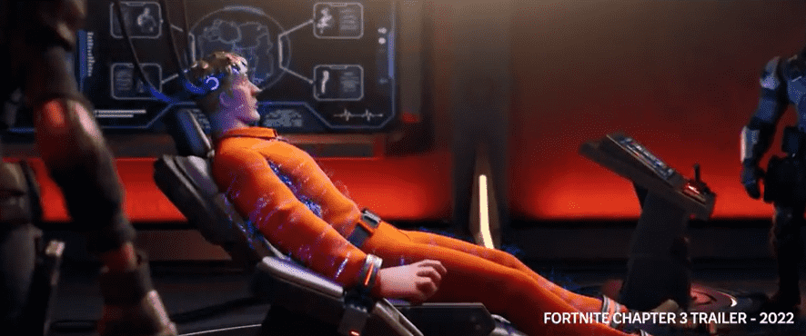

# Artemis：PUBG Creator 的下一款游戏将拥有 NFT 和元宇宙

PUBG创作者 Brendan Greene 透露了他的下一款游戏——一款基于区块链的元宇宙游戏。

在接受Hit Points采访时，这位 45 岁的游戏开发者透露，他的下一款游戏 Artemis 将以 NFT、元宇宙和区块链为特色。

“[Artemis] 可能会成为我们参与维护的平台，”他解释道。“但这是任何人都可以插入的东西，每个人都可以拥有自己的一部分。”

Artemis will reportedly let players make anything they like as part of a large, open world. But now, it looks as though the project will incorporate blockchain.

格林解释说：“我对数字空间的这种想法很着迷，那里没有真正的规则，但有一套你可以使用的系统。”“这让我着迷，现在仍然如此。我从没想过只是走开。”

区块链通常被认为是玩家为游戏开发做出贡献的一种方式，但许多开发者已经站出来反对这项技术，比如 Minecraft 完全禁止使用 NFT 或区块链。

格林坚称，阿尔忒弥斯*不是*为了赚钱。“这存在的唯一方式是它是为每个人制作的，而不是为钱而制作的，”他说。然而，他也证实，玩家将能够通过向其他玩家出售游戏内物品来从他们的创作中“提取价值”。

尽管存在怀疑，但格林表示他会继续坚持下去。

“我只会做我想做的事，”他说。“但它是否被称为元宇宙并不重要。我不在乎人们想怎么称呼它。”

Of course, Greene won’t be the first developer to get into the metaverse. Bandai Namco recently revealed it’s spent a massive $130 million on an upcoming metaverse project. Not to mention Epic Games and LEGO working together on a child-safe metaverse project.

Artemis 元宇宙将如何形成还有待观察。但 NFT 和区块链的加入肯定不会赢得批评。
