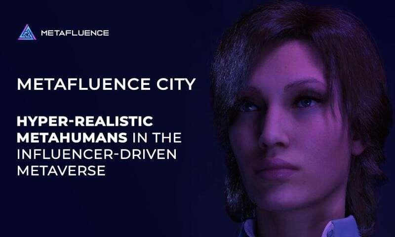

# Metafluence 宣布在 Metaverse 中使用超现实的 Metahumans

伦敦，英国，2022 年 9 月 27 日 (GLOBE NEWSWIRE) -- Metafluence是一个身临其境、现场直播和影响者驱动的社交 Metaverse，为影响者、品牌和每个人提供多个虚拟属性，它宣布在元宇宙。虽然元人类已经存在了很长时间，但 Metafluence 正在将它们部署到其虚拟城市 Metafluence City。

Metafluence City 旨在将 Metaverse 中的品牌、影响者及其受众联系起来。通过这座城市，Metafluence 将为用户提供展示和拍卖 NFT、组织会议和会议、建立电子商务商店、购买土地等虚拟财产以及定期与全球影响者和品牌互动的机会。

Metafluence 的超现实元人类于 2022 年 8 月 10 日推出，将推动广泛采用并将更多用户带入新兴的虚拟世界。

**超现实的元人类和元影响城**

Metafluence 设计了几个超现实的元人类，并逐渐将它们部署到元宇宙中。第一个超人类，Luna，是一位富有同情心、善良、有趣、超级神秘和聪明的影响者，他定期向用户介绍人工智能 [AI] 的潜力，以及它在全球的应用如何成为一项有利可图的冒险。Luna 喜欢在社交媒体上展示她对当前 AI、NFT 和 Metaverse 新闻的反应，Metafluence 希望这些反应能够帮助吸引更多用户。

Metafluence 的超现实元人类具有高保真度，能够以数字格式复制所有者的外貌。它们旨在模仿和模仿其所有者的行为，并在元宇宙中充当化身。此外，按照 Metafluence 的计划，当成功与 AI 集成后，它们可以在 Metaverse 中作为 AI 构建的元人类和影响者独立运作。

**Metafluence 团队的历史性一天**

Metafluence 还与超人类一起于 2022 年 8 月 10 日推出了超现实城市 Metafluence City。Metafluence City 是一个由影响者驱动、基于 Metaverse 的城市，供全球品牌、影响者和数百万粉丝方便地购买虚拟资产、社交和与数百万其他人互动。Metafluence City 的超现实世界建立在四个基本支柱之上：虚拟空间（Land Plots 和 Metahuts）、高保真化身（Metahumans）、社会化和货币化（新收入模式）。

作为 Metafluence 团队历史性的一天，8 月 10 日首次见证了 Metafluence 团队成员、影响者、社区成员、品牌、KOL 和粉丝与各自的头像一起度过了充足的时间。

从那难忘的一天开始，Metafluence 团队继续定期对虚拟城市进行更新，以保证用户获得更好的用户体验。虚拟城镇的 Metafluence Alpha 测试版本是该团队首次进入全球舞台，提供了从头像到头像的交互到群组社交、语音聊天、文本聊天、创建大量头像、视频录制等的特殊功能。

Metafluence希望通过这些超现实的metahumans和Metafluence City，开创Metaverse的新趋势。许多大公司和全球品牌都加入了元界和 Web3 趋势。然而，关键问题仍然存在——大规模采用。

Metafluence 了解障碍以及如何消除障碍，因此开发了一个易于使用的社交 Metaverse 平台，以激励有影响力的人将粉丝带入他们的虚拟空间，并通过参与一对一的沉浸式格式让他们留在身边。由于其影响者驱动的性质，Metafluence City 将汇集来自各个国家和行业的各种影响者的观众。

**关于元影响**

Metafluence 是第一个由影响者驱动的 Metaverse 平台，为用户提供一个虚拟城市，以连接品牌、影响者和数百万粉丝。通过 Metafluence City，Metafluence 将允许用户展示他们的 NFT、建立 Metacommerce 商店、组织会议以及在更个人的层面上与他人互动。
