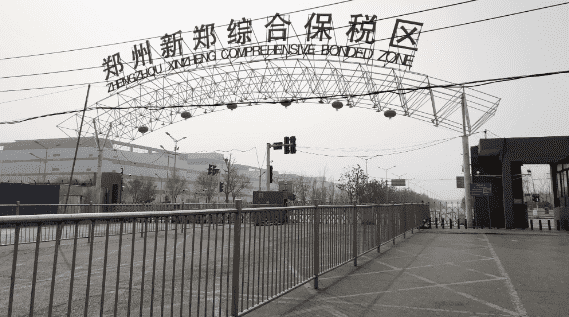

# 中国的河南 iPhone 生产中心将未来押注于元宇宙

中国中部的河南省在过去十年中将自己定位为全球供应链的关键节点，拥有世界上最大的 iPhone 制造基地，并已将元界作为其下一个核心产业。

根据最近发布的一份计划草案，省政府的目标是到 2025 年发展千亿元的元界产业，这是中国地方政府最近急于将其发展蓝图与定义松散的概念联系起来的举措。

“metaverse”一词通常用于描述一个身临其境的虚拟世界，其中人们的数字表示可以相互交互。一些人预计这将是互联网的下一次迭代，尽管目前商业应用程序很少。

官员在周二公布的文件中表示，河南希望为具有“重大影响”的元界培育“创新区”，并促进相关产业的发展。

该计划名为《河南省2022-2025年元界产业发展行动计划》，详细阐述了该省未来几年的主要任务，包括攻克扩展现实、数字资产和脑机接口等关键技术。

这些技术将应用于各个领域，旨在打造“工业元界”、“能源元界”、“教育元界”和“虚拟人类元界”。

通过加入一系列宣布促进虚拟世界发展的举措的中国地方政府，河南正在与几个主要的中国商业中心竞争以吸引投资者和企业。

7 月，上海市政府表示，其目标是设立一个资产约 100 亿元人民币（14 亿美元）的产业基金，专门用于虚拟世界的发展。

在北京，国家支持的中国计算机行业协会今年成立了元界委员会]，负责起草行业标准，帮助相关部门制定行业路线图，并设立 10 亿元人民币的基金支持初创企业。

1 月，湖北省中部的武汉和安徽省东部的合肥都承诺在未来五年内推动虚拟世界的发展。

武汉表示将把元界、大数据、云计算、区块链与“实体经济”结合起来，而合肥表示将在元界等“前沿领域”培育一批领先的公司和产品。

河南省郑州新郑综合保税区，拥有全球最大的 iPhone 生产基地。照片：周茜茜

在周二的计划中，河南表示希望以“创新方式”吸引企业和投资，支持国内外领先的元界公司在省内设立总部、实验室和研发中心。

全省力争到2025年培育10家具有“核心竞争力”的“骨干”元界企业。

文件称，在对开发元界的相关风险进行研究后，将建立一个元界治理体系，包括伦理、数据安全、版权侵权和成瘾等方面的风险。

上个月，河南还宣布了建设元界产业园的计划，计划在建成后的三年内吸引50多家元界公司入驻。

河南省工业和信息化厅副厅长田海涛当时对当地媒体表示，该省并没有试图盲目跟风。

他说，河南的科技产业发展迅速，作为一个大省，其庞大的人口使其在数据量和可用案例方面具有优势。
