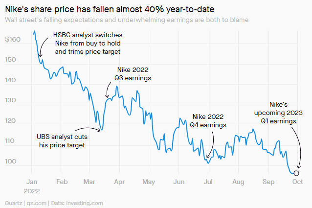
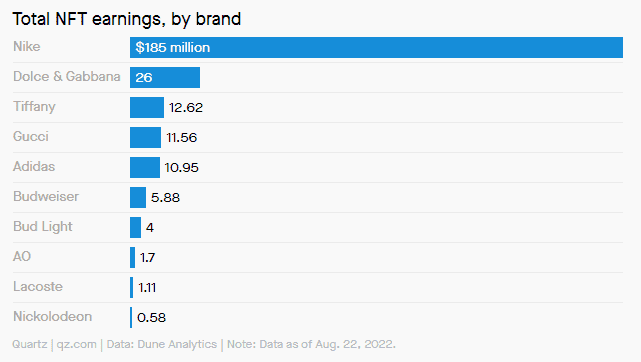

# 耐克正在虚拟世界中赚钱

在元宇宙中，耐克正在大踏步前进。

去年 11 月，这家运动服装公司申请了七项专利，揭示了制造和销售虚拟鞋类和服装的计划。几天后，它[推出了 Nikeland——一个充满在线游戏和虚拟产品的 Roblox 世界。去年 12 月，它收购了 RTFKT（读作“神器”），这是一家生产数字收藏品（包括虚拟运动鞋）的不可替代代币 (NFT)工作室。

在推出后的五个月内，Nikeland 就吸引了700 万访客。与此同时，耐克对 RTFKT 的收购正在获得回报——数百万美元。

但是，当这家运动鞋巨头明天（9 月 29 日）收盘后发布财报时，这些数字化胜利是否足以阻止其股价下滑？

**耐克股价全年下跌**

在 2021 年 12 月至 2022 年 2 月期间，得益于稳健的直销，耐克的收入同比增长 5%至 109 亿美元。但下个季度，由于供应瓶颈困扰公司，收入同比下降 1%至约 120 亿美元，并撤回了其指导。

这家运动鞋制造商仍然面临 着一些影响其股价的持续性问题：

🇨🇳 中国市场的波动导致上季度该地区的收入下降近 20%，工厂关闭正在挤压供应；

🇺🇸美国过多的鞋类库存正在造成供过于求的危机；

🇪🇺 欧洲货币疲软意味着赚取的美元减少。

虽然令人印象深刻，但 1.85 亿美元是耐克总收入的沧海一粟。即使在不太好的一年，耐克每个季度的收入也超过 120 亿美元。但随着全球虚拟世界市场的增长——它有望在五年内达到 410 亿美元——耐克可能会获得更多收益。

**耐克从 NFT 运动鞋中脱颖而出**

4 月，耐克推出了 20,000 个“Cryptokicks”NFT，每个售价为7,500-9,000美元。其中一幅由日本当代艺术家村上隆创作，以高达 134,000 美元的价格售出。

**在元宇宙中暴利**

作为线下销售摇摇欲坠，在线世界显示出一些希望。

到 3 月，包括该品牌的元宇宙进军在内的 Nike Digital 已经获得了四分之一的收入，比三年前的 10% 增长了很多。

Dune Analytics 8 月份的数据显示，事实上，耐克是 NFT 业务中收入最高的品牌。即使竞争对手阿迪达斯的 NFT 交易量超过 50,000 笔，而耐克的交易量为 67,000 多笔，其收益甚至还不到耐克 NFT 收入的十分之一。

这不是一时的时尚。自 2019 年以来，耐克就拥有了基于区块链的运动鞋的专利。
