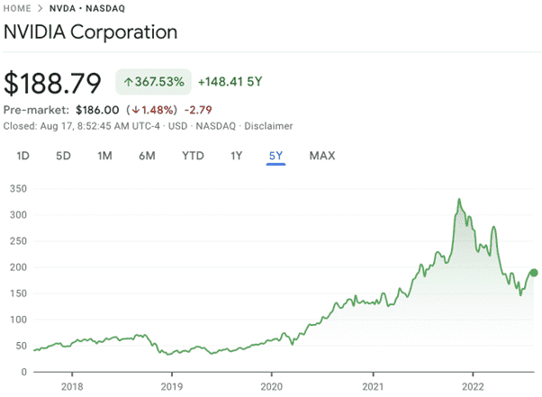
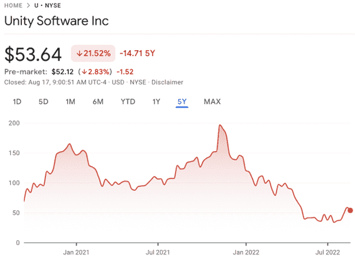
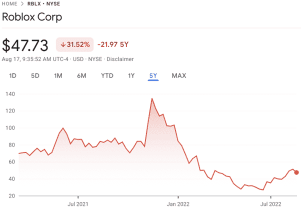
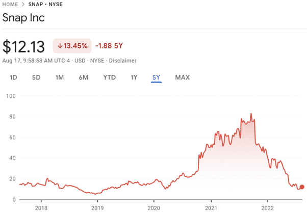
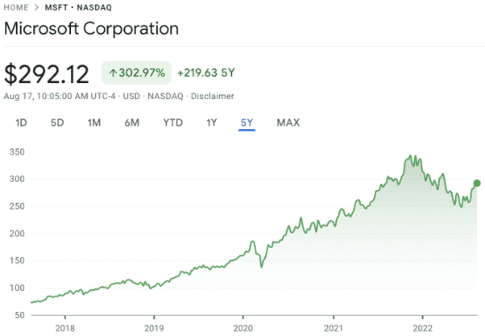

# 元界股票：如何投资深陷虚拟世界的前 5 家公司

元界股票：元界正迅速成为我们这一代最受期待的技术发展。新兴技术距离成为广泛的主流成功还有很多年的时间。然而， Rebecca Barnatt-Smith表示，投资者已经在寻找机会投资于这个勇敢的全新互联数字环境。

为虚拟世界提供燃料所需的大量计算能力，以及它对虚拟和增强现实的依赖，为许多现有股票成为 Web3 环境中的主要受益者铺平了道路。但是在华尔街哪里可以进行明智的投资呢？

**让我们更深入地研究一下当今可供投资的五支最令人兴奋的元界股票，以及每家公司如何发展：**

 

**元界股票#1：英伟达（纳斯达克股票代码：NVDA）**

首先，让我们探索一家可以在为元宇宙提供动力方面发挥重要作用的公司。Nvidia 的显卡和数据中心芯片最适合通过提供个人在庞大的数字环境中相互交互所需的计算能力来实现虚拟世界。 

对于投资者来说至关重要的是，我们已经看到 Nvidia 显卡为 Meta Platforms 的 AI Research SuperCluster (RSC) 超级计算机提供动力。该公司希望创建一个框架来处理 Metaverse 的处理要求。 

在经历了 2021 年的暴涨之后，该股本身已经下滑。但 NVDA 从 2022 年第二季度的底部强劲反弹表明，投资者对该股的信心依然强劲。 

该公司与 Meta 建立了牢固的关系，Meta 是一家一心致力于打造元宇宙的公司。Nvidia 的强大力量来自手头的任务规模，以一种可以迎合所有用户的方式为新的 Web3 环境提供动力。根据英特尔的估计，成功的元节 rtttttt 需要将当今普遍可用的计算能力提高 1,000 倍。 

随着元宇宙的发展步伐加快，引入更多处理硬件的这一要求可能为英伟达提供强劲增长的黄金机会。 

**元界股票#2： Unity Software（纽约证券交易所代码：U）**

就像 Nvidia 一样，Unity Software 将成为推动元宇宙的另一个关键参与者。该公司专注于使游戏开发人员能够创建可以在跨平台基础上运行的高质量图形内容。这可以将基于计算机、智能手机、游戏机和 VR 硬件的用户聚集在一起。 

值得注意的是，到 2021 年底，Unity占据了游戏市场 61% 的市场份额。这使得该公司全年大部分时间的股票表现并不令人意外。Unity 受到了 2022 年科技股抛售的影响。但随着 Web3 的发展，该股与游戏行业的接近程度可能使其成为开拓者。 

据认为，迄今为止，该公司的软件已被纳入全球 60% 以上的 3D 内容的开发中。这不仅对游戏设计师而言意义重大，而且对于像 BORN 这样的元宇宙开发工作室来说意义重大，它们可以使用该技术在元宇宙中为其客户渲染大量 3D 创作。 

如今，Unity 正在开发 Insomniac Events 等多个平台，以生成新的元宇宙世界。微软首席执行官 Satya Nadella 等关键行业人物声称“元界本质上是在创造游戏”，Unity 很可能会在该领域的发展中发挥核心作用。 

**元界股票#3：Roblox（纽约证券交易所代码：RBLX）**

Roblox已经建立了作为元节早期迭代的声誉。作为一家游戏公司、社交网络和内容创建平台，该股票包含了我们今天所知道的元宇宙的许多基础。此外，Roblox 在 2021 年纽约证券交易所上市时的市值为 419 亿美元，这表明该公司已经是华尔街眼中的元界明星。 

值得注意的是，Roblox 已成为领先的娱乐中心，为 Lil Nas X 和 David Guetta 等领先艺术家举办 3D 音乐会。在撰写本文时，Roblox 已经托管了超过 2400 万次 3D 体验供用户参与。 

我们还可以看到 Roblox 增长的有力证据。2021 年第四季度，Roblox平均每天有 4900 万活跃用户，比去年同期增长 33%。如果该平台建立在其增长基础上，它可能会成为未来世界的首选元宇宙。 

**元界股票#4：Snap（纽约证券交易所代码：SNAP）**

这位前身为 Snapchat 的艺术家本身可能被公认为社交媒体巨头。但近年来，该公司一直在增强现实领域掀起波澜。 

事实上，SNAP 的 AR 投资正在平台内产生健康的增长水平。随着技术进一步倾向于增强现实的发展，它们可以与元宇宙形成错综复杂的联系。 

尽管 2022 年对 Snap 的股市命运来说是艰难的时期，但2.5 亿用户在 2022 年第一季度使用了该平台的 AR 工具。伴随 Snap 著名的 Lenses 工具不久，一副成熟的 AR 眼镜可能会成为兼容 Metaverse 的先驱眼镜。 

**元界股票#5：微软（纳斯达克股票代码：MSFT）**

尽管与该名单上的一些同行相比，科技股普遍遭到抛售，但微软股票的表现异常出色。虽然这可能意味着获得折扣股票的机会更少，但这家蓝筹公司已经一次又一次地证明它可以跟上新的创新。 

2022 年初，微软宣布收购领先的游戏公司动视暴雪。这笔700 亿美元的交易提供了对动视游戏的访问权限，例如广受欢迎的“使命召唤”。此外，微软将能够向动视每月 3.9 亿的地震用户进行营销。 

该公司毫不掩饰将游戏视为虚拟世界发展的内在组成部分这一事实。在这次收购中，我们可以看到微软在虚拟世界游戏领域成为领导者的明显表现。 

微软还积极利用其 HoloLens 作为为 Teams 创建混合现实空间的一种方式。微软在创新方面有着悠久的历史，如果最近的市场动向可以看的话，它似乎肯定会成为元宇宙发展的前沿和中心。 

**给投资者的提示**

对于投资者来说，不断研究他们正在考虑添加到其投资组合中的元宇宙公司至关重要。该空间仍处于形成阶段，事情可能会迅速发生变化。 

考虑到这一点，没有任何 Metaverse 股票可以确定长期增长。然而，随着元宇宙的曝光程度适当，随着时间的推移，投资者可能会从该领域的赢家中受益匪浅。 
