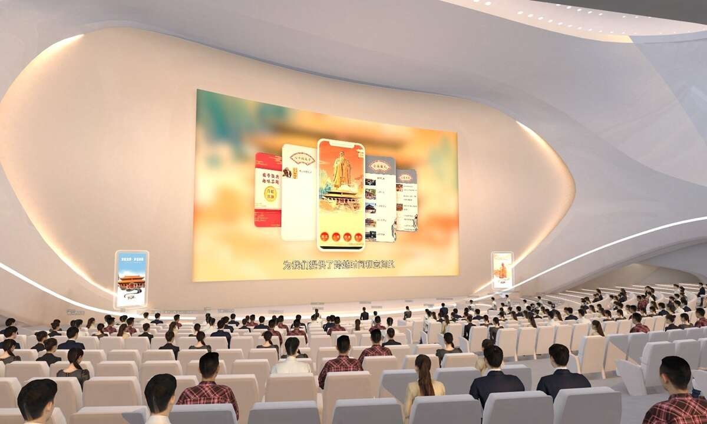
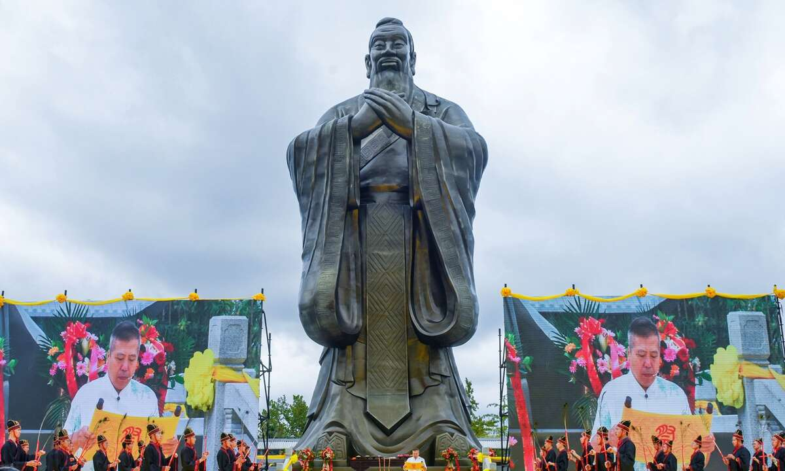

# 元界首次举办VR纪念孔子诞辰纪念活动

人们使用虚拟形象参加周三的云孔子纪念仪式。照片：由孔子文化节提供

9月28日，山东省胶州市，民众参加纪念孔子仪式。图片：VCG

周三，中国各地举行了隆重的追悼仪式，向生活在公元前 6 至 5 世纪的中国伟大的哲学家、政治家和教育家孔子致敬。 

通常参加这些仪式之一需要花时间穿好衣服，然后前往举行传统仪式的寺庙或其他场所。

但对有些人来说，这次参加孔子祭，不过是按几下而已。 

只需单击一下，与会者就会发现自己已经穿好衣服，准备出发了。下一秒，他们被传送到了一个巨大的大厅，在那里他们挑选了房子里最好的座位，体验了孔子祭祀。 

虽然这听起来像是魔术，但实际上是虚拟现实 (VR) 技术将孔子 2,573 岁生日这一全球事件带到了周三的虚拟世界。

科技让中国古老而博大精深的儒家文化彻底突破时空界限，让无数人沉浸在传统与现代的交融中，在被称为“云祭孔”的虚拟世界中。

孔子祭祀活动的开展，不仅体现了科学技术的不断进步，也体现了中国通过创造性和创新的方式保持优秀传统文化的能力。

**与时俱进**

参加 VR 仪式，参与者只需通过手机或电脑选择自己的头像，然后使用这些头像探索虚拟世界的主会场：一个 600 个座位的礼堂 - 有 20 个 VIP 座位 - 一个巨大的弧形屏幕显示各种视频，为参与者带来“真实”体验。

为了让活动更具特色和仪式感，场馆还设置了孔子式天篷，并展示了28张与儒家文化相关的主题海报，让参观者一进入礼堂就感受到浓厚的文化氛围。

“元宇宙”是目前非常流行的概念。因此，在元宇宙时代来临之际，儒家文化如何体现价值、展现新活力，是中国文化部门一直在思考的问题。

“过去几年，联合追悼孔子仪式都在网上举行，核心内容是开展各种活动，祭祀孔子和其他儒家思想家和学者，”活动组织者之一的张博主任，山东省济宁市文化遗产发展中心告诉《环球时报》。孔子的故乡曲阜县级市位于济宁市。

“展示仪式的新方法可以吸引更多的人参与文化的传承和发展，”张说。

儒家文化的生生不息，正是源于“与时俱进”的理念，新时代文化的传承与发展需要一批勇于走在时代前沿的传承人分析师表示，履行他们的职责和责任。

在上周举行的新闻发布会上，参与云孔子祭祀活动的几家孔庙和机构呼吁海内外华人传承中华文明，弘扬中华文化，彰显儒家文化智慧。

过去的云孔子祭祀，让中国的传统礼乐得到有效展示，弘扬儒家“仁”的理念，传播到世界各地，网站主编王成山中国孔子基金会旗下的Chinakongzi指出。

**珍爱孔子智慧** 

周三上午，全国各地举行了孔子追悼仪式。

在伟大哲人的故乡曲阜，当地高官、外国使节、学者和孔子后裔等数百人上午在孔庙参加了仪式。

孔庙于公元前 478 年为纪念和祭祀孔子而建，几个世纪以来多次重建。该庙是整个东亚和东南亚所有孔庙的原型和模型，特别是在布局和风格方面。自1994年以来，孔庙成为联合国教科文组织世界遗产“曲阜孔庙孔庙”的一部分。

黑龙江省哈尔滨市、福建省福州市、浙江省杭州市等城市的孔庙也举行了平行追悼仪式。

与孔子纪念仪式一起，国际孔子文化节与国际尼山论坛、文化和文明讨论空间以及中外学生孔子文化周一起启动。

国际孔子文化节创办于1989年，是集文化、旅游、学术和科研于一体，以弘扬中华古代文化为宗旨的国内、国际规模最大的旅游节庆活动之一。

截至2019年底，全球162个国家和地区共有550所孔子学院和1172个孔子课堂。他们的宗旨是加深国际对中国语言和文化的了解，促进中国与其他国家的人际交流。
