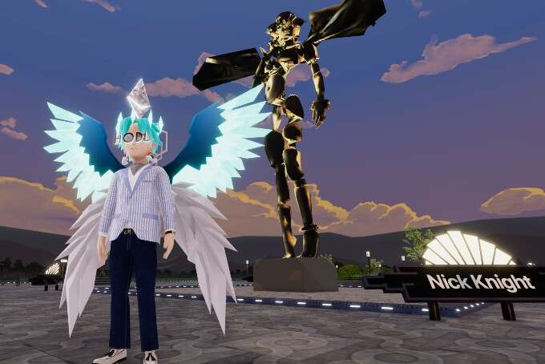
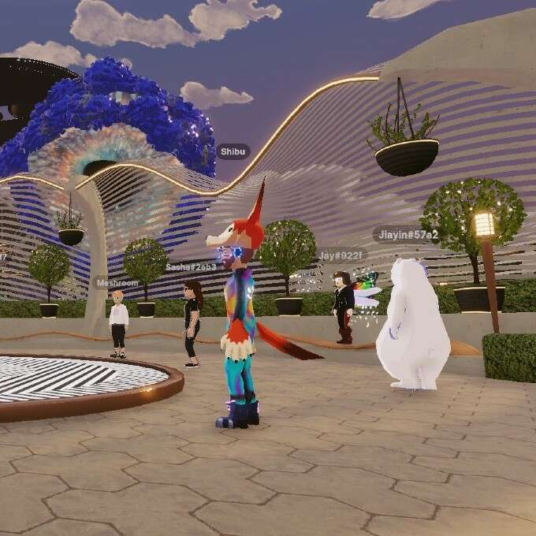
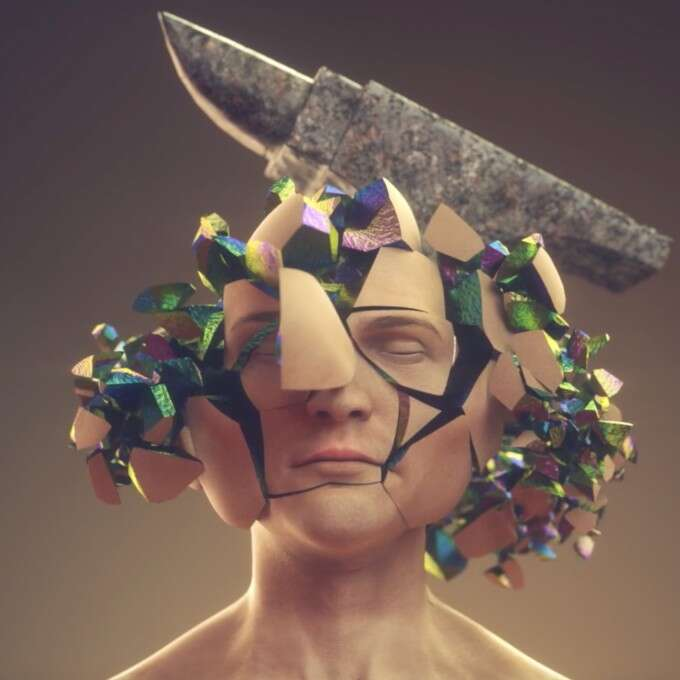
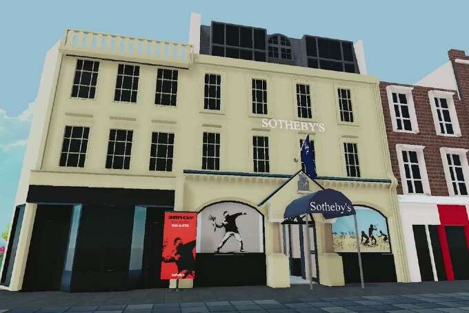

# Decentraland 元界艺术周的亮点

上个月末，世界上最大的元界解决方案之一，每月活跃用户超过 50 万，Decentraland 举办了第三届年度元界艺术周。此次盛会以“世界由代码构成”为主题，以苏富比、ArtNet、Frida Khalo等艺术界中流砥柱为主题，呈现新与旧、高与低、主流与前沿的艺术，在沉浸式环境中汇聚一堂虚拟世界的数字环境。下面，我们重点介绍此次活动的五个突出时刻。

## 艺术广场

由艺术广场提供

十多位艺术家代表 Decentraland 基金会在艺术广场的虚拟“户外雕塑花园”中展示了他们的作品。Soho 广场区因这次展览而焕然一新，展出了 Decentraland 有史以来规模最大、保真度最高的作品。广场将于明年继续展出，展示行业领袖的 3D 雕塑和视频作品，其中包括 Krista Kim、传奇图像制作人 Nick Knight x SHOWstudio 和 Lady Gaga 的创意总监 Nicola Formichetti 等。

## 艺术网

由 Artnet 提供

Artnet 是最大的在线艺术社区之一，成立于 30 多年前，是世界上第一个在线艺术平台，今年的元界艺术周选择了探索“通过行为艺术、现场诗歌和人工智能艺术的元界”的理念. 与许多知名艺术家合作，本周在不同的场地举办了各种艺术体验。一个礼堂举办了围绕艺术和技术的未来的小组讨论，他们甚至分享了在整个活动期间赠送的有限的艺术家可穿戴设备。

## 已知来源

由已知来源提供

Known Origin 在他们自己的画廊中展示了一组令人惊叹的活动，包括一个名为“Crypto Winter”的虚拟装置，这是一个反映加密市场脆弱性的有趣活动，以及一个策划展览。除了作为今年艺术周虚拟“开幕派对”的举办地之外，它也是今年呈现的最具视觉震撼力的沉浸式展览之一。 

## 雅诗兰黛

雅诗兰黛在元界艺术周之际继续在美、艺术和技术的交汇处持续创新，提供由著名身份设计师和美未来主义先驱Alex Box 博士设计的独家 POAP 体验。受富有远见的创始人雅诗兰黛夫人的遗产启发，POAP by Box 可供与会者收藏。那些设法找到并声称其中一个 POAP 的人将能够获得对雅诗兰黛品牌未来 Web3 激活的访问权限。

## 苏富比

由苏富比提供

苏富比庆祝元界艺术周，推出多个新的艺术合作，他们的新元界永久收藏，以及与元金合作推出的元界首个珠宝雕塑。这件作品将被纳入即将举行的苏富比实体拍卖会，它将打破拍卖行的刻板印象，因为在此次拍卖中允许“*实体”*拍品是苏富比非常具有前瞻性的想法，并说明了他们在数字领域的投资向前发展。Metagolden 创始人 Francine Ballard 表示： 

“就我们而言，自 2021 年进入 Web3 领域以来，我们一直在将奢侈品实物产品与数字资产配对。然而，此次销售将提供一个有趣的用例，说明两者如何在二级市场上一起转售，因为我们计划利用开放的商业基础设施将我们的产品从珠宝和艺术扩展到时尚。我们最新的系列 HW3（Web3 之家）由实体和数字时尚领域的一些知名人士共同创立，并将于 10 月向一个非常精选的团体首次亮相。”
