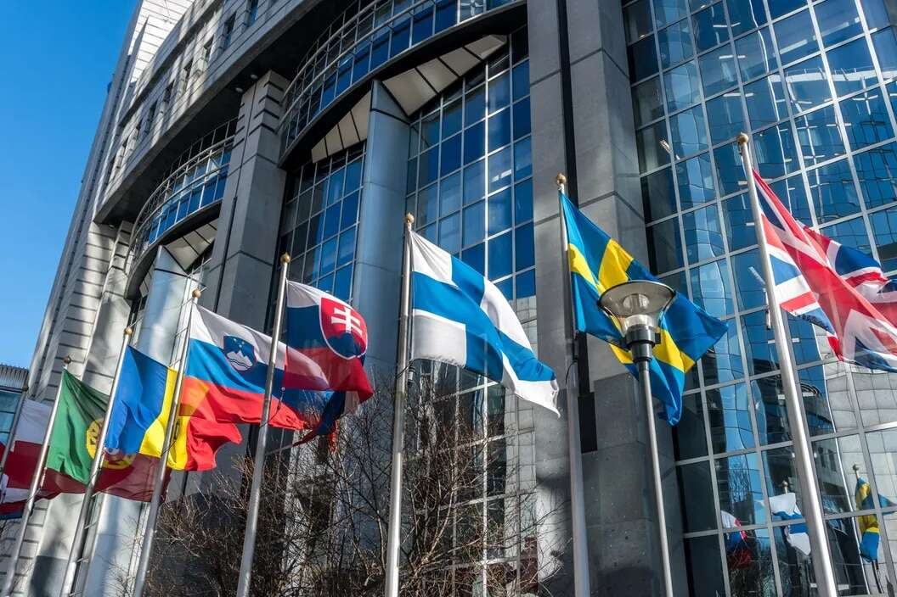

# 欧盟立法者最新草案针对的通过 Metaverse、DeFi、NFT 进行洗钱

CoinDesk 看到的一项法案草案显示，希望解决洗钱问题的欧洲议会成员希望针对大型加密交易以及元界、去中心化金融 (DeFi) 和不可替代代币 (NFT)。

欧洲议会目前正在审议欧盟委员会在 2021 年提出的对欧盟反洗钱法的全面改革。

该草案被标记为对法律的一系列“妥协修正案”，旨在寻求不同政治派别之间的共识，它吸收了左翼立法者 7 月提出的将去中心化金融纳入法律范围的想法。

DeFi 和管理它的去中心化自治组织（DAO）“还应遵守联盟 [反洗钱/反恐融资] 规则，在这些规则中，它们受到直接或间接控制，包括通过智能合约或投票协议，由自然人和法人，”文本说。

“开发商、所有者或运营商应在启动或使用软件或平台之前评估洗钱和恐怖分子评估的风险，”它补充说。

洗钱当局试图禁止使用 Tornado Cash 等增强隐私的服务，担心它被用来处理犯罪资金并支持朝鲜等政权。

但包括美国财政部外国资产控制办公室在内的当局在确定要制裁的个别实体方面遇到了困难。在最近的一个案例中，OFAC 瞄准了开源加密交易匿名者Tornado Cash，而为该项目做出贡献的俄罗斯软件开发人员 Alexey Pertsev 目前正在荷兰等待审判。

该法案的折衷草案仍需由立法者投票表决，然后才能与欧盟理事会的政府会议达成一致，其中还将包括 Web3 公司，这些公司有义务根据欧盟法律对其客户进行洗钱检查。

根据该计划，目前涵盖银行、房地产经纪人和钻石交易商的“义务实体”名单将扩展到包括受欧盟单独的加密资产市场监管 (MiCA) 监管的钱包和其他加密服务提供商。接受价值超过 1,000 欧元（970 美元）的商品和服务的加密支付的交易者，以及交易或挖掘代表艺术品或收藏品的 NFT 的个人和平台，也可能需要根据计划检查其客户的身份并报告可疑交易。

反洗钱法规草案——将补充另一项关于识别加密交易各方的欧盟法律——将 Web3 的新兴领域视为威胁。

“虚拟世界为犯罪分子提供了新的机会，他们可以将通过非法活动获得的现金转换为不可追踪的货币，以购买和出售虚拟房地产、虚拟土地和其他高需求商品，”草案称，并警告存在更大滥用的风险随着虚拟领域变得越来越流行。
