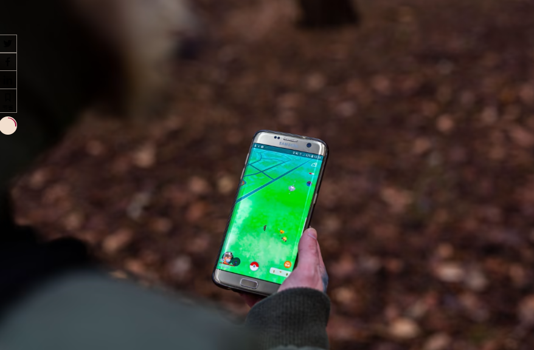
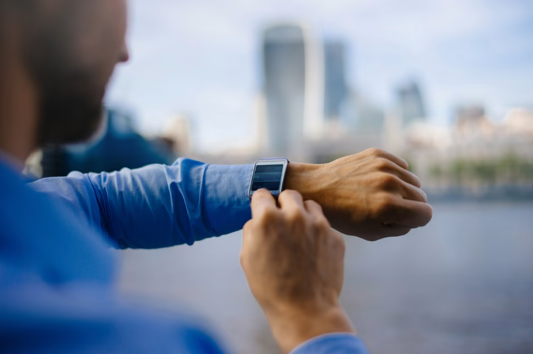
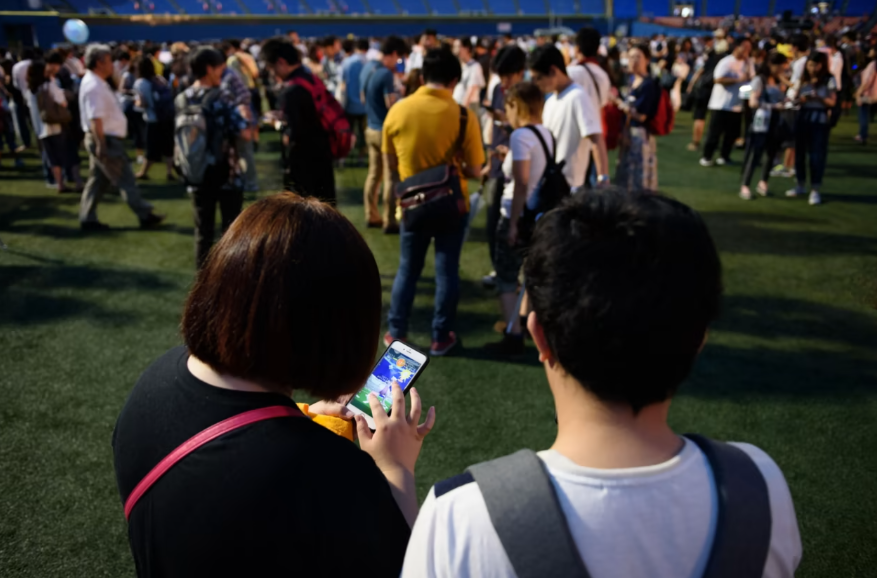

# 约翰·汉克：现实世界中的元宇宙将比 VR 更神奇

虽然 Facebook 和微软相信未来的交互和交易将发生在虚拟世界——一个完全数字化的世界，人们作为虚拟现实 (VR) 中的化身存在——但 Niantic 创始人约翰汉克一直在追求“现实世界的虚拟世界”，使用增强现实 (AR) 鼓励人们探索他们的实际环境。 

2015 年，Hanke 领导了 Google 地球地图项目，从谷歌分拆出来，Niantic与神奇宝贝公司和任天堂合作推出了全球热门游戏Pokémon Go ，展示了 AR 技术的潜力。 

现在，Niantic 正在通过收集数百万用户的数据和扫描来创建世界的 AR 地图。在这里，汉克向英国《金融时报》科技记者克里斯蒂娜·克里德尔 (Cristina Criddle) 讲述了为什么他想要增强现实世界，而不是创造一个合成世界。 

Cristina Criddle：你谈了很多关于构建现实世界的元宇宙——你还在关注那个吗，你能解释一下它是什么样子的吗？ 

约翰汉克：是的。. . 我认为向空间计算的过渡是那些重大的根本性变化之一。

这就像互联网或移动智能手机。. . 我们看到公司带着产品进来，但在这些事情变成今天的样子之前失败了几次：基本上是我们生活的一部分。我认为 AR 和空间计算处于相同的轨道上。

我们专注于与以前相同的事情：构建这些游戏、这些消费者体验，并构建这个 AR 平台——其核心是我们在 5 月推出的这个 AR 地图。

我们现在已经映射了超过 100,000 个位置。我们称它为世界上最具活力的地图，因为它不断地被用户提供。因此，就在我们说话的时候，新的世界扫描图像正在出现，新的扫描图像正在被聚合并处理成这些地图，这些地图可以通过您的智能手机进行本地化，但未来还会使用 AR 眼镜。

所以现在这是一个有机的、有生命的、呼吸的系统。它是活的，数据进来并得到处理，人们正在使用它，我们现在有成千上万的 Niantic 以外的开发人员在我们的平台上构建应用程序，这非常令人兴奋。

**CC：**在地图方面，一旦你捕捉到了世界的每一点，你最终希望做什么？

**JH：**我们希望通过信息和服务让它充满活力。例如，我猜你已经进入某个场所、商店或交通枢纽，并使用发布在某处的二维码在手机上做某事：你已经扫描了一个代码，得到了火车时刻表或一个应用程序。. . 这有点神奇，因为它让人感觉毫不费力，就像你只需拿起手机点击一下，你就会得到一些有用的东西。该地图的目标是让这种体验无处不在，而无需二维码。

当地图存在时，当你举起手机或戴眼镜看东西时，基础设施就可以知道你的焦点在哪里，以及是否有与此相关的信息或服务甚至应用程序现实世界，[你]可以得到它。

我认为这将是非常神奇的。感觉就像这个世界是一个活生生的表面，只有一些东西可以帮助你更多地欣赏它，或者更轻松地导航它，或者做一些你想做的交易，只是更加无缝。

这就是承诺。有一条路要走，但我认为技术将允许它发生。

**CC：**我想，随着技术的进步，这些体验会变得更加身临其境，更加真实。从哲学的角度来看，这对我们关于现实是什么以及我们生活的世界是什么的概念有什么影响？

**JH：**我想说虚拟现实 (VR) 和增强现实 (AR) 的目标之间存在根本区别。有一些公司会将它们融合到一个首字母缩略词的字母汤中，并称之为“XR”，并说 XR 意味着 VR 和 AR。我实际上认为他们非常不同，他们有非常不同的目标。

VR 真的想为你创造另一个世界：一个虚拟现实，一个我们可以逃到的合成创造物：美丽的海滩；或另一个星球；或者没有地球；或您可能想去的任何地方。

这不是 AR 的目标。AR的目标是增强现实。这并不一定要用视觉图像代替它。可能有非常适度的视觉提示。. . 因此，如果您想了解更多关于下一班火车何时到达的信息，您可以按下一个按钮，以获取您将在 15 分钟内离开的火车的车票。但它的核心并不是用视觉来压倒你。

我们可以有选择地向世界添加东西，但这更像是在客厅里整理家具。它有选择地添加一些可能会丰富世界的东西。就像您正在追逐的神奇宝贝一样 - 但这并不意味着将您置于*神奇宝贝*世界中，这样您就不再存在于现实中。那将是虚拟现实，这是一个不同的故事——也许有利于逃避现实，但就技术的未来而言并不那么重要。

**CC：**你如何度过你的业余时间？

**JH：**我是一个家长，我有三个孩子，其中两个现在要出门了，但我家里还有一个，所以过去 20 年我的业余时间都围绕着做与家人和孩子在一起的东西。我们尽量离开家，出去享受。. . 我们很幸运住在北加州，有很多事情要做。海滩、山脉、公园。

我的目标——也是我的奋斗目标——一直让我的孩子远离他们的游戏、他们的 iPad、他们的任何东西、本月的东西，让他们离开并享受那里的一些东西。我一直试图让孩子们出去做这件事——骑自行车、徒步旅行、冲浪、滑雪板或其他任何事情，只是散散步。而且，通常情况下，95% 的时间，当你把他们拉开，他们会克服你把他们拖出去做他们不想做的事情的感觉，他们真的很享受。

这就是创建 Niantic 的部分灵感：试图将世界变成一个游戏板；尝试采用一些真正令人着迷的游戏品质，也许我不会使用上瘾这个词，但肯定会吸引孩子。[我们] 采取其中的一部分，并将其与一项关于在世界上活跃和活跃的活动结合起来，尝试并充分利用两者。

**CC：**但是，如果你要让自己沉浸在现实世界中，让自己沉浸在大自然中，那么在其中添加一个技术层会感觉有点脱节吗？

**JH：**这是一个挑战。例如，您会看到我们与*Pikmin Bloom*合作，以及游戏的设计方式。有两个角色，不知道你有没有看过。. . 

**CC：**我一直在玩它。

**JH：**哦，很好。所以你知道有角色，你可以看到他们并收集新角色，但游戏的一部分是你出去散步，这就是孵化你新的 Pikmin 作物的原因。

但是，当您外出散步时，您根本不需要看屏幕。一旦你设置好游戏，它就会在后台记录这些步骤——也许你走路，你在公园里停下，然后你坐在长凳上——直到你回到家，[什么时候]你可以打开应用程序看看你通过你的步骤完成了什么。

因此，它融合了游戏的动机，但又不让游戏打扰到只看花草树木或与散步的朋友交谈会更愉快的时间。我们正试图在激励的技术之间找到平衡——让你离开沙发并打破惯性的诱惑——但不要太多的阻碍。

我认为技术对我们很有帮助。我无法想象不带手机去旅行，获取地图和方向以及所有这些的想法。但是，当我和我的孩子一起旅行时，他们有一个设备，我想做的最后一件事就是在我们到一个新地方时浏览[他们的]社交媒体信息。

所以这些工具很强大，但它们也会妨碍我们。这是我们作为个人必须处理的事情，但我认为公司也可以对他们如何设计产品更加谨慎和深思熟虑——让技术有所帮助，但不侵入，不以消极的方式接管我们的生活。这是我们这一代人必须面对的挑战。

**CC：**我们现在正在探索新类型的硬件，你可以在其中体验 AR 和 VR，但它们还没有完全起飞。那么您认为我们与设备的关系会发生怎样的变化？

**JH：**我会挑战 AR 尚未起飞的想法。我们还没有 AR 眼镜。. . 但智能手表现在几乎是必需品。

我记得智能手表在 2012 年、2013 年推出时：“谁需要智能手表？这是无用的技术！” 然而，随着时间的推移，技术得到改进，电池寿命更长，应用程序在健康、健身和安全方面更智能，这是一种增强现实设备，而不是手机。

你可以在上面加载地图，出去探索世界，仍然可以享受科技带来的一些好处。

[with] 音频也是如此。在公共交通工具上看到有人在他们的耳朵里没有豆荚几乎是不寻常的，来自苹果、三星或其他人。这也是一种增强现实。通常，它是播客或音乐，但有些应用程序可以带您进行虚拟旅行并告诉您有关地点的信息。你可以和你的虚拟助手交谈，打电话或做笔记。

因此，AR 正以这些可穿戴设备的形式向我们袭来。而且，最终，我认为它也会引起我们的注意。这是我们通常首先想到的 [AR] 形式，但对于 AR，这是最难的。这是技术上最具挑战性的，但并不完全存在。但是，如果你看看正在发生的事情，你会看到将我们带向那个方向的风潮。

**CC：**当你谈到其他一些公司——苹果、谷歌、Facebook/Meta——时，你如何破坏目前控制这些技术的权力？或者你甚至必须这样做？

**JH：**我会说你通过建造和运输来破坏。而且我认为，作为一家公司，我们非常有能力做一些独特的事情，而其他人很难做到。作为一家中型公司，我们的好处是我们只做一件事：我们正在做 AR，我们非常专注于它。我们都在。这就是我们的生活。我们起床，整天呼吸，晚上做梦，第二天起床再做一遍。

在大公司中情况并非如此。他们正在做很多事情，这些天他们几乎无所不在。事实上，当他们没有进入某个新市场时，几乎一周都不会过去。

我在其中一家公司工作了十年，我知道这会让人分心。本季度有一个头号倡议，并且有一个团队在一段时间内引起了所有人的关注。但是，然后，这是另一回事，然后还有其他东西引起了人们的注意，然后一年前的大事不再那么闪亮和新了，人们有点飘走了，它失去了光彩。

这就是大公司面临的挑战：随着时间的推移保持专注，不要分心。所以他们面临着挑战；我们有我们的。我们是战斗中的大卫，而不是歌利亚。但我喜欢我们的机会。

我认为构建这个用户和游戏社区与构建底层地图的结合确实是相辅相成的。

**CC：**我想这完全取决于人们拥有什么类型的手机，以及连接性。目前这项技术能走多远是有限制的，尤其是在你的身体位置方面。

**JH：**是的，也不是。三年前，你需要最新的手机来做 AR。现在，手机的更换周期如此之快，以至于世界上存在的绝大多数手机都可以做 AR。所以这并没有真正阻止事情。我们做 AR 的方式不需要激光雷达传感器。一些高端 iPhone 配备了激光雷达。这很有帮助，你可以用它做一些事情，但是我之前提到的使用单目图像的技术不需要激光雷达传感器。所以这不是障碍。

而且这些设备每六个月就会继续变得更好。所以我认为，最终，从用户体验的角度来看，手机上的 AR 有一个上限，只需举起手机并透过屏幕看世界。这不是一个超级符合人体工程学的活动。有一种现象在早期的 VR 时代得名：大猩猩手臂 [将设备放在垂直平面上会感到疲劳]。你只是不够强大，无法做到这一点。一段时间后会很累。

因此，AR 的未来将是眼镜一直到这里的时候——这不是你必须选择做和停止做的事情。

**CC：**你们的游戏非常依赖IP。为什么你认为这个 IP 是游戏和 AR 游戏的关键？

**JH：**我们做一些原创IP。我们的第一款游戏*Ingress*是原创的。我们现在有一款游戏即将推出，名为*Peridot*，这是一款基于角色的游戏，您可以在其中饲养这些 AR 中存在的生物。那是我们自己的IP。然后，当然，我们有漫威游戏、NBA 游戏和*神奇宝贝*。

几年前出版的一本很棒的书把它钉住了：叫做*Hit Makers。*它是关于流行音乐的，它谈论的是什么是一首热门歌曲。作者的基本论点是它是熟悉的东西和新的东西融合在一起。他的结论是，大多数流行歌曲都建立在你已经知道的东西上——节奏、旋律、可能是歌词——但显然有一些新颖的东西引起了我们的注意。

这两件事加在一起让你很容易接受创新，因为它对你来说并不完全陌生。就像，好吧，我以前听过类似的东西，但我真的很喜欢它的一些新东西。因此，对于 AR，一个熟悉的角色，你已经知道和喜爱的东西，是向人们介绍新体验的好方法。

就像*Pokémon Go*一样 。. . 您将在世界各地奔跑并做所有以前在电子游戏中从未做过的事情，但这是为了追逐神奇宝贝，这是一种幻想，在许多情况下，人们已经爱上了它。所以它有帮助。

**CC：**你有最喜欢的宝可梦吗？

**JH：**我的伙伴 Pokémon 很长一段时间都是 Tentacool。这有点争议，因为我一直认为 Tentacool 是鱿鱼。我对章鱼和鱿鱼非常着迷，因为它们非常聪明，而且它们有这种颜色变形的东西和科学家们完全着迷的大脑。但是其他人说，不，不，不，你错了，Tentacool实际上更像是一种水母。所以那会有点令人失望，因为我不认为水母很有趣。

**CC：**最后一个问题：我们已经讨论了 AR 作为一种实用程序，当你身处现实世界时——使用 AR 来补充你的生活，无论是通过 AR 查找公交车时间，还是餐厅的菜单。我们离那还有多远？

**JH：**我认为我们今天已经开始以二维码的形式体验到这一点。二维码已经存在很长时间了，在亚洲流行，到了西方，但没有人真正使用它们，然后在 Covid 期间，当很多餐馆和地方都不想昏倒时，它们变得更加流行菜单，所以二维码又开始流行起来了。

现在，我认为大多数消费者已经学会了如何去做。. . 我认为我们已经了解到，使用设备查看事物可以成为交互的开始，无论是了解事物还是开始进行交易，或者其他什么。

我认为对于可穿戴设备和手表，我们会做很多事情，而且我们不会意识到我们已经过渡到那个。当然，拐点将是眼镜，但它有很多化身。例如，您可以戴上眼镜来帮助启动这种体验，但信息是通过音频传给您的。这是我们已经尝试过的东西，其他人可能也会尝试。

手表、耳机、AR、计算机视觉，一起工作——我认为我们将走向那个未来。. . 整个想法是它变得无缝，摩擦消失了，我们可以用更少的努力做更多的事情。如果设计得好，它对我们的干扰就会减少，对我们的干扰也会减少。

也许我们能把左手拿回来，因为我们不必一直拿着手机。我们实际上可以有两只手来搬运我们的杂货或防止我们的孩子跑到街上，或者我们正在尝试做的任何事情。所以这将是一个巨大的胜利。

**CC：**嗯，我们不确定这些眼镜什么时候会来。他们仍在等待中。

**JH：**它会发生的。

**抄送：**什么时候？

**JH：**我记得在 iPhone 之前的一代智能手机上制作移动地图——[当时]他们刚刚开始在手机中添加 GPS。而且效果不是很好。有几个进入市场并失败了。[然后] Apple 做了他们的事情并且做对了，然后 Android 紧随其后。AR 将是这样的。会有一些设备进入市场，[并且]卖得不好。

Magic Leap 就是其中的 v1，他们带着另一个版本的眼镜回来了，其中包含更多关于它的不起眼的故事。但是会有其他的不起作用。

然后，不可避免地，鉴于技术的历史，它就足够了；它会点击；它会发生。所以三五年，我认为是这样的时间框架。
