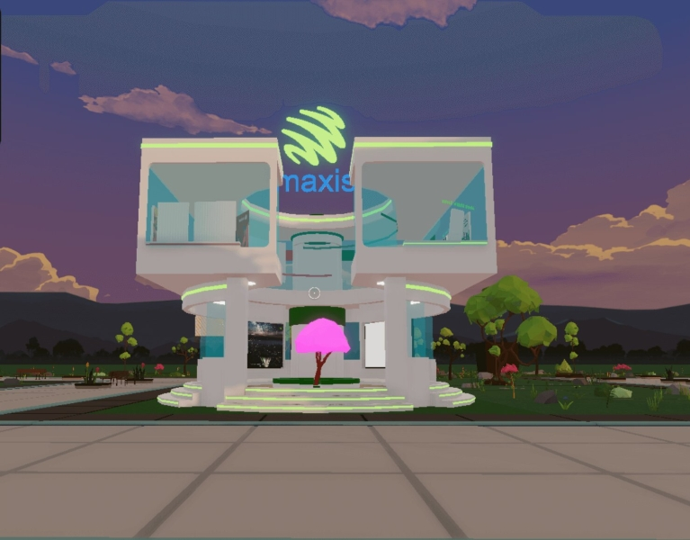
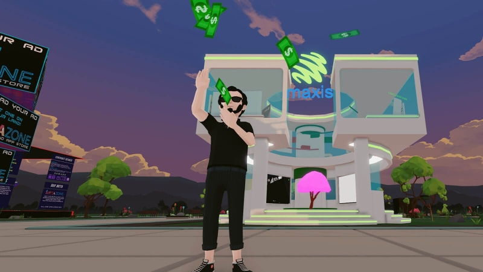

# Maxis 踏入元界，让我们一窥未来

Maxis 凭借其 Maxis Center Decentraland 进入了虚拟世界。虽然仍处于初步阶段，但元界中的 Maxis 旨在通过高度参与、相关和有益的互动，为沉浸式体验提供一个独特的目的地。

作为此探索阶段的一部分，该电信公司在 Maxis Center Decentraland 推出了一家虚拟电信商店，这是一种在元界上的互联零售体验，旨在通过特定产品使客户受益。用户将能够使用最新的 3D 技术购买 Maxis 的产品和服务，查看并了解如何使用由 Maxis Fibre 驱动的 Maxis 家用设备改造他们的家，甚至可以通过与马来西亚艺术家的合作购买具有收藏价值的 NFT。此外，还有一个热链接墙和#BikinSampaiJadi 内容供客户欣赏。客户还可以通过二维码获得数字护理。

通过该平台，Maxis 可以从多个角度一窥未来的可能性——从基本服务、客户参与、企业解决方案展示、游戏、吸引人才、沉浸式教育以及与多行业建立合作伙伴关系的生态系统垂直。

这一推动与其 Rangkaian Kita Rangkaian Malaysia (RKRM) 活动一致，旨在以各种可能的方式和任何时候为所有马来西亚人服务。RKRM 是 Maxis 的“永远领先”品牌宗旨的强化和深化，其推动力是其从移动电信供应商演变为为每个细分市场提供解决方案的连接和数字解决方案专家。*A+M*已与 Maxis 取得联系以获取更多信息。

Maxis 首席销售和服务官 Patrick Er 表示，元界反映了其品牌宗旨和电信公司的“什么是可能的”核心价值，因为它扩大了对数字未来的可能性，以继续为客户提供服务。最好的方法。“这只是激动人心的数字化旅程的开始，我们期待更多内容出现在这个平台上，所以请继续关注这个空间！” Maxis 的首席销售和服务官 Patrick Er 说，”他补充说。

根据皮尤研究中心和埃隆大学想象互联网中心 2022 年的一项调查，54% 的商业领袖和技术创新者表示，虚拟世界将成为 50 亿人日常生活中更加精致、完全沉浸式、运作良好的方面到 2040 年，全球人数或将增加。调查发现，与今天相比，到 2040 年，预计还会有更多人发现虚拟世界足够有用，可以每天访问它。

