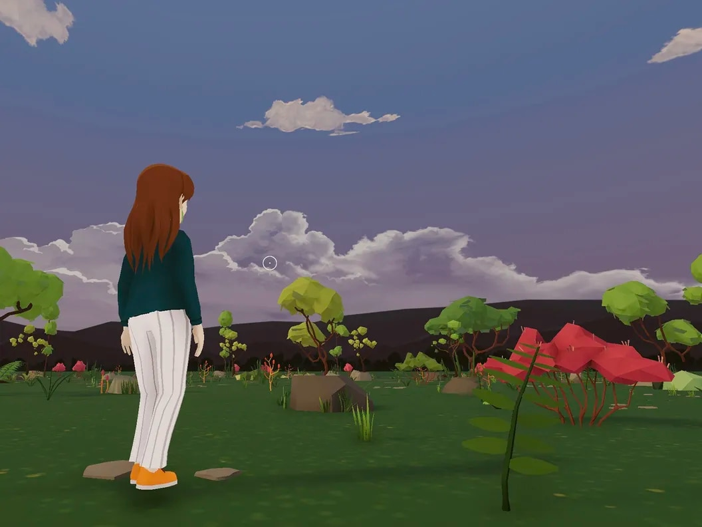

# 元界中的孤独者：Decentraland 在 $1.3B 生态系统中的 38 位每日活跃用户

你可能会问，这些天元节发生了什么。看看估值超过 10 亿美元的两家最大的公司，答案令人惊讶：不多，或者至少不足以让用户每天都回来。根据 DappRadar 的数据，基于以太坊的虚拟世界Decentraland在过去 24 小时内拥有 38 个活跃用户，而竞争对手The Sandbox在同一时间拥有 522 个活跃用户。

根据 DappRadar 的说法，活跃用户被定义为与平台智能合约交互的唯一钱包地址。例如，登录 The Sandbox 或 Decentraland 以使用每个平台各自的本地实用程序令牌 SAND 或 MANA 进行购买被视为“主动使用”。

这意味着 DappRadar 对每日活跃用户的汇总并没有考虑到那些登录并在 Metaverse 平台上闲逛或短暂参加某个活动（例如虚拟时装周）的人。这也可能意味着这些空间不是人们进行交易的地方，例如购买不可替代的代币（NFT）。

开发人员可能会用熟悉的短语“不要讨厌玩家，讨厌游戏”来捍卫低的每日统计数据；但对于两个元宇宙平台来说，这似乎不仅仅是平静的一天。

根据 DappRadar 的数据，Decentraland 的每日最大用户数为 675。对于 The Sandbox，这个数字更大，约为 4,503。

Decentraland 的创意总监 Sam Hamilton 告诉 CoinDesk，虽然他们报告的平均每天有 8,000 名用户，但这说明了任何与元宇宙被动交互的个人。他指出，虽然他们在 3 月份看到了高峰期，但“游客和观众”的数量已经降温。

尽管用户指标较低，但 Decentraland 和 The Sandbox 的估值很高。根据 Messari 的数据，Decentraland和The Sandbox的市值均在 13 亿美元左右。虽然赚钱游戏Axie Infinity的市值为 11.6 亿美元，但其在 DappRadar 上报告的近 22,000 名每日用户表明，不提供留存激励的开放式虚拟世界（例如游戏或交易）可能不会定期出现此时回访用户。

尽管元宇宙可能足以成为公司围绕其概念重新命名的流行语，但大规模采用可能仍需要一段时间。

数字资产投资公司 Arca 的投资组合经理 Sasha Fleyshman 告诉 CoinDesk，当元界平台实际按预期运行时，它们对用户的价值要大得多。

“任何告诉你今天有一个有效的元宇宙的人都是在说谎，”弗莱什曼说。

去年 8 月，饮料公司 Snapple 在 Decentraland 的弹出式酒窖引发了有关元界促销内容主流用例的质疑。7 月，滑手 Tony Hawk 宣布他的虚拟滑板公园与 The Sandbox 中的头像系列配对，旨在将他价值 14 亿美元的“Tony Hawk Pro Skater”视频游戏的粉丝带到一个新的、更具互动性的平台。定于 10 月 19 日至 23 日运行，虚拟滑手的投票率可能比在 SAND 中购买 Hawk 的 NFT 的用户更大。

“在我看来，我们倾向于在这方面缺乏产品与市场的契合……不管他们的估值如何，”弗莱什曼说。
