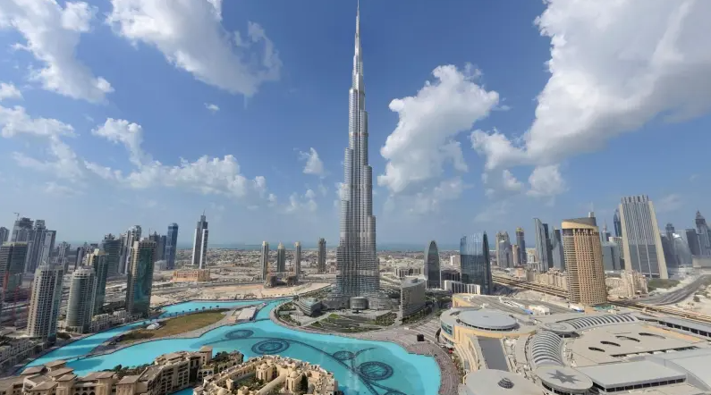

# 现在你可以在元宇宙体验世界上最高的建筑

图片来源：boonedam.com

您现在可以体验元宇宙中最高的建筑。哈利法塔（Burj Khalifa）凭借自身的数字双胞胎加入了虚拟世界的潮流，这将使人们可以四处走动并欣赏迪拜的 360 度全景。

它加入了越来越多的标志性建筑、纪念碑和市中心，这些建筑、纪念碑和城市中心在元宇宙中创造了自己的 3D 版本。Metaverse通常被描述为一个 3D 虚拟空间，人们可以在其中通过游戏、虚拟事件和其他沉浸式体验进行互动。

例如，纽约时代广场的建筑已经在沙盒虚拟世界中复制，而韩国最大的城市首尔、釜山和现在的昌原已经在虚拟世界中创建了自己的数字版本。

拥有双胞胎结构（一个在虚拟世界，另一个在物理世界）的概念已经成为一种趋势，以至于詹姆斯敦决定创建一个基于 Decentraland 的时代广场大楼的物理复制品。詹姆斯敦在 5 月投资了 5 亿美元，通过虚拟和增强现实装置重建时代广场。

上个月，Dropp Group以 2500 万美元收购了元宇宙平台 Phly，以创建世界上第一个“phygital”元宇宙。根据公告，Dropp Group 希望帮助房地产公司在虚拟世界中重建其房产的数字双胞胎。

该公司还致力于为虚拟世界中的每个主要城市、建筑和纪念碑创建一个身临其境的复制品。

哈利法塔的参观者无需佩戴任何 3D 设备（如虚拟现实 (VR) 或增强现实 (AR) 耳机）即可体验数字版本。该项目由虚拟活动公司 Eventcombo 牵头。

Eventcombo 在评论该公告时说：“虽然大流行迫使世界陷入孤立，但它也导致了元宇宙的进步和加速采用。尽管数字化已成为新常态，但元宇宙正在促进数字空间中的物理和类似真实世界的交互，以提升体验并架起真实世界和虚拟世界的桥梁。”

该公司分享了一段短视频，显示虚拟化身在建筑物的不同区域走动，试图向潜在游客展示这种体验。
