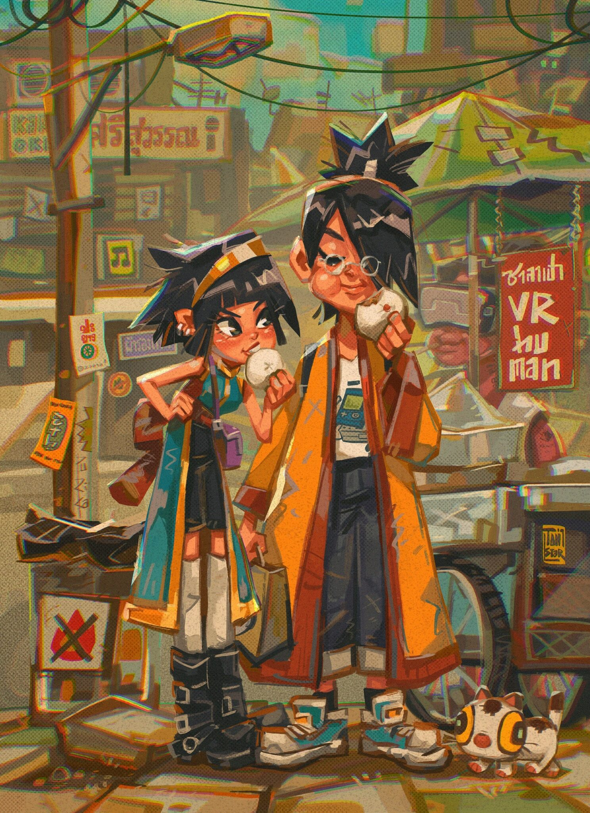
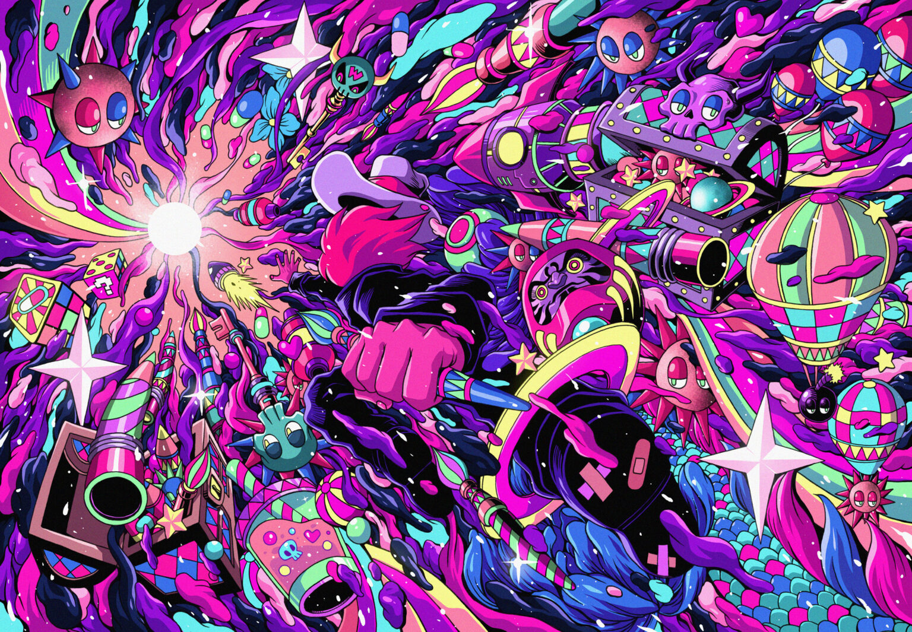

# Ibis Styles 开发了一项新的全球活动，该活动将看到 NFT 艺术品的创作，这些艺术品将在元宇宙中展出。

作为雅高酒店集团的一部分，廉价子品牌 Ibis Styles 推出了其“#OpenToCreators”活动，该活动与世界知名的数字创作者[@tikkywow](https://www.instagram.com/tikkywow)和[@naranjalidad](http://www.instagram.com/naranjalidad)合作制作。

艺术家创作的所有 NFT 随后将在元节中的 Ibis Styles 虚拟艺术画廊中共享，可通过[spatial.io](https://spatial.io/s/ibis-Styles-Gallery-63207b8396854f00014a64aa?share=1999572191507638744&utm_source=%2Fspaces)访问。

虚拟画廊关注最近在新的宜必思曼谷是隆酒店和宜必思尚品塞维利亚酒店举办的实体活动，原创作品和 NFT 都是在这些酒店创作的。

在 Ibis Styles Bangkok Silom，@tikkywow 创作了一件原创艺术品，现在与两件委托作品一起展出。

在同一事件中，为 ibis Styles NFT 产品组合创建了 @tikkywow 艺术作品的 NFT，并将出现在 metaverse 中新推出的 ibis Styles 虚拟画廊中。

除了@tikkywow，曼谷活动中的其他艺术家还包括[@jeffaphisit](https://www.instagram.com/jeffaphisit)和[@tanstar.artist](https://www.instagram.com/tanstar.artist/)。他们的数字作品也将出现在 Ibis Styles metaverse 画廊中。

[Instagram 上@ibisstyles](http://www.instagram.com/ibisstyles)的追随者 现在可以参加有机会赢得艺术家 Naranjalidad 创作的 NFT，该 NFT 将通过[Opensea](https://opensea.io/fr/collection/ibis-styles-otc-collection)转移。获胜者还将获得雅高 ALL 忠诚度计划的黄金会员身份。

雅高经济品牌副总裁 Laure Duberga 表示：“Ibis Styles 喜欢欢迎毫无歉意的创作者，即具有前卫风格的艺术家，他们将最新鲜的内容带入生活并突破创意界限。

“今年，我们的年度#OpentoCreators 活动有一个独特的主题，重点关注数字艺术家和 NFT 创作者。我们通过提供多个平台来表达他们的创造力来表达我们对这些艺术创新者的支持——在我们的酒店，通过我们的社交渠道，最终在整个虚拟世界中。”

Ibis Styles Bangkok Silom 被雅高描述为“酷设计酒店”，拥有一家名为 PrudRod 的餐厅，供应正宗的泰国美食、波西米亚风屋顶酒吧和配备语音 Google Home 设备的客房。

雅高经济和中档品牌高级副总裁 Caroline Bénard 表示：“我们向创作者开放活动的目标是通过让我们的观众参与创作过程，使当今最先进的创作形式——数字艺术和 NFT 民主化。

“通过我们的社交网络，我们希望激发宜必思尚品宾客、粉丝和追随者的想象力，并邀请他们与这些才华横溢的数字艺术家合作。

“在 Ibis Styles，我们认为必须尽可能广泛地分享和欣赏创意，我们在这里支持创作者，同时让更多人加入全球对话并参与艺术社区。这就是为什么我们将我们的品牌变成一个创意场所：在我们的酒店、我们的社交媒体平台和虚拟世界中。”
