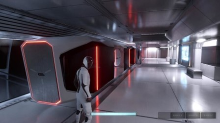

# GAMA 为其以太空为主题的元宇宙招募船员

**洛杉矶，9 月 19 日**——GAMA 已经启动了它的元宇宙——GAMA 空间站 (GSS)。该项目专注于互操作性，正在向区块链和 web3 生态系统中的其他社区敞开大门。该计划已经从最近与 CloneX 社区成员的公告开始，他们在 GSS 中展示了他们的 NFT 角色。

#### 我们在宇宙中并不孤单

GAMA 是 GSS 元节背后的 Web3 项目。该项目专注于提供身临其境的虚拟体验。因此，GSS 计划采用创新的游戏机制以及身临其境的社交生态系统，结合起来创造一种旨在为元界项目设定标准的逼真体验。

这是通过虚幻引擎 5 实现的。该游戏引擎允许 GAMA 将高端图形和优质音频、照明和动画集成到体验中。这与其“将数字世界与现实融为一体的创新游戏机制”的目标相一致。

GAMA 并不是唯一的 Web3 项目。区块链生态系统充满了各司其职的平台。每个人都试图创建一个专门的社区并为成员提供独特的体验。而且，虽然这有其好处，但如果这些平台能够定期协作为用户创造新体验，那就太好了。

考虑到这一点，GAMA 特别强调了虚拟世界中的互操作性。目标是让其他社区的人们体验该项目的沉浸式娱乐体验。

“我们并不孤单。互操作性是元界的一个关键因素。我们知道我们在宇宙中并不孤单，欢迎更多社区加入我们在 GSS 上的使命。”

该计划的第一个受益者是 CloneX NFT 社区。通过合作，CloneX NFT 所有者可以在 GAMA 虚拟世界中看到他们的角色，并且很快就能自由体验虚拟世界，让他们的角色栩栩如生。

最近，一位 CloneX 的所有者甚至将他的 GSS CloneX 图像作为[专辑封面](https://open.spotify.com/track/4oORcITmQQarAsLyAPsbmc?si=ah-rLnQJRoqzZdiYD62HeQ)。

#### 合并世界

虽然 GAMA 的重点是提供令人难以置信的元宇宙体验，但该项目也意识到了物理、现实世界产品的价值。因此，它努力通过 GAMA 工作室通过数字和物理收藏品代表的图形故事讲述格式提供独特的用户体验。

GAMA 的 NFT 让持有者可以访问现实世界的事件，他们可以在其中亲自互动。这加深了 GAMA 元宇宙中的社区感和归属感。

**关于伽马**

GAMA 是一个 Web3 平台，它正在通过其元宇宙构建一种新的娱乐形式。除了为自己的社区提供独家体验外，GAMA 还通过向其他 NFT 社区提供体验来应用通用标准。

GAMA NFT 是其 GSS Metaverse 叙事的核心，每个人都代表一名机组人员，他们正在前往太空以利用替代形式的能量。GAMA 最近取笑了它的第一款可玩游戏《黑暗地平线》，这将是其元宇宙的第一个扩展。

