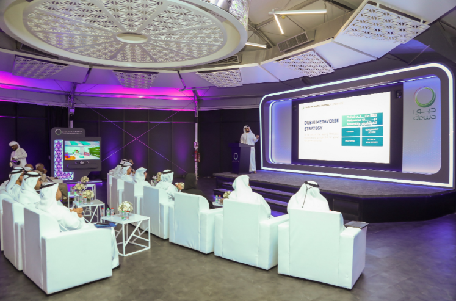

# DEWA 在 Metaverse 上推出 DEWAVerse 平台

迪拜电力和水务局 (DEWA) 已在 Metaverse 上推出其“DEWAVerse”平台，并成为第一个在 Metaverse 上推出其平台以向客户、员工和社会成员提供服务的地方政府组织。DEWA 投资于 Metaverse 技术以实施和开发其当前和未来的项目，这有助于利益相关者的幸福、业务的发展、提高效率和生产以及降低成本。

这是在 DEWA 的数字化转型指导委员会会议上宣布的，麦肯锡还出席并提交了 2022 年数字商数评估报告，强调 DEWA 一直保持其作为公用事业领域全球数字化领导者的地位。

“在 DEWA，我们努力加强对第四次工业革命技术的使用，包括 Metaverse，这是所有重要领域的关键支柱和新工作方法，以利用这项技术寻找新机遇并提供创新解决方案，加速增长以提升迪拜在区域和全球的地位。这有助于实现阿联酋副总统兼总理兼迪拜酋长谢赫穆罕默德·本·拉希德·阿勒马克图姆殿下的愿景和指示，从数字技术和人工智能中受益，以提高绩效并改善人们的生活质量。

这也推动了迪拜王储兼迪拜执行委员会主席谢赫哈姆丹·本·穆罕默德·本·拉希德·阿勒马克图姆殿下发起的迪拜元宇宙战略，旨在将迪拜也打造成世界十大元宇宙经济体之一作为 Metaverse 社区的全球中心，以加强其在该领域的成功，”DEWA 的医学博士兼首席执行官 HE Saeed Mohammed Al Tayer 说。

会议期间，回顾了使用元界技术的七个项目。其中包括客户服务中心，这是本地首个此类服务中心，它使客户能够与客户服务中心代理进行沟通，以回答他们的询问并在虚拟世界中完成交易。DEWA Workplace 使用户能够在 DEWA 建筑物中移动并在虚拟世界中举行会议。DEWA Future Lab 使用户能够在虚拟世界中使用创新工具举行头脑风暴会议、讨论挑战并开发最佳解决方案。急救和消防安全以虚拟方式介绍急救和消防安全程序。MetaDrone 收集有关太阳能电池板的信息，修复它们，并使用 VR 生成报告。DEWA Onboarding 允许新员工以虚拟方式了解 DEWA 的愿景和使命。

DEWA 是迪拜首批在 2014 年完成所有服务 100% 智能转型的政府实体之一。DEWA 在其旅程中的关键里程碑包括 2014 年采用谷歌眼镜，这构成了所提供服务质量的新转变。该应用程序是专门为满足 DEWA 监控其车站任何故障的需求而设计的。2016 年，DEWA 采用了 Microsoft 的 HoloLens 技术，以增强其运营并提高生产力。DEWA 是第一个在电力和供水服务中采用这种技术的政府组织。DEWA 还于 2017 年开始使用智能头盔和智能眼镜 (DAQRI)，它与虚拟现实技术一起为发电厂的工程师提供支持。

DEWA 首次在中东和北非地区通过虚拟 3D 平台组织了 2020 年第 22 届水、能源、技术和环境展览会 (WETEX) 和迪拜太阳能展 (DSS)。该展览使参观者和参展商无需旅行即可参加。此外，DEWA 还为其员工提供了虚拟现实工作室和自助服务。该工作室为 DEWA 的员工提供关于急救、安全程序和防火的模拟培训，DEWA 的概述、其项目、战略以及它为员工和客户提供的服务。

2021 年，DEWA 还启动了能源和水的虚拟现实生成、生产和分配项目，该项目提供 132/11 kV 变电站的 3D 体验、交互式培训测试以及配电中多个设备和设备的仿真和可视化模型网络。2022 年，DEWA 使用增强现实技术在其位于穆罕默德·本·拉希德·阿勒马克图姆太阳能公园的创新中心推出了数字指南和虚拟定向之旅。
