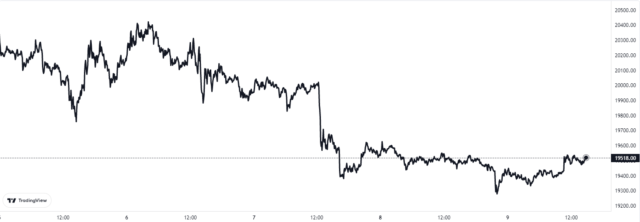

# “LaLiga Golazos”NFT 平台将于 10 月 27 日上线

Dapper Labs 和西班牙足球联赛 LaLiga 宣布，他们的新 NFT 平台将于 2022 年 10 月 27 日推出。

根据新闻稿，LaLiga 和 Dapper Labs 现在公布了他们即将推出的数字收藏平台“LaLiga Golazos”的名称。

西甲是西班牙顶级足球联赛，拥有皇家马德里和巴塞罗那足球俱乐部等传奇球队。根据欧足联的排名，该联盟目前在欧洲排名第二。

LaLiga Golazos NFT 将包括自 2005-2006 赛季以来加入联盟的足球俱乐部最著名的比赛的视频收藏品（称为“时刻”）。

该平台还将在当前 2022-23 赛季的每个比赛日都有新的 Moment 掉落。根据公告，粉丝们将能够以英语和西班牙语体验所有这些收藏品。

“LaLiga Golazos 允许球迷拥有和收藏 2005 年至今的 LaLiga 比赛和精彩瞬间，”LaLiga 执行董事 Óscar Mayo 评论道。

“我们不断创新新方式，让 LaLiga、其俱乐部和球员更接近我们的球迷，与我们的合作伙伴、行业领导者 Dapper Labs 合作，我们可以让他们真正成为这种狂热体验的一部分。”

Dapper Labs是其他著名运动收藏品（如 NBA Top Shot）背后的公司，正在处理 LaLiga Golazos 平台的开发方面。

NFT平台内测定于本月27日上线，首个合集也将于同日下架。

足球历史上最具标志性的比赛，如 El Clásico 和马德里德比，将出现在最初的 NFT 中。

Dapper Labs 的 LaLiga Golazos 总经理Jorge Urrutia del Pozo表示：“我们很高兴与 LaLiga 合作，为全球足球迷提供数字收藏体验，旨在满足他们对比赛的热情 。”

“LaLiga Golazos 将使球迷能够拥有一段 LaLiga 历史，并参与一个全新的足球社区，该社区认可并奖励他们的球迷。”

**比特币价格**

在撰写本文时，比特币的价格浮动在 1.95 万美元左右，过去 7 天上涨了 2%。在过去的一个月里，加密货币的价值上涨了 1%。

下图显示了过去五天代币价格的趋势。

