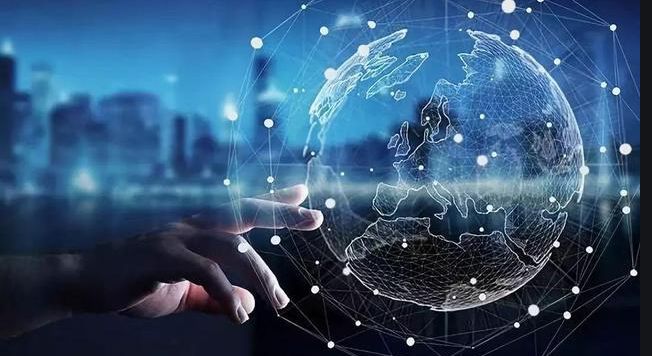

# 什么是元宇宙？意义、特征和重要性

元界被定义为一个空间计算平台，它提供数字体验作为现实世界的替代品或复制品，以及社会互动、货币、贸易、经济和财产所有权等关键文明方面——建立在区块链的基石上技术。这篇文章详细解释了这个概念、它的特点以及它为什么如此重要。

## 什么是元宇宙？

**元界是一个空间计算平台，提供数字体验作为现实世界的替代品或复制品，以及社会互动、货币、贸易、经济和财产所有权等关键文明方面——建立在区块链技术的基础之上.**

将 Metaverse 与 1970 年代和 1980 年代的互联网进行比较是恰当的。随着新的通信形式奠定了基础，人们开始猜测它会是什么样子以及人们将如何使用它。尽管它被广泛讨论，但很少有人理解它的含义或它的运作方式。

回想起来，一切都没有像一些人希望的那样顺利。不过，现在是时候定义这个模糊而复杂的术语了，因为预计到 2024 年，元宇宙将增长到 8000 亿美元的市场。Facebook、微软、苹果和谷歌等科技巨头正在大力投资以使其成为现实。

Metaverse 是通过浏览器、移动应用程序或耳机访问的 3 维世界的混合体。它将允许人们进行远距离的实时交互和体验。结果将是一个庞大的在线应用程序生态系统。

元宇宙目前在数字世界风靡一时，因为它看似无穷无尽的潜力和目标。许多投资者被元界所吸引，因为它处于技术和数字发现的最前沿。这是一个物理世界和数字世界可以共存并对日常生活的基本领域产生重大影响的环境。

从本质上讲，它是一个无限的、相互关联的虚拟社区的世界，人们可以在其中使用虚拟现实耳机、增强现实眼镜、智能手机应用程序和其他技术进行社交、协作和娱乐。它还将包括在线生活的其他方面，例如社交媒体和购物。

随着应用场景的成熟，元界将发展成为一个异常庞大、极其开放、动态优化的系统。为了打造一个能够支持各种虚拟现实应用场景的系统，来自不同领域的创造者将共同努力。

### 了解元界的七层

企业家和作家 Jon Radoff 建议 Metaverse 包含七个不同的层，每一层都会影响用户体验的一个方面：

- **经验：**随着物理空间在数字世界中的非物质化，物理性的限制将被消除。Metaverse 将为人们提供我们目前无法享受的广泛体验。
- **发现：**通过应用商店、搜索引擎和评级网站，客户可以通过这一层了解新平台。寻找新技术和社区需要这一关键步骤。
- **创造者经济：**为了生产数字资产或体验，开发人员使用各种设计工具和应用程序。随着时间的推移，许多平台正在开发更直接的创意方法，例如拖放工具。
- **空间计算：**它融合了混合现实 (MR)、虚拟现实 (VR) 和增强现实 (AR)。随着时间的推移，它已发展成为一个重要的技术类别，使用户能够与 3D 环境进行交互以增强体验。
- **去中心化：**不会有一个单一的权威来统治元界。随着元界的扩展，可扩展的生态系统将支持企业所有者在区块链技术的支持下提供更全面的专业数字产品。 
- **人机接口：**元界的硬件层必须包括人机接口。任何虚拟世界都可以接受一个人的身体作为 3D 逼真的化身。
- **基础设施：**为人们的小工具提供动力、将它们连接到网络以及分发内容的技术是基础设施层的一部分。随着时间的推移，[5G 网络](https://www.spiceworks.com/tech/networking/articles/lte-vs-five-g/)将显着提升元界的容量。

### 元界平台示例

为了理解元宇宙的意义，让我们看看将这一愿景变为现实的领先平台：

- **Decentraland：**Decentraland 是一个基于区块链的虚拟社交环境。它用于建造、交易、赚钱和探索虚拟世界。它本质上是一个数字账本，通过计算机网络永久记录比特币交易，并作为 Decentraland 宇宙的基础。它为学习和享受虚拟体验提供了绝佳的机会。Decentraland 可用于在虚拟商品市场举行会议和交易等。在现实生活中，与其他成员的互动很简单。
- **沙盒：**这是一个托管在[以太坊区块链](https://www.spiceworks.com/tech/tech-general/articles/blockchain-role-in-metaverse/)上的 3D 虚拟世界，人们可以在其中互动、构建事物和赚钱。Sandbox 支持许多设备，包括 Windows 手机和智能手机。通过新的虚拟体验，它为人们提供了赚钱的机会。不过，它的使用并不便宜。为了实现这一点，SandBox 开发了基于以太坊的 SAND 代币。可以用 SAND 代币支付以太坊网络上的 gas 费用。
- **Bloktopia：**Bloktopia 使用虚拟现实为用户提供身临其境的体验。它是一个 21 层的虚拟结构，代表当前使用的 2100 万比特币。通过新的虚拟体验，它提供了各种创收潜力。人们可以设计他们的化身，参与众多活动，了解加密货币，并在塔中购买虚拟“房地产”。使用平台的构建器工具，您还可以利用该空间来制作艺术品、游戏、序列和其他东西。
- **Meta Horizon Worlds：**用户可以在 Horizon Worlds 上进行社交、商务会议、探索虚拟环境、参与虚拟活动和玩游戏。Meta 的 VR 社交应用之一是 Horizon Worlds。在 Horizon 宇宙中，没有使用区块链技术。它具有功能性 VR 构建块，例如代码块、音乐和动画效果，除了可导航的 VR 设置外，还可以帮助内容开发人员。作为具有仅限邀请政策的虚拟探索者的测试平台，Facebook（现为 Meta Platforms Inc.）于 2020 年 8 月首次推出 Horizons。
- **Metahero：**Metahero 项目提供实用技术，让用户可以扫描实际对象并将它们移动到 Metaverse 而不是虚拟领域。它专注于利用超高清摄影测量扫描技术将物理人工制品带入数字世界。通过他们的 3D 化身，用户可以使用 Metahero 作为门户来探索 NFT、社交媒体、时尚和 Metaverse 的其他方面。Metahero 从现实世界的事物（包括人）中创建超高清化身。

## 元宇宙的特点

Metaverse 的工作基于以下关键特性：

### 1. 头像的加入

创造自己的数字化身以独特地表达自己的情感和感受是元宇宙的核心概念之一。每个人都有自己的数字身份，可以是静态的或动画的，并且对他们来说是独一无二的。数字化身是一种独特的自我表达方式，因为除了精确复制您的实际形式之外，它们还可能是您最喜欢的名人的再现或完全原创的东西。

当用户有机会修改他们的头像时，就会引入游戏化的概念，从而创造出更具吸引力和动态的[体验](https://www.spiceworks.com/tech/devops/articles/what-is-gamification/)。

化身可以经常更改，并且可以在某些方面类似于用户的现实生活中的对应物。化身有时也可以是计算机应用程序。在键盘、操纵杆、鼠标和专门的人机接口 (HCI) 设备的帮助下，用户可以操作他们的化身。更逼真的化身可能会给观众或与他们互动的任何人带来更身临其境的体验。

### 2. 基于区块链的运营

区块链允许消费者保护他们的虚拟资产并为他们提供所有权的数字证明，使其成为元界的重要组成部分。元界正在经历数据量、价值以及安全性和可靠性重要性的增长。[区块链技能](https://www.spiceworks.com/tech/tech-general/articles/high-blockchain-skills-demand/)和技术对于确保元界中的数据有效性是必要的，人工智能被用来保护其多样性和丰富的材料。

由于[数据库管理系统 (DBMS)](https://www.spiceworks.com/tech/cloud/articles/database-management-systems-dbms/)等系统中集中式数据存储的诸多缺点，没有区块链，元界概念是不完整的。没有中心化组织的影响，基于区块链的元界可以访问任何数字场所。

### 3. 虚拟土地（地块）的使用

元界对虚拟土地的需求正在飙升。在元界，任何人都可以购买土地来购买加密货币。土地是不可替代的代币（NFT），是一种区块链资产类别，人们不能用其他东西进行交易。大小是指元界房地产图中的基本像素数。

数字店面、虚拟游戏甚至娱乐都可以在虚拟土地上进行交互。它的大小和位置将决定土地的用例。例如，VR 街道附近的地块可能是值得的，因为它具有展示广告的潜力。

### 4. 沉浸式体验（AR 和 VR）

通过利用混合现实和 AR/VR 技术，元界的参与者将能够获得融合现实和虚拟世界的更加身临其境的体验。很容易理解为什么 Metaverse 越来越受欢迎：这将使游戏变得栩栩如生，音乐会和戏剧，以及专业或教育的相遇看起来更真实。

元界项目的主要构建块是 AR 和 VR。增强现实系统的功能需要三个关键组件：实际和虚拟环境的连通性、实时交互和准确的 3D 对象渲染。

### 5. 与人工智能（AI）的交叉点

[作为内容分析、自我监督语音处理、机器人交互、计算机视觉](https://www.spiceworks.com/tech/artificial-intelligence/articles/what-is-computer-vision/)和全身姿势估计等领域企业研究的驱动力，人工智能对元界至关重要。 

元界的业务应用程序可以通过多种不同的方式使用 AI 交付。AIOps 是 AI 的一个子领域，它使用[机器学习](https://www.spiceworks.com/tech/artificial-intelligence/articles/what-is-ml/)来帮助公司管理其 IT 基础设施——这将很快应用于 Metaverse 系统。此外，人工智能驱动的聊天机器人在组织中变得越来越普遍。在 Metaverse 中，具有逼真头像的 AI 机器人可用于各种目的，包括销售、营销和客户支持。

### 6. 去中心化自治组织 (DAO) 进行治理

DAO 是一个治理机构——如理事会或委员会——使用区块链和智能合约就各种决策达成共识。根据 DAO 治理指南，Treasury Wallet 为跨多个网络的农业提供资金。为确保组织中的每个人都有机会参与治理过程，DAO 中的所有决策继续受提案和投票过程的约束。该程序对于协助参与者对管理元界资源的重大决策进行投票至关重要。

### 7.对人机界面（HCI）技术的依赖

被称为元界的大型在线计算机平台包含许多不同的平台、设备和大规模的个人用户。在创建元界时使用人机交互——特别是如何将用户活动集成到虚拟世界中——对于实现这一目标至关重要。

为了参与特定活动，人和计算机通过称为 HCI 的过程交换信息。人机交互最重要的好处是它可以帮助需要正式培训和有关如何与计算系统连接的信息的群体。 

### 8. 关注社交互动

人类通过用户的化身和视觉表示在元宇宙中进行交流和交互。用户可以与元界和其他用户进行互动和交流。这些交流的背景是网络空间，它代表了现实世界。

但是实际位置的经济和物理限制之间存在差异。可以想象我们在现实世界中的物理体验融合到一个虚拟环境中。人们将能够借助这种结合所有这些不同遭遇的整体体验来驾驭无限的世界。

### 9.支持Web3

Web3 背后的理念是开创互联网的新时代。这是用户对其在线资料、数字资产和在线角色的所有权和控制权的进步。[Web3 和 Metaverse](https://www.spiceworks.com/tech/tech-general/articles/know-more-about-metaverse-and-web-three/)技术彼此完美协调。Web3 可以为元界中的连接提供基础，因为元界是一个虚拟环境，并且更喜欢去中心化的网络。

## 元宇宙的重要性

Metaverse 不仅是一种新兴的新技术，也是当今炒作周期的一部分。[它建立在对人工智能](https://www.spiceworks.com/tech/artificial-intelligence/articles/what-is-artificial-intelligence/)和沉浸式交互的多年研究基础之上，将以多种方式改变企业。

### 1.它是一种与用户交互的新技术

您可以利用 Metaverse 作为公司的优势，为客户提供全新水平的沉浸式体验和娱乐选择。如果它是第一批为客户提供元界体验的企业之一，那么您的企业将获得竞争优势和关注。

有几种方法可以在 Metaverse 中推广您的公司，包括品牌游戏体验、虚拟物品和 AR/VR 陈列室。企业可以使用 Metaverse 构建身临其境、引人入胜的 3D 营销体验，并以新的、包容的方式吸引潜在客户的注意力。

### 2. 企业可以找到虚拟活动的机会

计划可以在线和亲自观看的会议或现场活动并不少见。许多人不能出差参加专业会议或讲座，但这仍然不是不学习更多知识的借口。与简单的 Zoom 或 Google Meet 流相比，Metaverse 中的会议可以是成熟的 VR 体验，具有适当的网络和参与机会，而不仅仅是一个小窗口中的另一个视频，其下方有评论。借助 VR 和元界，观众将感受到更多的临场感和沉浸感。

### 3.司可以宣传和销售他们的商品

几家公司已经在积极利用增强现实技术让消费者虚拟地尝试服装或眼镜，看看新家具如何适合他们的空间，或者接受新发型或化妆品的改造。在元宇宙中，有可能以更好的方式拥有相同的体验。

如果您可以选择租赁或购买商业地产，您可以在元界中建立商店和陈列室，用户可以在其中查看您的商品。今天，用户仍然热衷于购买虚拟服装和配饰，证明数字时尚正在流行。

### 4. 元界引入广告新媒体

品牌可以通过电子商务业务中的元界平台与大量全球受众互动。企业应该期待在元宇宙中引入用于品牌故事讲述和一般广告的新技术。讲故事是提高品牌知名度和识别度的最有效方法之一。

人们喜欢听到比简单的口号更能揭示企业及其信念的故事。讲故事最终将转变为“故事生活”，当观众成为积极的参与者甚至是对事件有发言权的角色时，而不仅仅是被动的听众。

### 5.可以提高团队合作和流程的创建

在线会议和远程团队合作是我们都接受的新现实。这些方法是强加给我们的，但事实证明它们在面对面的办公室环境中同样有效。可以通过使用 Metaverse 进一步改进工作流程。会议将显示为一群人坐在一个房间里，而不是 Zoom 呼叫。

Meta 已经开始提供 VR 工作室。Metaverse 为员工提供了一个数字化的交流环境，让他们能够阅读彼此的肢体语言和情绪，并保持情感纽带。

### 6. 电子钱包和加密货币让企业交易更简单

加密货币和元界齐头并进。即使在这个早期采用阶段，在没有加密钱包的情况下享受数字世界的好处也将是一项挑战。元界也支持数字钱包，允许企业控制其虚拟生态系统中的交易。

虽然这个概念可能会让一些商业用户不知所措，但区块链技术和加密货币的好处多于缺点。使用加密货币，用户和企业可以更轻松地进行任何在线交易。无需将您的银行账户链接到虚拟世界，只需点击几下即可付款，所有交易都是透明的。

