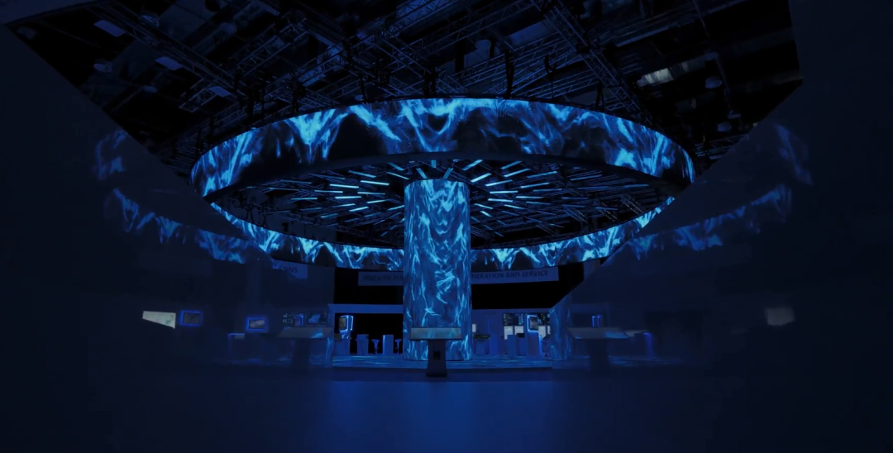

# NTT Docomo 致力于虚拟世界的未来

今年早些时候，日本运营商 NTT Docomo 表示有意扩大其元宇宙研发活动，成立了一家名为NTT Qonoq的全资子公司，据报道预算为 600 亿日元（4.12 亿美元），将开发硬件和扩展现实 (XR) 领域的软件产品。

Docomo 的首席执行官 Motoyuki Ii今年早些时候告诉《日经亚洲]》报纸，该运营商将在其消费者虚拟世界平台 XR World 已经开始的工作的基础上，在今年年底之前加强其虚拟世界的努力。 

现在，Qonoq 已经成立，旨在探索企业和消费者用例。它自 10 月 1 日开始运营，拥有约 200 名员工，专注于硬件和软件产品开发，并根据关于虚拟世界和数字孪生领域的使命声明为客户提供“专注于全球市场的服务和解决方案”。单位的网站。 

NTT Docomo 在其关于推出 Qonoq的公告]中指出，新部门将“通过使用 XR 开发各种服务和解决方案，进一步促进 Docomo '创造一个新的传播文化世界'的目标” 。

运营商企业元界发展的关键将是 NTT XR 已经完成的工作，NTT XR 是更广泛的 NTT 集团帝国内的一个相关部门，于今年 3 月下旬成立，“以支持在各种情况下客户运营的转型，包括制造、分销和零售，”NTT Docomo 表示。 

支持该研发的将是运营商的创新光和无线网络 (IOWN) 下一代网络开发，母公司 NTT 已经进行了数年，并且是NTT 集团 6G 努力的基础。

归根结底，Qonoq 团队的使命是为 NTT Docomo 开发新的商机，与世界各地的网络运营商同行一样，NTT Docomo 正在寻求从传统的连接服务中脱颖而出，为消费者和企业客户提供更广泛的数字服务. 根据一些行业观察家的说法，到本世纪末，虚拟宇宙彩虹尽头的金罐可能会很可观。 

企业部门被认为是为电信公司带来新的收入增长的关键，并且是行业高管认为电信公司可以通过其虚拟现实 (VR)、增强现实 (AR) 和混合现实 (MR) 应用程序产生最大影响的领域–看到B2B 是电信增长计划的核心，但 B2C 仍然是引擎室，发现报告和电信公司应该将他们的元界努力集中在企业部门 – Openet 首席执行官。

在建立 Qonoq 的过程中，NTT Docomo 加入了越来越多的电信公司，这些电信公司正在将资源投入到元宇宙的开发中，以期利用客户的未来需求并充分利用光纤宽带、5G 以及最终的 6G 将增强的连接性使能够。 

Telefónica 最近大力宣传其元宇宙，甚至在马德里举办了元宇宙日来分享其见解，而Orange 也一直在提升其 XR 游戏，德国电信与 SK Telecom 合作，将韩国运营商的元宇宙平台带到欧洲。

