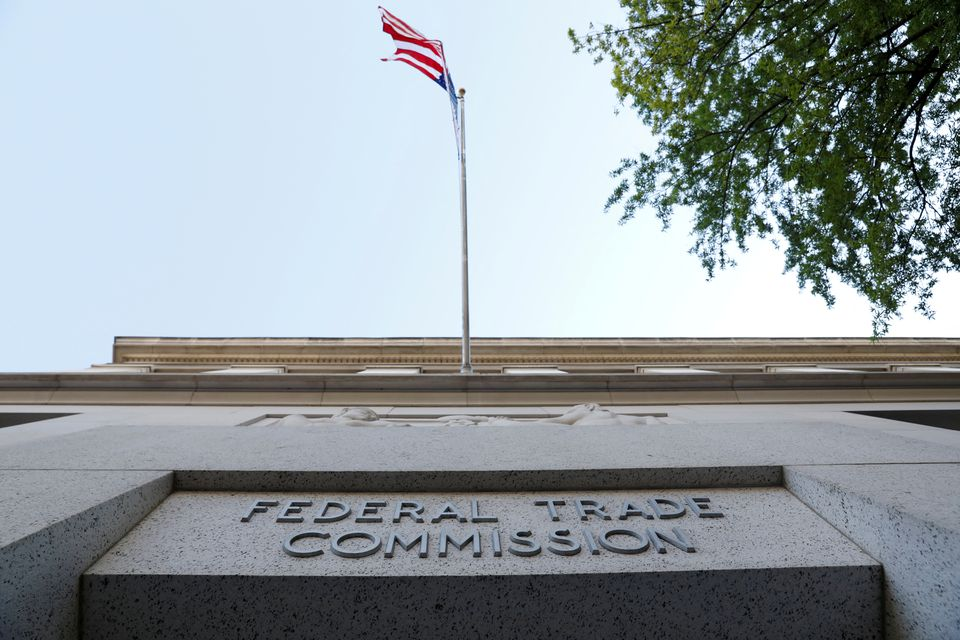

# Trustbusters 的元宇宙策略

纽约，10 月 10 日（路透社 Breakingviews）——马克·扎克伯格并不是唯一一个在虚拟世界中冒险的人。周五，联邦贸易委员会的反垄断机构减少了反对 Meta Platforms (META.O)收购虚拟现实应用程序制造商 Within 的论点。但即使在剩下的简化索赔中，联邦贸易委员会也很难做到。

由 Lina Khan 经营的代理机构放弃了最初的论点，即 Meta 的 Beat Saber 游戏直接与 Within 的 Supernatural 健身应用程序竞争。这总是一个奇怪的定义延伸，既将市场限制在虚拟现实的一小部分，同时又包括完全不同的应用程序。

2020 年 8 月 29 日，在美国华盛顿特区的联邦贸易委员会总部可以看到标牌。REUTERS/Andrew Kelly/File Photo

现在 FTC 声称该交易是反竞争的，因为它消除了 Meta 将引入的未来竞争的影响，如果 Meta 被迫开发而不是收购自己的健身产品。这类似于反对 2015 年灭菌公司 Steris 和 Synergy 合并的论点——联邦贸易委员会败诉。

对于执法者来说，这也是一个不舒服的转变。通常，合并各方声称假设的新进入者可能会改变局面。可汗领导下的联邦贸易委员会扩大反垄断行动已经面临挑战。采用通常由其敌人提出的论点可能会面临进一步的反击。（乔纳森吉尔福德）
