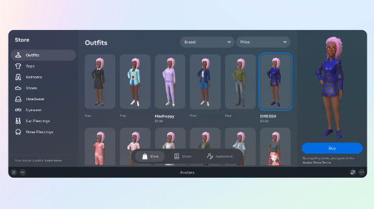

# Meta正在拼命地试图让metaverse发生

周二 Meta Connect 的明星是 Meta Quest Pro，该公司前身为 Facebook 的所谓“联盟状态”。Meta 最新的虚拟现实耳机售价高达 1,499.99 美元。与之前的版本 Meta Quest 2 相比，这是一个显着的价格跳跃，它可能是你的，价格为 399.99 美元——不是很便宜，但仍处于三位数的范围内。

价格上涨，再加上 Meta 在整个虚拟活动中坚持认为该公司将 Metaverse 设想为每个人都可以访问的“下一代社交平台”，感觉有点像是一个公然的矛盾。即使您是少数能够花一大笔钱购买虚拟现实耳机的幸运儿，您真的愿意吗？

这就是 Meta 似乎正在努力解决的问题。虽然头显价格上涨，但该公司几乎所有其他重大举措都针对一个共同而简单的基线：让虚拟世界成为人们真正想要使用的东西。 

Meta 的元宇宙并不完全是一帆风顺的一年。不到一年前，创始人马克扎克伯格重新命名了当时的 Facebook，以表明该公司正在转向他认为是我们数字生活的未来。从那以后，Meta 一直被打嗝和失误所困扰，其中包括一个被大肆宣传的扎克伯格化身被遗忘了，一份报告表明该公司的员工对虚拟世界缺乏热情，以及关于虚拟性侵犯的指控。

因此，它目前的策略似乎是发布一系列更新，看看什么可能引起人们的兴趣——如果你愿意的话，可以采用“把意大利面扔到墙上，看看有什么能坚持”的方法。 

除了 Meta Quest Pro，该公司还在活动中宣布，它将向移动和桌面用户开放 Meta 虚拟世界中的社交媒体平台 Horizon Worlds，因此没有耳机的人将能够访问虚拟世界.

这是一个值得注意的步骤：这是对 VR 头显并没有像公司希望的那样迅速起飞的默许。如果没有足够多的人了解元宇宙的感觉甚至是什么，Meta 就无法希望其产品被采用。以消费者喜欢的格式（他们的短信、浏览器、公司陷入困境的 Instagram 平台）开放其虚拟世界，让那些不愿意花 399.99 美元（更不用说 1,499.99 美元）的人们体验新世界的方式。

也让元宇宙成为一个难以推销的是作为一个漂浮的、没有腿的躯干的迷失方向的体验，而 Meta 宣布它不会再那样了。此前，Meta 的 CTO Andrew Bosworth 在 Instagram AMA 中表示，全身化身很难实现，特别是因为 VR 追踪通常来自某人现实生活中的眼睛和手。“准确地追踪自己的腿非常困难，仅从物理角度来看，现有耳机基本上是行不通的，”他在 2 月份表示。

但扎克伯格（或者更确切地说，他的长腿头像）在活动中宣布，该公司将使用人工智能来绘制虚拟世界中的腿，让头像不仅可以走路和跑步，还可以穿上数字服装。腿（扎克伯格表示他渴望参与的市场；我之前写过的游戏平台 Roblox目前在市场上占有相当大的份额）。这将是改善用户如何看待虚拟世界中的运动以及他们如何决定在那里代表自己的巨大一步。

但即使有腿，即使有能力在不戴耳机的情况下漫游虚拟世界，关键问题仍然存在：人们*真的*会购买 Meta 的虚拟世界吗？值得注意的是，即使是 Meta 的员工也对公司的愿景持怀疑态度，有人甚至说迄今为止在这些项目上花费的金额让他“恶心到了 [他\] 的胃”。

可通过网络链接访问的免费、可共享版本的元宇宙将向可能没有数百美元可烧的人打开以前封闭的世界，这是朝着使空间民主化的巨大举措。它可能会让人们相信 Meta 的说法，即与卡通版的老板交谈非常酷——而且更广泛地说，元宇宙确实是我们将在其上开展生活的下一个数字平面。 

但它也可能会做相反的事情：人们可能会跳上链接并发现即使在现在的浓郁状态下，元宇宙，呃，也没有腿。
