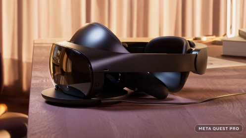

# 一个“开放、可互操作”的元宇宙“对每个人都更好”：Meta 的马克·扎克伯格

Meta CEO马克扎克伯格的头像。

去年 10 月，Facebook 和 Instagram 的更名母公司 Meta公布了其帮助构建未来沉浸式虚拟世界互联网的宏伟计划。从那以后，这家社交媒体巨头的股价已经下跌了 60%，增长停滞不前，元界的热度忽高忽低，在此过程中引起了强烈反响。

尽管如此，Meta 仍然专注于建立自己的愿景。今天，该公司在其年度Meta Connect 会议主题演讲中分享了其在元宇宙方面的最新进展，包括一款功能强大的新型虚拟现实 (VR) 耳机，作为迈向更奢华的在线世界和互动的另一个垫脚石。

一些Web3构建者担心 Meta 在构建元宇宙中的作用，期望社交媒体公司开发另一个“围墙花园”或封闭生态系统。但该公司已逐渐改变其信息，以提出不同的方法。今天，联合创始人兼首席执行官马克扎克伯格对开放元宇宙的潜力采取了迄今为止最坚定的立场。

扎克伯格谈到了过去计算时代开放和封闭生态系统的历史，并指出“封闭生态系统专注于严格控制和集成”，并且这些平台最终占据了大部分创造的价值。然而，当谈到元宇宙时，扎克伯格明确表示 Meta 重视一种不同的方法。

“我坚信，由许多不同的开发人员和公司构建的开放、可互操作的元宇宙将对每个人都更好，”他说。

诚然，这与明确表示 Facebook 的元宇宙将建立在区块链技术之上、与构建在以太坊和 Solana 等公共区块链平台上的 NFT 资产合作，或支持加密货币不同。但这承认 Meta 并没有将自己标榜为元节的唯一或主要构建者。

Meta 全球事务总裁尼克克莱格在 5 月发表的一篇文章中分享了类似的评论。扎克伯格当时在一次播客采访中也表示，他对虚拟世界中的互操作性持开放态度——但并未明确详细说明公司在这方面的计划。

今天，扎克伯格谈到了头像定制的互操作性，但这可能仅仅意味着服装和配饰可以转移到支持 Meta 头像技术的其他平台上，而不是与其他类型的基于 NFT 的头像自由使用。

在过去的几个月里，Meta 已经接受了来自以太坊、 Polygon]和Flow等领先平台的NFT 收藏品，推出了与 Facebook 和 Instagram 的集成，让用户可以向朋友和追随者展示他们拥有的 NFT 资产。在构建元界平台时，Meta 是否也会拥抱现有的 NFT 生态系统？

许多 Web3 构建者一直持怀疑态度。

去年，领先的虚拟世界投资者 Animoca Brands 的 Yat Siu 告诉*Decrypt*，Facebook 和腾讯等科技巨头对开放、可互操作的虚拟世界构成“威胁” ，该领域的其他公司也有类似的担忧。

扎克伯格今天的评论并没有明确表明 Meta 计划与 Web3 创作者携手并进并完全拥抱开源技术，但这是迄今为止最强烈的信号，表明 Facebook 公司正在尝试在其设计在线平台的方式上取得重大进展.

**Meta的最新动作**

在主题演讲的其他地方，Meta 发布了许多公告，表明在硬件和软件方面实现其元宇宙愿景的持续进展。

在硬件方面，Meta 展示了Quest Pro，这是一款功能更强大的独立 VR 头戴设备，主要面向商业用户和专业人士。与目前为消费者设计的 400 美元的 Meta Quest 2 耳机不同，Meta Quest Pro 的售价为 1,500 美元，并包含更多的图形功能，以提供强大的 VR 体验。

元任务专业版。图片：元

但它不仅仅是一个以 VR 为中心的耳机。混合现实设备还将支持增强现实体验，并可以将数字内容叠加在用户对现实世界的看法上。它使用更清晰的外部摄像头来启用该功能，此外它还集成了面向内的传感器来重新创建用户的面部表情并允许眼睛跟踪功能。

Meta 对 Metaverse 的影响不仅仅局限于硬件：该公司还在开发软件和基础设施，以便有朝一日推出其计划中的统一在线 3D 平台，专为工作、娱乐、社交、购物等而设计。

Meta 今天宣布，该公司目前的 Horizon Worlds VR 应用程序将扩展到网络，用户可以通过计算机或触摸设备加入。这可能标志着 Meta 计划将其当前的 VR 体验扩展到多平台世界，最终可能转变为与去年首次展示的演示相匹配的东西。

诚然，该公告是在一份报告发布之后发布的，该报告表明 Horizon Worlds存在严重的错误和质量问题，并且 Meta 自己的员工很少使用该平台。可能还有大量工作要做，不仅要改善体验，还要使其与其他设备兼容。

Meta 还在开发更详细的头像，可以在其应用程序中使用，包括 Horizon Worlds、Instagram 和 WhatsApp。到 2023 年，他们甚至会长腿。目前，Meta 的 Horizon Worlds 化身只是漂浮的躯干，但该公司正在开发基于预测算法生成数字腿的人工智能技术。

此外，Meta 宣布了科技巨头微软的主要新合作伙伴，该合作伙伴最初将在几个关键方面取得成果。

微软将为 Quest VR 平台带来 Windows、Teams、Office 和 Xbox Game Pass 的沉浸式版本，而 Meta 的头像系统将集成到 Teams 中。这种交叉兼容性可能预示着进一步的元宇宙行动即将到来。Meta 之前展示了 Metaverse 如何用于跨虚拟屏幕的协作远程工作。

尽管反对其萌芽的元宇宙努力，但从今天的演示文稿中可以清楚地看出 Meta 并没有退缩。在接受The Verge采访时，马克扎克伯格重申，这将是一个深思熟虑的投资和建设过程，将其描述为“长期旅程”，技术可能需要几年时间才能成熟。

事实上，Meta 还在主题演讲中调侃了一些针对虚拟世界的未来技术，包括通过智能手机扫描构建的逼真的 3D 化身，以及围绕细微手指运动构建的界面和控制系统。这些功能仍然是原型，可能最终不会集成到成品中。

Meta 的 Metaverse 计划可能还需要数年时间才能大规模完成，但今天的主题演讲提供了一些关于该技术的显着更新，并可能改变了围绕这家社交媒体公司的方法的基调。
