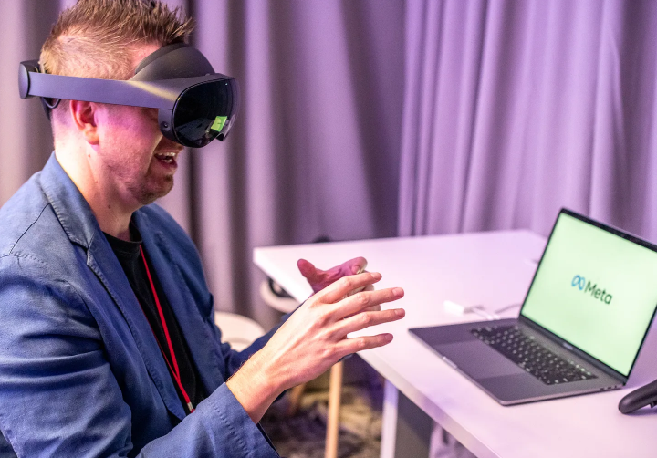

# Meta 的元宇宙变成 Pro

上周，我在位于伯林盖姆的 Facebook 办公室参加了 Horizon Workrooms 会议的演示。（元）

**一、演示**

上周一个阳光明媚的日子，我第一次访问了位于加利福尼亚州伯林盖姆的 Meta 园区，以体验该公司在构建元宇宙方面的最新进展。当天的重头戏，以及[今天上午在 Connect 大会上的主题演讲](https://www.facebook.com/RealityLabs/videos/3281891035412216)，是 Meta Quest Pro：[一款售价 1,499 美元的独立混合现实头戴设备](https://www.theverge.com/2022/10/11/23397328/meta-quest-pro-vr-headset-price-release-shipping)，将于 10 月 25 日发货，该公司希望它能激发专业人士和企业的新一波采用.

昨天我在这里写了关于[Meta 必须在 Connect 上证明的内容](https://www.platformer.news/p/what-meta-has-to-prove-at-connect)：metaverse 不仅正在发生，而且*正在发生，而且*Meta 比其他任何人都更能抓住即将到来的平台转变的好处。事实上，这是周二主题演讲的核心主题，首席执行官马克扎克伯格、首席技术官安德鲁“博兹”博斯沃思和其他高管谈到了他们已经取得的进展，并宣布了旨在表明 Quest 已经成为一项严肃业务的合作伙伴关系。设备。

高管们[谈到了](https://www.platformer.news/p/what-meta-has-to-prove-at-connect)迄今为止在 Quest 商店内的游戏和应用程序上花费的 15 亿美元。销售额超过 100 万美元的 400 部图书；收入超过 1000 万美元的 33 部作品。扎克伯格和他的同事在公司总部周围进行了一系列高跷、索金式的散步和谈话。惊叹于虚拟现实提高人们工作效率的各种方式。

一些观察者[发现演讲令人汗流浃背且霸道](https://techcrunch.com/2022/10/11/its-painful-how-hellbent-mark-zuckerberg-is-on-convincing-us-that-vr-is-a-thing/)；至少，它缺乏我们现在从 Apple 甚至 Snap 的虚拟简报中所期望的润色。但该公司确实有自己的动力：迄今为止，Quest 2 的销量估计超过 1500 万台，使其成为最受欢迎的 VR 控制台，并且可以说（正如扎克伯格所说）是该领域的第一款主流设备。尽管苹果明年可能进入该领域无疑会挑战 Meta 的领导地位，但与此同时，该公司在创新方面拥有坚实的主张。

在 Burlingame，我在 Quest Pro 上花了两个小时，在开发人员的帮助下进行了一系列演示，让该设备完成了它的步伐。在一个名为 Tribe XR 的应用程序中，一位音乐家远程指导我如何操作专业的 DJ 控制台。在另一个名为 Wooorld 的项目中，我探索了世界的虚拟地图，让我能够传送到这些空间的摄影娱乐中：一种体现的谷歌街景，并内置了一个你现在在哪里的测验游戏。

作为 Quest 2 的老用户，我发现它很挑剔且不合适，Meta 对 Pro 所做的改进立即显而易见。将设备的电池放在后面意味着它可以更好地平衡头部；使用各种刻度盘调整适合度，以获得更好的观看效果。彻底改进的显示屏也是如此，它提供了比 Quest 2 更亮的颜色和更锐利的边缘。

新的控制器也给我留下了深刻的印象，它提供了卓越的触觉反馈，将设备变成了出色的虚拟画笔、铅笔和魔法标记。在演示其 Workrooms 会议软件时，一位 Meta 员工让我站在虚拟白板上画画。我在半空中涂鸦，但视觉和触觉系统的结合让我觉得我在与什么东西接触，这种超现实感在我离开校园很久之后就一直萦绕在我的脑海里。

我最喜欢的演示绝对是最愚蠢的——一个简单的沙盒，让你可以在房间里扔东西、扔飞镖、射击目标和玩其他简单的游戏。它旨在展示 Pro 可以捕捉到的精细动作——我（糟糕地）玩了一个类似[Jenga](https://www.jenga.com/)的游戏，让我通过非常小心地移动我的手指来从堆叠中移除积木。但我记得它是因为它让我感觉，短暂而美妙，就像一个蹒跚学步的孩子，在虚拟空间中碰撞，在我身后留下一串数字碎片，直到是时候继续下一个演示了。

风险最高的演示，也是我上周尝试的第一个演示，是生产力应用程序：Workrooms，它可以让同事在 VR 中见面。（那些没有耳机的人可以通过 Zoom 加入。）坐在真实的物理办公桌前，我打开了一个虚拟桌面：一个带有三个显示器的桌面，比我在现实生活中的显示器大得多。我使用 Quest 的应用程序切换器启动了 Workrooms，并与一对 Meta 员工进行了简短的会面。

如果您愿意，Quest Pro 可以跟踪您的面部动作，结果是更具表现力的虚拟会议。Meta 员工对我微笑，点了点头；有一次，为了证明他可以，他对我使了个眼色。扎克伯格几年来一直在说 VR 的杀手级应用是它可以创造的存在感，但直到现在我觉得这还很有限。增加的表现力感觉像是向前迈出了一步。

我对虚拟桌面印象不深。一方面，在 VR 中使用网络浏览器令人印象深刻，这仅仅是因为这些巨大的虚拟显示器提供了巨大的空间。但是，虽然该设备的视觉清晰度得到了很大改善，但 Pro 不会是我阅读网站的前五种方式之一。它有效，但还不足以取代我的笔记本电脑甚至我的手机。

回顾她自己的经历，我的*Verge*同事 Adi Robertson 称 Pro “[一个非常复杂的开发套件，更适合测试下一代技术而不是满足特定需求](https://www.theverge.com/23393115/meta-quest-pro-vr-headset-hands-on-specs-price)”，我或多或少地落在了同一个地方。我喜欢我测试的设备的各个方面，我非常想花更多的时间在它上面。

在开发人员有一两年的时间来*构建*它之后尤其如此：例如，利用设备上的彩色视频直通来实现混合现实体验，或者只是玩*钢铁侠 VR*游戏公司周二展示。我不认为该公司会以 1,499 美元的价格出售所有这些东西，但我确实认为它推动了行业向前发展，而且它从第一家看到的好处可能会随着时间的推移而增加。

关于 VR 的一件事是，我在使用它后通常感觉不太好：不恶心，确切地说，但类似于我在颠簸的汽车后面看书时的感觉。我在几个小时内就摆脱了这种感觉，但每当我试图想象虚拟世界中的生活时，那种感觉的记忆都会让我停下来。

**二、博兹**

演示结束后，我走过几座大楼，在 Meta CTO Andrew Bosworth 的巨大会议室里与他会面。我想知道 Pro 是为谁准备的，Meta 时机是否正确，以及这一刻对公司的*感受*：它可能面临着自著名的艰难 IPO 以来对其业务的最大挑战，实现其在混合现实领域的雄心可能决定公司的未来。

我们谈话的重点如下；为了清晰和长度，这次采访已经过编辑。

**凯西牛顿：我非常积极地使用了我的 Quest 2 一两个月，但把它放在一边。我听说这种经历并不少见。你觉得 VR 找到了它的杀手级应用了吗？还是在路线图上仍然领先？**

**Andrew “Boz” Bosworth** ：我认为对于习惯于覆盖笔记本电脑或手机的人来说，这与今天的设备不同。它可能具有更类似于游戏机的使用特性，后者往往是内容驱动的。如果您是游戏玩家，那么您对设备的使用确实会根据内容进行索引：设备本身不是抽奖，而是设备上的内容。

因此，您在过去几年中看到我们所做的事情，而 Quest Pro 是朝这个方向迈出的又一步，它正在增加更多理由让该设备对您有所帮助。这增加了它为消费者带来的价值，并随着时间的推移推动我们成为一个更通用的计算平台。这不会在一夜之间发生。尤其是对于像虚拟现实这样非常新颖的东西，相对于这些 2D 屏幕，它们有点相互渗透。

我们对用户群的参与度和保留率感到非常满意。我们手上有一个参与的保持性产品。但我们希望为他们释放更多价值。

**让我们谈谈在公司的这一刻。这是您最大、最昂贵的赌注。你必须发明一堆新东西。你已经找到了一个早期的市场，但你需要把它做得更大。**

**而且你基本上经历过这家公司的每一场战斗。那么，这是不是感觉最艰难的时刻？**

它当然站在时代的万神殿中。你知道，2008 年对每个人来说都是艰难的一年——那是最后一次重大衰退。当时我们还是一家需要融资的私人公司。所以2008年在很多方面都是艰难的一年。那时，我们面临着非常激烈的竞争。然后 2012 年，[转向移动](https://www.businessinsider.com/facebook-mobile-shift-2011-11)和 IPO，是非常艰难的一年。这是在那些东西的万神殿中。

我总是试图抵制那种感觉我们生活的时代特别特别的冲动。我认为这是一种非常以自我为中心的放纵，我们很多人都逃脱了。就像，衰退发生了，它们以大约每十年一次的节奏发生。自上一次以来我们已经有 14 年了，所以它可能比那长一点。但是，它们仍然会发生，你知道它们会发生，当它们发生时它们会很烦人。它们影响每个人。它们确实影响到每个行业的每个行业的每个人。所以从宏观经济的角度来看，你在这方面并不是独一无二的。

然后在我们自己的行业中，没有人真正知道如何应对大流行以及随之而来的经济，因为这些都在消退。所以我们都在同一条船上。我们有一些独特的挑战——显然是超级有才华的竞争对手，[ATT ](https://www.cnbc.com/2022/02/02/facebook-says-apple-ios-privacy-change-will-cost-10-billion-this-year.html)，所以我们遇到了这种对我们来说相对独特的逆风，或者至少对我们的科技行业来说。但即便如此，你也会有竞争，你会改变政策。所以这肯定是一个艰难的时期。在这个世界上并没有感觉特别艰难，相对于我的职业生涯也没有特别艰难。但这是一个挑战，你知道，这就是工作。

**我想我基本上同意你们所有的观点，即增强现实和虚拟现实，如果可以完善，可以吸引大量观众。但是还有很多东西要发明。在科技领域，时机就是一切。你觉得你的时机对吗？**

正如我所说，对于虚拟现实，我们知道这将是一件真实的事情。这将是一件大事。而且它不会是单调的。它不会都是线性的。

但我们已经过了曲线的拐角处。那么它有多陡峭？我们不知道。需要多少年？我们不知道。但它就在那里。

我们知道（VR）已经足够好了。我们知道它可以解决人们遇到的实际问题，而且我们拥有的路线图非常令人兴奋。那里的未来非常非常美好。

增强现实是一个问题，什么时候足够好？你看的是什么时候的 Palm Pilot 或 Treo，什么时候是 iPhone？所以这就是我们所有人都必须投入的严谨性。这是一个竞争非常激烈的领域，很多人都在投资。

它仍然很远，但每年都在继续显示我们离我们更近了一年。这是一个有吸引力的概念。有时技术感觉就像“嘿，无论过去多久，它总是一样的距离。” 这不是我们在 AR 中发生的事情。每一年，我们都感觉离我们更近了一年。
