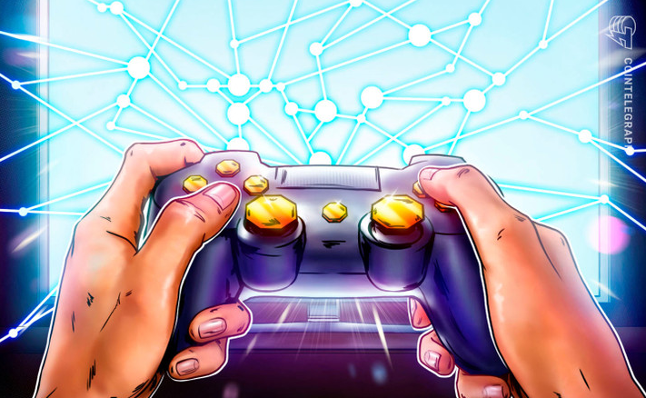

# GameFi 将成为 Metaverse 的入职点 — Animoca Brands CEO

2000 亿美元的游戏产业正迅速成为 Web2 和 Web3 之间交互的关键点。最近，越来越多的游戏公司集成了数字钱包支持和基于不可替代令牌 (NFT) 的奖励系统，甚至推出了自己的元界。

GameFi 在 Web3 经济中日益突出，使得 Animoca Brands 等公司相信它将成为 Metaverse 的入门点。在 TDefi 首席执行官 Gaurav Dubey 主持的未来区块链峰会炉边聊天中，Animoca Brands 联合创始人 Yat Siu 表示，其重点是游戏行业，因为它比任何其他行业都更接近元宇宙。他指出，GameFi 将成为“元界的入门点，并向人们介绍数字所有权。”

Siu 指出，目前，价值 2000 亿美元的游戏生态系统中的很大一部分并不面向游戏玩家甚至游戏公司，而是主要面向 Facebook 和 Apple 等推广者和广告商。他补充说，Web3 的出现可能会结束这种垄断，并将权力带回游戏玩家和游戏公司。

> “游戏行业产生的价值中有一半以上流向了苹果、Facebook 和谷歌。其中有多少可以追溯到游戏行业？零。这是今天的问题，它使生态系统变得不健康。”

Siu 指出，元界不会是一个单一的或中心实体，而是几个元界的组合。他说，元界将是“新经济的建设，完全是关于数字所有权。” 他进一步解释说：

> “对我们来说，元宇宙是一个完整的经济体。我们不想用 PNL 来衡量这些公司的未来，我们想用 GDP 来衡量它。就像我们不能通过它产生多少气体来定义以太坊的价值，而是通过它作为一个整体的效用来定义它一样，同样地，元宇宙是一幅完美的画面。所以，从主题上讲，它是一个元节。但实际上，是 itu2019 的数字所有权。”

Animoca Brands 是一家总部位于香港的游戏软件公司和风险投资公司，在元界项目上进行了大量投资。今年 7 月初，该公司筹集了 7800 万美元来推进其“开放虚拟世界”概念。

