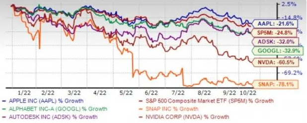

# 从蓬勃发展的元宇宙空间中获益的 5 只股票

以大流行为主导的社会转型已将数字化确立为新常态。冠状病毒的爆发迅速改变了人们的生活方式和注意事项。不完全习惯于数字平台进行办公室工作（在家工作）、订购食物和其他日常需求、转账和付款的人们现在完全适应了这些活动。

2020 年，UNCTAD 报告说：“冠状病毒大流行带来的全球危机已将我们进一步推向数字世界，当经济开始回暖时，行为的改变可能会产生持久的影响。未来将比数字化更多过去。这将为人工智能的发展和网络空间活动提供主要动力。”

### 元界——最新的出现

数字化空间的最新出现是元节。简而言之，元界意味着一个互动和协作的虚拟世界。数字空间由虚拟和增强现实的使用提供支持。

据彭博社估计，元界的市场机会预计将从 2020 年的 5000 亿美元到 2024 年达到 8000 亿美元。在线游戏制造商和游戏硬件的主要市场可能在 2024 年突破 4000 亿美元，而其余业务将来自直播娱乐和社交媒体。游戏、AR 和 VR 为虚拟世界创造了 4130 亿美元的主要市场。

根据 Verified Market Research 援引美通社的一篇文章，从 2020 年的 272.1 亿美元到 2030 年，虚拟现实市场规模预计将达到 8245.3 亿美元。从 2022 年到 2030 年，该市场的复合年增长率预计将达到 39.1%。

### 值得关注的股票

我们将搜索范围缩小到有可能成为元界领域主要参与者的五只股票。

**NVIDIA Corp.** NVDA 受益于 GeForce 台式机和笔记本电脑图形处理器 (GPU) 的强劲增长，这推动了游戏收入的增长。NVDA 最先进的 GPU 很可能在元界开发中发挥重要作用。NVIDIA 收购 Mellanox 是这方面的关键催化剂。

NVIDIA Omniverse Enterprise 平台是一个端到端的协作和模拟平台，它从根本上改变了 3D 空间中的复杂设计工作流程。这个虚拟内容创作平台使设计师、创作者和工程师能够轻松地在数字空间中分享他们的材料。

Zacks 排名第三（持有） NVDA 预计本年度（截至 2023 年 1 月）的收入增长率为 2%，明年为 14.4%。Zacks 对本年度和明年收益的共识估计在过去 30 天内分别提高了 1.2% 和 0.4%。

**字母公司** GOOGL 在蓬勃发展的云计算市场中发展迅速。GOOGL 的云产品包括谷歌云平台和谷歌工作空间，它们在蓬勃发展的云计算市场中获得了动力。

此外，Alphabet 在基础设施、安全、数据管理、分析和人工智能方面不断增长的投资仍然是元界领域的主要发展。GOOGL 为加强其在蓬勃发展的可穿戴领域的影响力而做出的不断努力仍然值得注意。

Zacks 排名第三的 Alphabet 预计今年的收入增长率为 11.6%，明年为 10%。Zacks 对本年度和明年收益的共识估计在过去 30 天内分别提高了 0.2% 和 0.2%。

**Apple Inc.** AAPL 鼓励开发人员在他们的应用程序中使用人工智能和机器学习。AAPL 对自动驾驶汽车和增强现实/虚拟现实技术的关注为长期增长提供了机会。

为了加大力度，Apple 已经收购了几家在 AR 硬件、3D 游戏和 VR 软件方面拥有专长的小型公司。其中包括 SensoMotoric、Flyby Media、Emotient、TupleJump、Turi、Metaio、PrimeSense 和 Lattice Data Inc。此外，AAPL 的 ARKit 正在帮助第三方开发人员为其 iOS 平台创建 AR 体验。

Zacks 排名第三的苹果公司预计本年度（截至 2023 年 9 月）的收入和每股收益增长率分别为 4.5% 和 6.2%。AAPL 在过去四个报告季度中的每一个季度都取得了超出预期的收益。

**Snap Inc.** SNAP 继续专注于通过其 Spectacle 智能眼镜开发 AR 硬件。该公司的 AR 镜头的采用率一直很高，尤其是在 Lens Studio 2 推出之后。2020 年底，Snap 合作推出了其首款支持 5G 的 Landmarker Lens（一种在世界上叠加 AR 的新工具）与威瑞森。Lens 使用 SNAP 的增强现实技术和 Verizon 的 5G 超宽带功能。

Scan 和 AR Bar 等产品的稳固采用正在推动基于 AR 的镜头的使用，为 SNAP 提供了重要的增长机会。此外，Local Lenses 的推出可在全球范围内实现共享和持久的 AR 体验，预计将有助于用户参与。

Snap 在其产品组合中添加了由实时机器学习提供支持的卡通镜头。此外，Lens Explorer 和 Dynamic Lenses 中音乐镜头的推出，允许开发人员将实时信息从他们的应用程序带入 Snapchat Lenses，这是一个关键的催化剂。

SNAP 预计今年的收入增长率为 13.8%，明年为 15.7%。Zacks 对本年度和明年收益的共识估计在过去 30 天内分别提高了 66.7% 和 20%。Snap 的 Zacks 排名第二（买入）。您可以**在此处查看今天 Zacks #1 Rank (Strong Buy) 股票的完整列表**。

**Autodesk Inc.**的 ADSK 业务从永久许可过渡到基于云的订阅服务预计将使其长期受益。ADSK 通过其全面的产品组合充分利用了计算机辅助设计和制造的快速采用。

对 Autodesk 基于云的产品（BIM 360 云平台、Shotgun 和 Fusion Lifecycle）、移动产品 (AutoCAD 360) 和设计套件的更高需求将推动收入增长。ADSK 还受益于其对数字基础设施的投资，其中包括其电子商店。

Zacks 排名第三的 Autodesk 预计本年度（截至 2023 年 1 月）的收入和每股收益增长率分别为 14.3% 和 30.2%。Zacks 对本年度的共识估计在过去 60 天内提高了 1.5%。

下图显示了上述五只股票年初至今的价格表现。

Zacks 投资研究
