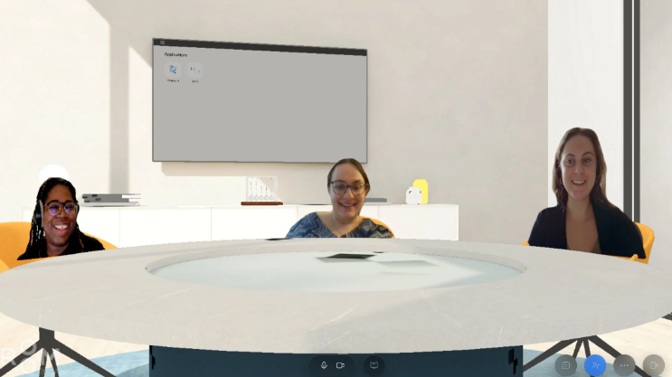
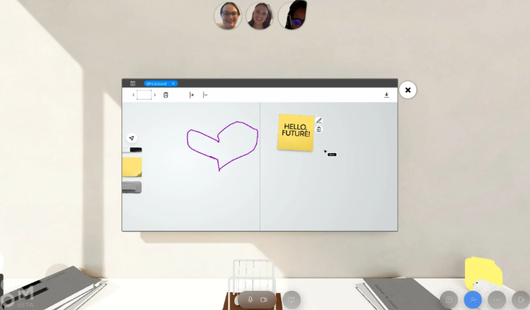

# “Room”提供了一种非 Facebook 方式来连接元界中的同事

既然虚拟会议在工作场所文化中得到了牢固的巩固，科技公司并没有止步于Zoom和Google Meet。

新产品已经在重塑典型的视频会议界面，每个参与者都在网格中占据自己的方格。Room，由电子游戏开发商 Crytek 的前 CEO Cevat Yerli 创建的新产品，就是其中之一。

“由于最近企业互动的快速虚拟化，我们已经将自己推向了这些二维的平面空间，”耶利在一份声明中说。

“Room 旨在鼓励人们在鼓舞人心的 3D 虚拟会议中进行互动，并最终支持和增强独特的文化规范。不是作为真实事物的替代品，而是作为次优选择。”

房间使用普通电脑摄像头（无需VR 耳机）将参与者置于三维环境中。这种体验利用了一项名为RealityOS的专利游戏模拟技术，该技术将摄像机的实时信息叠加在 3D“房间”上。

Room 目前有两种订阅类型：基本计划和创始人计划——该公司计划添加两个更高级的专业和企业计划。

基本计划是免费的，它提供三个房间，您可以在其中与四个人（三个加上一个主持人）举行长达 60 分钟的会议。创始人计划每月收费 6 美元，允许您在 17 间房间中进行选择，其中 17 人可以聚集长达 24 小时。你甚至可以有一个虚拟的过夜。

基本计划的Beta 版体验现已推出。用户可以邀请朋友和同事在会议室、壁炉或广播演播室周围会面。

我们在 PCMag 上试用了测试版。我们选择了会议室，并在不同的椅子上单击以“坐在其中”。我们使用笔记本电脑上的箭头键扫描“房间”。从视觉上看，它并没有让我们大吃一惊，但我们玩得很开心，这是一种与同事互动的新方式。这正是产品的意图。

PCMag 工作人员 Kim Key、Jackie Goldblatt 和 Emily Dreibelbis 坐在一个房间里。

我们测试了虚拟白板功能以及聊天功能，第一次尝试就可以正常使用。令我们惊讶（和高兴）的是，我们甚至可以通过点击它来让珠子在桌子上的牛顿摇篮装饰上左右摇摆。

我们画了一颗心，并在虚拟白板上贴了一张虚拟便利贴。

“我们认为数字空间应该由现实生活塑造，并以人的存在为特征，而不是匿名化身，”Yerli 说。

马克扎克伯格也表达了这种观点，他已投资超过 100 亿美元在他的公司 Meta（前身为 Facebook）下建立元宇宙。8 月，他在类似游戏的虚拟世界环境中发布了一张他的化身自拍照（阅读：类固醇上的模拟人生或第二人生），被嘲笑为过于简单和低质量。

但在最近一次出现在 Joe Rogan 播客上时，扎克伯格概述了他的愿景，即让虚拟世界尽可能逼真。这包括允许人们以全息图的形式在工作中“出现”，这似乎是 Room 所追求的路线，而不是动画化身。
