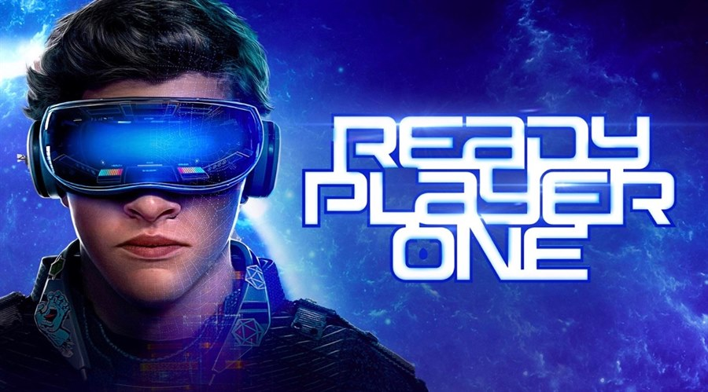

# 达到“Ready Player One”元宇宙的唯一方法是使用 NFT

通过“Ready Player One”小说和电影，全球对元宇宙的兴趣得到了显着提升。它创造了一个虚拟世界，现实生活和虚拟生活无缝融合。在我们的现实世界中实现这样的乌托邦似乎是不可能的，尽管这不一定是正确的。

### **“Ready Player One”大受欢迎**

人的思想总是会徘徊和好奇。为了放松，人类可以将他们的思想指向一个幻想或虚拟世界，在那里他们可以忘记和忽略当前的尘世任务和责任。通过各种娱乐方式实现“梦想状态”是可能的。热门选项包括电影和电视节目、视频游戏、书籍、VR/AR/XR 技术等。

书和电影《[Ready Player One](https://en.wikipedia.org/wiki/Ready_Player_One)》更让人们关注这样的叙事。虽然有些人公开怀疑人类生活是否是一种模拟，但另一些人则愿意完全拥抱虚拟世界。在书/电影中，虚拟世界是一种被称为 OASIS 的模拟。它对任何进入的人都有重大影响，因为在虚拟世界中消亡意味着他们的“角色”永远消失了。它类似于 RPG 中的硬核游戏玩法，但会抹去一个人的整个在线角色。

突出的一件事是 OASIS 的身临其境的性质。这与戴上 VR 头显仍然能够看到或听到周围环境不同。相反，它是一种完全的身心沉浸，这是我们目前的技术还无法实现的。流行的动漫《刀剑神域》中也出现了类似的场景，尽管这更进一步。
