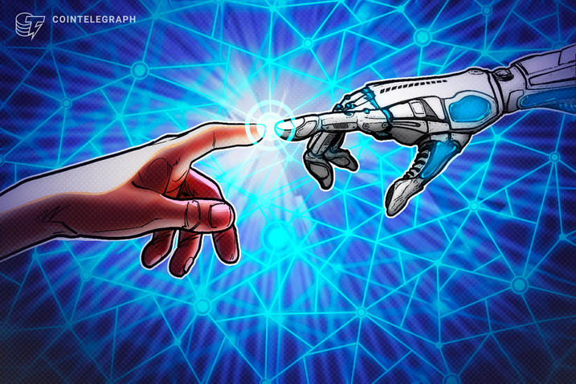

# Al tech 旨在让创作者可以使用元宇宙设计

Mona Metaverse 推出了一款支持 AI 的材质创建器，用于高级创意和个性化的 Metaverse 设计。

人工智能 (AI) 是许多 Web3 活动的支柱。从[不可替代的令牌 (NFT)](https://cointelegraph.com/nonfungible-tokens-for-beginners/what-are-nfts-and-why-are-they-revolutionizing-the-art-world)创建到欺诈检测，它是构成去中心化技术的根源不可或缺的一部分。 

总部位于迈阿密的 3D 虚拟世界开发和 Web3 社交平台 Mona 推出了用于材料设计的 AI 驱动的 3D 生成器。该工具允许平台上的设计师和创作者将文字输入人工智能机制，为他们的个性化数字空间创建材料。

MonaAI 材质生成器类似于 AI 图像和设计生成器 DALL-E。然而，它特别关注在虚拟世界设置中使用的“无缝”和逼真的纹理。据 Mona 称，目前，超过 4,500 名设计师正在使用该平台，他们将可以使用该工具。

Mona 联合创始人兼首席执行官贾斯汀梅利洛告诉 Cointelegraph，人工智能正变得越来越容易被创作者和元界开发者所接受。尤其是像前面提到的 DALL-E 和现在的 Mona 的 3D 材料设计师这样的工具，已经消除了更多的入口障碍。

> “明年的目标是让更多创作者更容易使用这些工具。”

然而，人工智能怀疑论者总是担心自动化系统会取代人类的创造力。Melillo 说，在设计和人工智能辅助工具的情况下，它们使数字世界中的建筑更容易获得，特别是对于新手来说。

> “总的来说，人工智能应该被视为艺术家帮助放大作品的工具，而不是取代它。人类的创造力是无可替代的。”

在外观设计用例之外，人工智能开始在其他元界设计策略中实施。此类示例包括其用于解决人口不足问题以及为个人用户创建独特的可玩场景。 

MonaAI 材料生成器是一种人工智能驱动的机制，可在数字世界中实现高质量的独特性。

无论当前的质量如何，Melillo 都表示 AI 是一种工具，将有助于永久采用 Web3。 

> “通过使创建过程更容易访问的工具，我们可以通过他们通过区块链创建和共享的工作让更多用户加入 Web3。”

他说，人工智能在 Web3 和元界的发展中扮演着“关键角色”，并将两者推向未来。
