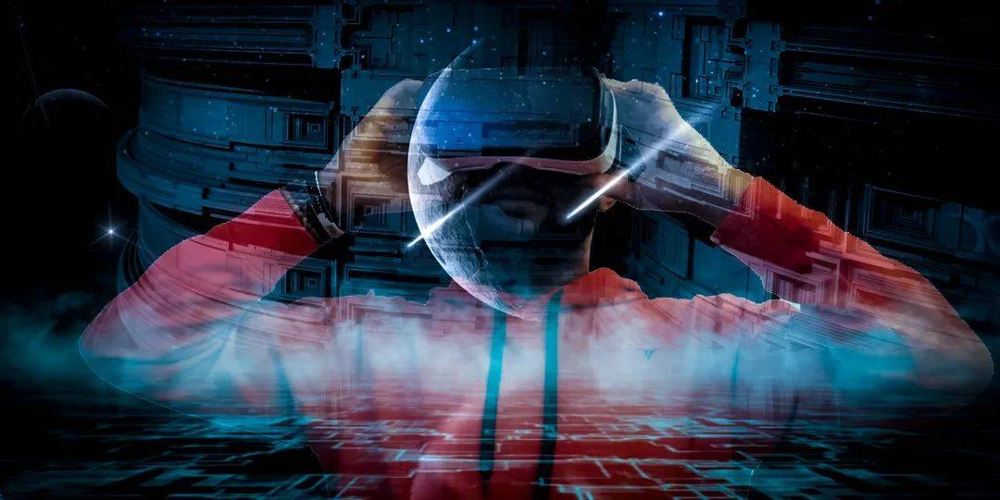

# 通过冒险进入元界来增加您的在线品牌价值

创新对于愿意摆脱竞争并拥抱创造力的品牌来说至关重要。企业开始看到[NFT](https://www.entrepreneur.com/money-finance/heres-a-beginners-guide-to-crypto-nfts-and-the-metaverse/426944)的实用性——具有唯一 ID 的数字产品。将 NFT 整合到其品牌战略中的企业应考虑与NFT创建者合作、将活动标记化、将实体产品转变为 NFT、许可和举办 NFT 竞赛和赠品。Zipline调查结果表明，84% 的 X 一代、70% 的千禧一代和 63% 的 Z 一代会对他们喜欢的品牌的 NFT 感兴趣。

NFT 允许品牌为数字产品赋予价值；但是，产品必须对消费者有价值。Gucci等品牌创造了 NFT 服装，耐克提供虚拟化身可以在虚拟世界中使用的数字运动鞋。NFT 的新兴使用现在允许品牌融合数字世界和物理世界；消费者可以购买或赢得图像或视频等数字产品，然后企业可以提供实体品牌产品来完成营销循环。企业可以自行设计 NFT，也可以利用专门从事 NFT 创建和 NFT 平台的公司。NFT 是品牌与消费者建立联系和发展品牌的可行选择认出。投资使用预制 NFT 平台的品牌更有可能在市场上获得收益。

**设计交互式虚拟店面**

过去，客户访问网站或应用程序以访问企业提供的产品。随着技术的进步，品牌可以为客户创造更加身临其境的体验。客户可能会访问虚拟店面，例如耐克创建的店面，而不仅仅是看产品。在 Metaverse 中，客户可以通过使用虚拟形象试穿服装和其他产品来与数字产品互动。应该探索品牌将客户体验从平淡无奇的网站访问提升为丰富而身临其境的体验的前景。

埃森哲的一项消费者调查表明，64% 的受访者进行了虚拟购买，83% 的受访者愿意通过虚拟世界进行购买。

模拟传统店内购物体验的便利性和效率的品牌更有可能保持客户的注意力。一旦决定在 Metaverse 中开设店面，企业必须决定使用哪个 Metaverse 平台。有知名平台，但品牌应考虑建立自己的平台以获得更多控制权。店面的设计可以是独立的应用程序或虚拟空间。多媒体公司可以帮助品牌创建和设计交互层，定义店面的功能以及与第三方工具集成的能力。客户可以使用虚拟护目镜、触觉手套、智能眼镜和 VR 耳机等可穿戴设备获得 3D 体验。

**创建虚拟事件**

虚拟聚会的兴起要归功于Zoom的热潮，品牌可以通过举办定制品牌的虚拟活动来利用这一变化。身临其境的虚拟体验可以为想要超越地理界限的品牌吸引新的商业客户。虚拟活动的类型和结构仅受创意水平的限制，并允许无限定制。品牌可能会与影响者合作，甚至创建自己的虚拟影响者。

企业可以举办从移动设备或笔记本电脑访问的实时或预先录制的活动。虽然需要[VR](https://www.entrepreneur.com/en-ae/technology/why-now-is-the-time-to-start-your-virtual-reality-business/369414)护目镜或耳机的 3D 活动是可能的，但它们现在并不那么流行。

艺人是利用元宇宙吸引客户参与现场音乐、喜剧表演和其他社交活动的最大群体之一。虚拟活动参与者可以使用化身出现在虚拟世界中，让他们在聆听自己喜欢的艺术家的同时与他人共舞。Roblox利用虚拟世界的创新技术，超过 3300 万观众参加了其虚拟音乐会活动。包括《堡垒之夜》在内的游戏市场已成功利用 VR 游戏在客户互动过程中推广产品，展示了虚拟品牌的力量。

虚拟参展商可以像传统会议厅活动一样创建逼真的互动。企业可以利用品牌展位展示各种内容，但高质量的作品是关键。品牌可以使用虚拟代币、徽章、头像升级和数字赠品将粉丝转化为客户。Metaverse 提供了与参与者进行更多互动的机会。品牌必须做出有针对性的决策，以确保潜在客户是活动的一部分，而不仅仅是观众。

**启动你自己的元节**

在虚拟平台上占有一席之地固然好，但拥有自己的平台更好。品牌应该考虑创建自己的虚拟平台。尽管最初看起来可能存在财务风险，但提供品牌化和有针对性的客户互动的能力只会改善消费者体验。希望成功进入 Metaverse 的企业应准备市场分析，以确保项目能够满足客户的需求并在竞争中脱颖而出。一些公司甚至提供创建自己的安全智能合约、NFT 市场等的能力。
