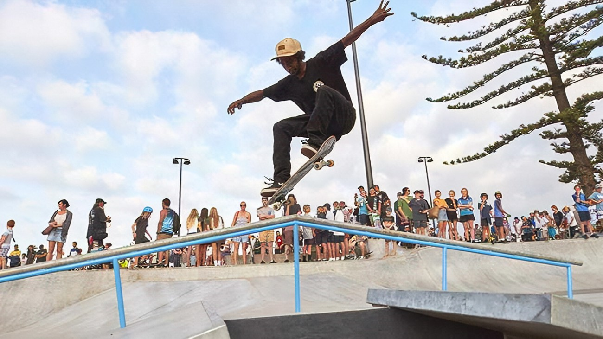

# 第二季：滑板公园即将来到元界

新加坡，新加坡，2022 年 10 月 14 日 (GLOBE NEWSWIRE) -- 首个基于币安智能链构建的多平台虚拟现实 Metaverser 推出其第二季“滑板公园”，并将于 10 月向所有人公开2022 年 15 月 15 日，欧洲中部时间下午 6 点。本赛季包括 Metaverse 中的第一个滑板公园，其中包含用于游戏赚钱计划的史诗任务。

Metaverser 是一个虚拟世界，任何人都可以在其 Metaverse 中玩得开心并赚取收入。该平台建立在最现代的标准之上，利用 NFT 和平台的原生可替代代币。因此，玩家可以与来自世界各地的人们竞争、挑战和社交。

**仔细看看第二季**

Metaverser 正在寻求通过推出其最新的游戏化添加“滑板公园”来扩大其游戏赚钱活动。第二季的特色是每个人都可以使用的滑板公园，提供各种游戏来赢取奖品、最新的 NFT 新增“RollerSkate NFT”和比赛。Metaverser 旨在为想要在虚拟环境中花费更多时间并同时获得乐趣的玩家提供额外的激励。

**如何进入滑板公园并从中受益**

Metaverser 的旱冰鞋 NFT 总供应量为 1,111，价格为 9,000 美元 BABA，并希望在不久的将来增加其他类型的冰鞋。只有拥有rollerSkate NFT 的玩家才能进入公园并享受其好处。通过购买专属的轮滑 NFT，您将能够在整个游戏过程中获得更快的速度，只需佩戴 NFT。此外，玩家必须完成最新添加的挑战，才能赚取更多的 $BABA。

**参加社交媒体竞赛**

Metaverser 通过全年参与其社交竞赛为其社区提供赢得 NFT、$BABA、$MTVT 等的机会。每周末都会有社交周赛活动，会员可以在Metaverser的社交媒体平台上参与。完成所有活动，获得更多获胜机会！

**关于 Metaverser**

Metaverser 是第一个多平台虚拟世界，让用户可以在其元世界中玩得开心，并从不同的游戏中赚取$BABA、$MTVT 和$GBEX的收入。Metaverser 是根据大多数现代标准开发的，以利用 NFT 和平台的原生可替代代币。Metaverser 的玩家可以与来自世界各地的人们竞争、挑战和社交。Metaverser 背后的驱动力是它的目标是通过为每个人（无论其属性或种族）提供一个场所，让他们聚在一起享受乐趣，从而使虚拟世界更加真实。Metaverser 的代币 $MTVT 现已在Bitmart和Pancakeswap上架。
