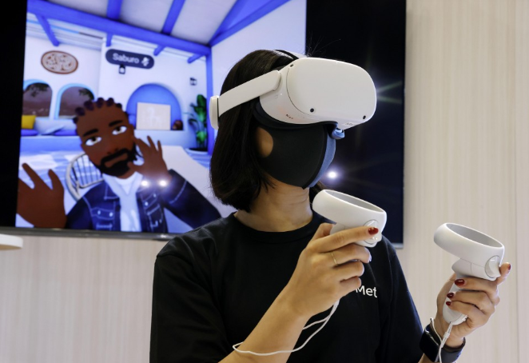

# 日本年度科技展上展出的元界商业工具

来自日本和国外的公司在周一向媒体开放的日本主要电子展上展示了与元界相关的下一代商业工具——一个人们可以在其中工作、购物和社交的虚拟世界。

由于冠状病毒大流行，该年度展会将于周二至周五在东京附近的幕张展览会议中心向公众开放，过去两年在网上举行。

拥有 Facebook 社交网络服务的 Meta Platforms Inc. 正在展示其 Horizon Workrooms metaverse 服务，该服务使佩戴虚拟现实耳机的参与者能够在海滨套房和教室等各种虚拟环境中以虚拟形象的形式举行商务会议。

*Meta Platforms Inc. 于 2022 年 10 月 17 日在东京附近的千叶电子展上展示了一项元界服务，该服务使佩戴虚拟现实耳机的参与者能够在各种虚拟环境中以虚拟形象的形式举行商务会议。（共同社）*

该公司去年更名专注于元宇宙，称虚拟领域不仅限于游戏和娱乐。

“我们看到了元宇宙商业应用的巨大潜力，”该公司日本部门的通信主管 Taeko Morimura 说。“我们希望很多人能够通过我们的产品体验如何将它用于商业。”

日本大型印刷公司 Toppan Inc. 在虚拟世界中建立了一个虚拟陈列室，人们可以在其中看到不同的颜色以及汽车和家庭使用的材料的细节，就像他们在真实的陈列室中一样。

凸版虚拟世界事业部负责人铃木隆史表示，该公司在虚拟展厅方面具有竞争优势，因为它通过为各公司制作产品目录积累了丰富的产品数据。

“我们可以在元宇宙中重建他们的产品。这是我们的优势，”铃木说。“我们也想超越企业对企业，接触普通消费者。”

总部位于东京的数字广告公司 Bascule Inc. 正在与日本宇宙航空研究开发机构合作，提供在虚拟世界中重建的国际空间站周围的 VR 耳机之旅。

“我们希望整合真实和虚拟，”该公司的制作人 Rumiko Nango 在谈到这次巡演时说。“元宇宙让你可以去你通常无法进入的地方。”

绿色技术是电子展的另一个热门主题，索尼集团公司展示了其 Vision-S 电动汽车。该公司表示，它正在寻找利用本地产生并通过微电网传输的可再生能源的方法，为未来的车辆提供动力。

夏普公司正在展示下一代太阳能电池板，其室内照明的发电效率是现有产品的两倍。

主办方表示，今年共有562家公司和组织参加，其中包括来自27个国家和地区的146家。
