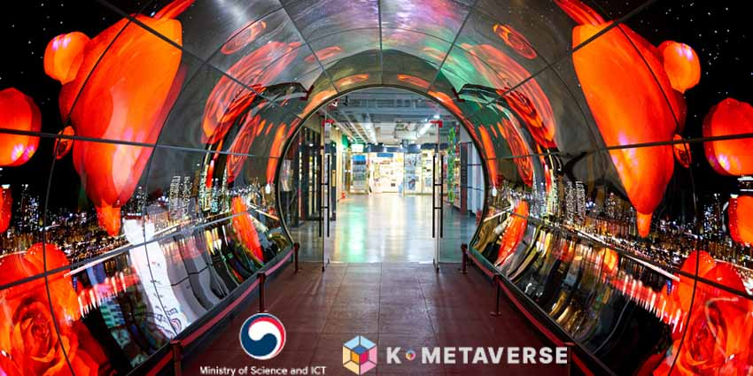

# 欢迎支持韩国的元宇宙计划

韩国是世界第 10 大经济体，最近宣布了一系列旨在开发国内技术的大规模举措，以将该国定位为第5 大虚拟世界中心。

该消息发布之际，韩国科学和信息通信技术部与国家 IT 产业振兴机构 (NIPA) 最近宣布 将促进国家元界和 XR 相关公司进入全球市场。

政府此前在 1 月份公布了其“新元界行业领先战略”，旨在在与竞争力和投资相关的挑战中发展该国的数字生态系统。

XR Today 采访**了 The Welcome, Ltd 的首席执行官 Mija Kim，这**是一家专门从事公共机构培训和举办国际会议的韩国公司。

这位首席执行官谈到了她的公司在促进韩国元界科技公司的发展和扩张方面的作用，以及该国开发扩展现实 (XR) 生态系统的前景。

**今日 XR：随着韩国合作实施其元宇宙计划，The Welcome 如何促进企业、行业和领导者的网络？**

**Mija Kim** : K-metaverse 2022 是由韩国科学、信息通信技术和未来规划部与国家 IT 产业振兴机构共同实施的一项大型项目，旨在通过选择和提供定制化服务来促进专门从事 Metaverse 的具有全球竞争力的公司支持 70 家具有强大技术能力的 K-metaverse 公司。

负责该项目的Welcome通过对70家韩国元界相关公司在早期、中期和晚期阶段的严格标准中选出的能力增强提供咨询，从而连接全球买家和投资者。

在技术开发、人才匹配、招商引资等各企业的需求下，提供多方面的咨询服务。

为扩大我们的海外网络，The Welcome 赞助了增强型世界博览会 (AWE)、世界移动通信大会 (MWC) 和 XR FAIR 等全球活动，并根据各公司的特点在展馆中举办展览并积极支持参与此类活动。

共有70家公司参加了约100场国内外活动，通过与买家的投资接触产生了有价值的商业业绩。

Welcome 不仅可以线下，还可以通过韩国公司ZEP的在线业务平台和元界平台，方便地查看国内公司信息。

这些公司生产它们是为了专注于业务流程，并通过各自的平台通过在线商务会议立即追求它们。

用户可以查看公司的核心技术、服务状态、基本概况以及各种宣传资料，包括视频和宣传册。

**XR Today：哪些韩国公司在构建元界方面最为活跃，使用了哪些技术？**

**Mija Kim**：我们根据企业成长程度将企业分为三个阶段。其中，全球增长潜力最大的十家龙头企业，均具有全球竞争力和技术实力。

值得一提的是，将智能吊舱硬件与应用程序连接起来的平台业务公司[3i公司和配备韩国最大XR舞台的新兴技术元宇宙内容公司]NP将在今年的AWE上进行主题演讲。

**XR Today：为什么 K-metaverse 公司计划在全球扩张，他们计划如何在国际市场上竞争？您如何选择它们进行扩展？**

**Mija Kim**：韩国互联网平台公司独立追求利用人工智能 (AI) 和区块链等新兴技术的元界生态系统。

目前，他们通过IT公司和娱乐公司之间的积极合作、投资和收购，在韩国形成了一个合作生态系统。

基于韩流的知识产权 (IP) 权利和强大的粉丝群是元界业务多元化盈利模式和实现全球市场准入的基础。

国内的中小企业和初创企业也有各自领域的技术和理念，但由于不利的条件，在将新平台转化为业务方面面临困难。

政府对 K-metaverse 等项目的援助现在寻求与全球公司的合作伙伴关系，并吸引投资和市场进入机会。这将提供支持，以便高质量的元界公司可以帮助形成韩国未来的元界生态系统。

**XR Today：韩国政府为构建韩国的元界生态系统做了哪些努力？**

**Mija Kim**：韩国政府最近公布了“韩国新政2.0实施计划”。其主要目标是促进与超连接技术相关的新产业。

此外，它还制定了“虚拟融合经济发展战略”，以推行促进 XR 使用、建立领先的 XR 基础设施、重组系统和支持企业竞争力的政策。它还将增加与元界相关的核心技术的投资和扩展，例如 XR、人工智能、区块链、网络基础设施、数据和数字孪生。

