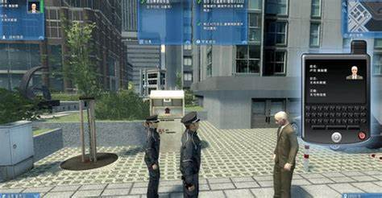

# 元界警察现在可以在虚拟世界中监控你

**Ajman Police 成为第一个通过 Metaverse 技术提供服务的警察机构。元宇宙警察怎么能逮捕你？**

阿治曼警方的官方[推特]账号宣布，他们现在将通过元界技术向客户提供服务。

阿联酋张开双臂欢迎 Web3 的采用。采用 Web3 的最新积极举措是在 Gitex 技术周之后，政府机构展示了最新的技术创新和服务。此前，阿治曼警方还参加了迪拜元界论坛。

## 警察元界：有必要吗？ 

随着元宇宙的采用率不断提高，它肯定会吸引不良行为者。几十年前，没有人会在他们最疯狂的想象中想到网络犯罪，但现在有政府机构来控制网络犯罪。同样，有必要通过控制犯罪来对元宇宙进行监管以保护用户的权利。 

一家法律和商业咨询公司的创始人兼首席执行官 Jamilia Grier 认为，“一些用户不可避免地会利用其他用户并且犯罪将会发生，遗憾的是，我们现在已经可以看到其中一些正在发生。正如我们有法律来处理物理世界中的犯罪一样，制定法律来处理在虚拟世界中犯下的犯罪也很重要，”

## **虚拟世界中的犯罪**

Metaverse 尚未成为主流，但已经有关于 Metaverse 犯罪的报道。一名 30 岁的韩国男子在一个流行的虚拟世界中通过假冒身份对儿童进行性侵犯。他使用幼稚的头像假扮同伴，与孩子们互动，给他们送礼物，并引诱他们发送不穿衣服的照片和视频。他被判处 4 年有期徒刑，并在医疗机构接受 80 小时治疗。

2021 年 12 月早些时候，一名女性通过一篇媒体文章分享了她受到性骚扰，她的头像在虚拟世界中被轮奸。

“在加入后的 60 秒内——我受到了口头和性骚扰——3-4 个男性化身，基本上都是男性声音，但实际上轮奸了我的化身并拍照，”该女子声称。当这名妇女试图逃跑时，骚扰者发表了辱骂性言论。

虚拟世界中报告了各种欺凌、种族诽谤和其他形式的数字仇恨事件。各种政府反犯罪机构可能很快就会开始追随阿治曼警方的脚步，以确保用户在虚拟世界中以文明的方式行事。

