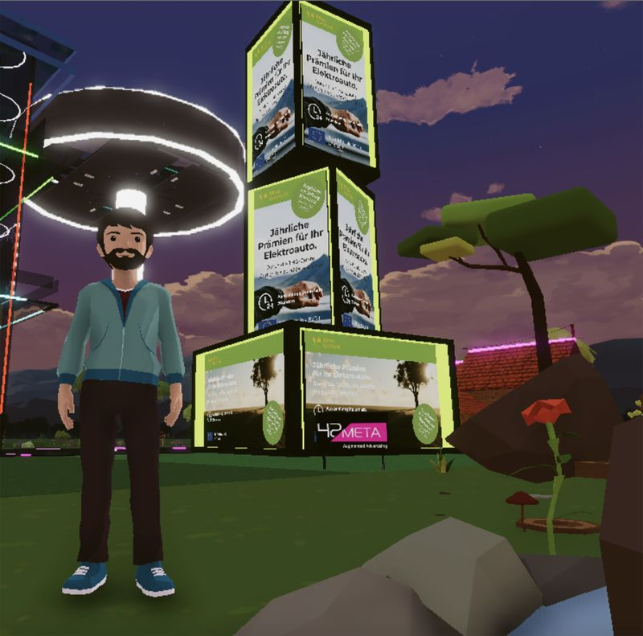

# 曾经火爆的元界土地市场正在吸引高风险的赌注

暴跌的加密货币价格为 Aditya Saxena 提供了一个他无法放弃的投资机会：虚拟世界中的一块土地。  

这位 25 岁的微软公司的软件工程师在 8 月份以大约 3,000 美元的价格购买了这块地。几个月前，他看到了类似的房产，这些房产的售价是这个价格的三到四倍。 

Saxena 长期以来一直对元宇宙着迷——这是融合了游戏、社交媒体和直播等技术的沉浸式在线世界的统称。他说他太年轻了，买不起真正的房子，并认为虚拟世界的土地抢夺是值得的。

“我们处于熊市，所以价格不是很贵，”Saxena 说。“我认为有一段时间不会出售它，但这是一个冒险的赌注。” 

与 Roblox 和 Fortnite 等流行的在线和手机游戏不同，用户可以通过游戏内购买来增强游戏体验，而 Metaverse 平台上的许多参与者将虚拟财产视为一种真正的投资，而不仅仅是用于娱乐或游戏。但危险比比皆是：新生市场动荡不定，容易投机，其吸引力未经证实，业绩记录参差不齐。

当今年加密货币价值下跌时，通常使用数字代币买卖的虚拟土地的价格也暴跌。根据分析公司WeMeta汇编的数据，从 2021 年 11 月初到本月初，两个流行的基于区块链的在线世界 Decentraland 和 The Sandbox 的平均价格下跌了约 80% 。按市值计算的最大数字货币比特币的价格在同一时期下跌了近 70%。

销售数量也有所下降。根据 WeMeta 的数据，到 2021 年 11 月，Sandbox 和 Decentraland 总共有超过 6,000 笔交易。上个月，销量跌破1000辆。

Saxena 将下跌的价格视为进入市场的机会。他还没有在他的 Decentraland 地块上建造任何东西，而是以每月 50 到 70 美元的价格出租它。一家公司目前租用一个广告牌的空间来宣传一家元宇宙营销初创公司。

这些地块作为不可替代的代币或 NFT 出售，加入了记录在区块链上的数字艺术和收藏品。在这些虚拟世界中，用户的化身可以四处走动、与其他化身交谈、赌博、参加音乐会和参与其他活动。

杜克大学金融学教授、《DeFi 与金融的未来》的合著者 Cam Harvey 表示，随着今年加密货币价格的下跌，许多投机者逃离了虚拟房地产领域，留下的主要是长期投资者。说这个楼市是不可预测的。 

“任何新想法都是有风险的，”尤其是当有多个虚拟世界时，他说。“因此，投资未成为赢家之一的元宇宙存在风险。”

30 岁的 Kieran Skelly 于 2021 年 3 月在 Decentraland 以每块约 7,000 美元的价格购买了 4 块地块。大约八个月后，他抓住虚高的价格，以 50,000 美元的价格卖出了一辆。他坚持其他人，假设价值会继续上升。但他们没有。它们的价值是 Skelly 购买它们的一半，他本月以每个 3,300 美元的价格卖出了两个。

30 岁的基兰·斯凯利 (Kieran Skelly) 三月份在虚拟世界的一个派对上。今年秋天，他以每块 3,300 美元的价格出售了两块土地，几乎是他为它们支付的 7,000 美元价格的一半。

“我有信用卡要付，”木工斯凯利说，并补充说销售过程并非没有障碍。他说，一个骗子向他提供了其中一个地块的高价，以通过冒充 Decentraland 管理员来吸引快速销售。 

Decentraland 基金会代表没有对任何具体案例发表评论，但表示该组织打击欺诈的努力包括删除网络钓鱼网站并告诉用户只能从官方网站下载文件。  

还有监管方面的担忧。Hester Peirce 被称为美国证券交易委员会对加密货币最友好的专员，他警告说，分散的 NFT，即被分解为要买卖的单位的资产，可能是未注册的证券。上周，彭博社 报道称，美国证券交易委员会正在调查 Yuga Labs Inc.，该公司是 Bored Ape Yacht Club NFT 系列的创建者。

弗吉尼亚州里士满的律师 James Murphy 就 Web3 和 metaverse 问题提供咨询，他说基于区块链的虚拟房地产可能属于这一类别。“人们应该担心吗？答案是肯定的，”他说。

许多虚拟世界确定了他们将出售的地块数量，许多加密货币和 NFT 投资者认为这很有吸引力。可以肯定的是，根据 Dune Analytics 的数据，对更广泛的 NFT 世界的兴趣也大幅下降，9 月份的交易量较 1 月份的峰值下降了 97% 。

**史努比狗狗的邻居**

虽然加密货币和虚拟土地的价格经常一起变动，但这些地块可能会因独特因素而波动。Sandbox CEO Mathieu Nouzareth 表示，如果他们接近知名名人或品牌，他们可以拥有更高的价值。例如，嘻哈偶像史努比狗狗庄园附近的一块地块 去年以 450,000 美元的价格售出。2 月，意大利奢侈时装品牌 Gucci在 Twitter 上宣布，它已在沙盒中购买了一块地块来举办促销活动。
