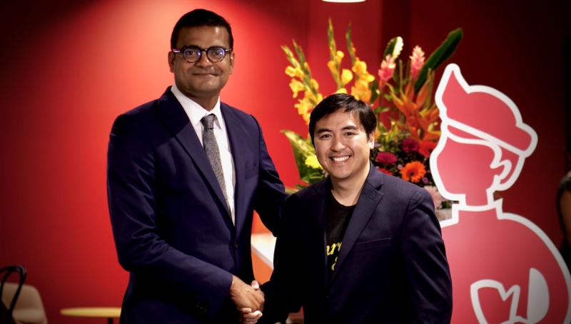

# Redhill 与 Pixel Canvas 合作加强了元节产品

Redhill 正在通过与 美国企业元节平台Pixel Canvas 合作以提供互动和身临其境的品牌体验，从而扩展到元节场景。该机构 将在品牌活动和传播策略中利用 Pixel Canvas 的平台和技术，为客户的全渠道讲故事增加一个新维度。Redhill 希望通过合作改变客户体验并提供真正的业务成果。

Redhill 创始人兼首席执行官 Jacob Puthenparambil 表示，其元界产品旨在帮助客户了解和利用下一波颠覆性的商业和行业浪潮，并为他们提供充分利用这些新虚拟世界所需的战略和技术. 通过使用编程、连接动画和游戏化，Redhill 将使其客户能够通过组织体验式会议、活动、客户演示和产品发布来创造身临其境的品牌体验，以提高用户参与度。

Pixel Canvas 以前是一家 VR 游戏公司，开始为 Verizon 和 WarnerMedia 等财富 500 强公司设计和交付 3D 虚拟事件原型。随着人们对虚拟世界的兴趣增加以及对沉浸式和视觉上吸引人的虚拟体验的需求不断增长，Pixel Canvas 转而开发一个能够提供高度可定制、可扩展、交互式和可访问的企业级虚拟世界体验的完整平台。

迄今为止，Pixel Canvas 的项目之一是“Unlockverse”3，这是为 Unlock Venture Partners 打造的虚拟商场体验。用户可以在自己的虚拟空间中访问风险投资公司的每个投资组合公司，查看产品图片和公司信息，以及观看实时讨论，并与员工进行实时聊天。

Pixel Canvas 的平台由 Unreal Engine 5 提供支持——被吹捧为一种先进的实时 3D 创作工具，可提供逼真的视觉效果和沉浸式体验——与现有的虚拟世界相比，它带来了比现有虚拟世界更好的沉浸感和参与度的逼真体验。迄今为止，Pixel Canvas 的库包含超过 25 个模板化环境、30 个小游戏和 5 个逃生室，这些都可以完全重新设计以满足品牌的需求，并辅以视频和文本聊天、实时流媒体等全套网络功能。此外，这些体验是云渲染的，可扩展性和基于浏览器的任何连接设备都可以访问。

Pixel Canvas 创始人兼首席执行官 Joey Lee 表示： “通过与 Redhill 的合作，我们的公司将能够提供身临其境的体验，以改变品牌在完全实现的元宇宙中连接、协作和沟通的 方式。”该公司也期待与 Redhill 合作，在快速发展的亚太地区探索创意机会。

这一最新消息建立在 Redhill 在过去一年推出的其他产品的基础上。最近，Redhill收购了总部位于新加坡的 Vision Strategy Storytelling，作为该机构进一步加强其可持续发展产品的一部分，为该机构及其客户提供以社会影响和可持续性为中心的创意视觉叙事解决方案。

今年早些时候，该机构成立了一个新的创意技术和设计部门——Redhill Studio——提供创意设计、视频和播客制作以及网站和网络应用程序开发。除此之外，Redhill 还提供整套端到端集成通信解决方案，包括跨行业和部门的公共关系、数字叙事、危机管理、营销、内部通信和品牌推广的战略咨询。

最近，Redhill 在新加坡正式启动了其全球总部，新的 5,000 平方英尺办公室可容纳多达 150 名员工。该机构成立于2014年。
