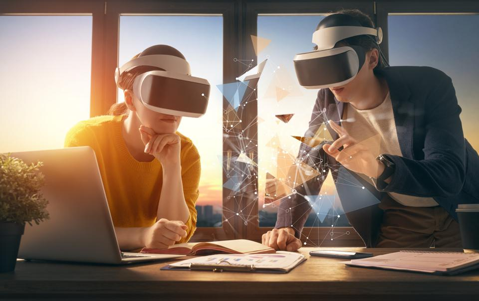

# 元界对业务的影响是什么？

想知道元界将如何影响未来的商业价值？

我最近与 Warpin Media 的首席执行官 Emma Ridderstad 进行了交谈，[Warpin Media](https://www.warpinmedia.com/)是一家沉浸式技术解决方案公司，致力于将 Enterprise Metaverse 引入具有前瞻性的组织。

元界未来的商业价值是什么？

当我问 Emma 虚拟世界对她意味着什么时，她说她将虚拟世界想象成我们今天在网上所做的一切——通过我们的智能手机和电脑——但能够通过虚拟现实和增强现实在沉浸式 3D 中完成这一切。

在元宇宙中，我们将能够在世界之间无缝移动，这样我们就可以更好地工作、玩得更好，并更自由地交流。Emma 说：“这项技术使我们能够同时接触更多的感官，因此这是一种更丰富的体验。”

## 元界未来的商业价值是什么？

Warpin Media 与已经认识到元宇宙潜在力量的创新公司合作，我们讨论了一些公司已经推出的独特用例。

例如，企业已经在使用增强现实和虚拟现实为消费者提供体验，并以前所未有的方式吸引他们。当一部新的星球大战电影在日本首映时，服装零售商 H&M 在他们的东京商店设立了一个设计师展位。购物者可以戴上 Magic Leap 增强现实眼镜，将纯黑色 T 恤变成可以带回家的定制服装。

其他公司正在寻找使用 AR 的方法[0.0 ](https://www.forbes.com/digital-assets/assets/arweave-ar/)[%](https://www.forbes.com/digital-assets/assets/arweave-ar/)和 VR，让客户能够试穿或试用他们的商品。例如，豪华汽车公司法拉利在增强现实中展示他们的模型，因此购车者可以在汽车周围“走动”，甚至可以深入研究汽车的发动机和制动系统。

许多零售商也在研究如何提供其产品的 3D 虚拟版本。越来越多的消费者将有兴趣购买与实物服装和配饰相似的 NFT 服装。

企业还可以通过将讲故事融入客户的沉浸式体验中来增加价值。一家威士忌公司与一家酒店合作调制了一种新鸡尾酒，然后创造了一种身临其境的体验，将消费者带到苏格兰，飞越高地，让他们深入了解威士忌的制作过程，并为他们提供虚拟之旅酒厂。虚拟之旅结束后，您摘下虚拟现实眼镜，您的威士忌鸡尾酒就摆在您面前。这些身临其境的品牌故事体验是公司以创新方式与客户建立联系的好方法。

Emma 补充说：“从消费者的角度来看，您将获得更多关于您所购买的品牌和产品的信息——因为这是您第一次不受 2D 打印广告或商业广告的限制。你可以真正使用产品……就像与普通广告互动一样，但要让它在 3D 中栩栩如生。”

## 有远见的公司应该做些什么准备

当我问到 Emma 对想要开始使用 Metaverse 技术的公司有什么建议时，Emma 说：

“每家公司都应该开始考虑将虚拟现实用于自己的店内或员工培训。公司可以通过虚拟和增强现实体验元宇宙，并用它来练习你在公司内已经需要练习的东西——你可以从节省成本和提高保留率中获得所有好处。”

她还建议制定从大处着眼、从小处着手并经常进行测试的政策。

“拥有你可以想象的这项技术的最终目标，但从一个非常小的项目开始，看看它是如何进行的，”Emma 补充道。“你正在以一种全新的方式出现自己，然后看看该技术如何解决公司所面临的问题。”

公司还应该引入不同的声音来为项目做出贡献。进入元界空间时，公司不仅需要技术专家，还需要了解人类行为的人，这样我们就可以创建人们想要进入的安全可靠的元界空间。

## 元宇宙的更大愿景

在她与 Warpin 的合作中，Emma 对元宇宙有着更大的愿景。

“我希望我们可以利用这项技术来增强人类体验……在人类之间架起桥梁。我希望我们以同理心和创造力工作，并利用元宇宙将人们聚集在一起。”

要了解有关技术和商业未来的更多信息，请访问我的博客或前往我的 YouTube 频道观看与领先行业专家的更多对话。
