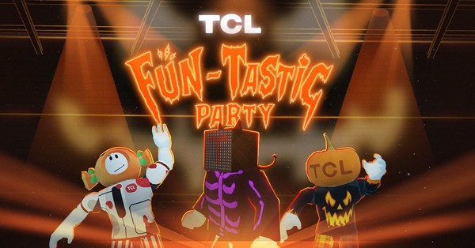

# TCL 在元宇宙迈出重要步伐

全球电视和消费电子行业的主要参与者 TCL 电子（1070.HK）今天宣布其在元宇宙的激动人心的举措。

为纪念其进入元宇宙的重要一步，TCL 将在虚拟游戏平台 Roblox 上推出万圣节活动，让用户能够创造自己的沉浸式体验。TCL 开发了一个引人入胜的万圣节主题虚拟派对，在个性化的虚拟世界中与观众建立联系。

作为致力于持续创新的全球技术领导者，TCL 让人们通过其电视和智能屏幕享受优质的观看体验。现在，TCL 正在通过提供一种趋势、有趣和身临其境的方式与元界中的 TCL 互动，加强与下一代消费者的联系。未来，TCL 期望探索和开发更多机会，为我们的客户带来更多创新的方式来享受元界及其他地区的 TCL 产品。

万圣节活动将在多个市场的 TCL 社交媒体账户中启动。从2022 年 10 月 21 日起，TCL 将邀请观众参加在 Roblox 元宇宙的 Dream House 举行的万圣节#Fun_Tastic 派对。

**欢迎来到TCL梦想之家**

当用户进入 Dream House 时，TCL 邀请他们进入#Fun_Tastic Party 的氛围，并通过为他们的头像选择个性化的万圣节服装开始他们的冒险。现在他们已准备好探索 Dream House，享受虚拟体验并连接 TCL 技术。

TCL 打造了一系列万圣节游戏和派对体验，在各个房间连接到 TCL 产品，供用户发现。以万圣节为主题的装饰和神秘的灯光，每个房间都以 TCL 一些流行的 C935 和 C835 迷你 LED 电视、条形音箱和 FreshIN+ 空调的各种属性为主题，具有独特的装饰和活动。

当他们探索房子时，用户可以玩迷你游戏，在每个角落享受惊喜，或者只是在他们最喜欢的房间里放松一下。其他有趣的活动包括虚拟照相亭，以便用户可以在社交媒体上捕捉和分享派对中的万圣节时刻。

**如何参加Fun_Tastic Party？**

用户可以通过 TCL 的社交媒体平台访问 Roblox 上的 TCL #Fun_Tastic 万圣节派对。

全球：[Facebook](https://www.facebook.com/TCLElectronicsGlobal/)、[Instagram](https://www.instagram.com/tclelectronics/)、[Twitter](https://twitter.com/TCL_Global)、[YouTube](https://www.youtube.com/user/TCLTVs)、[TikTok](https://www.tiktok.com/@tcl) 
北美：[Twitter](https://twitter.com/tcl_usa) 
意大利：[Instagram](https://www.instagram.com/tcl_italia/) 
墨西哥：[Facebook](https://www.facebook.com/TCLMEX)、[Instagram](https://www.instagram.com/tclmex/) 
英国：[Instagram](https://www.instagram.com/tcl_uk/)、[YouTube](https://www.youtube.com/c/TCLEurope) 
印度：[Facebook](https://www.facebook.com/TheCreativeLifeIndia/)、[Instagram](https://www.instagram.com/tcl_india/)、[Twitter](https://twitter.com/tcl_india)、[YouTube](https://www.youtube.com/channel/UCkVAWmPnvZ97HqOJu7Isjqg) 
西班牙：[Instagram](https://www.instagram.com/tcl_espana/) 
沙特阿拉伯：[Facebook](https://www.facebook.com/TCLElectronicsMiddleEast)、[Instagram](https://www.instagram.com/tcl_ksa/?hl=en)、[YouTube](https://www.youtube.com/channel/UCp2xjQtNp-3yDo8ilEyf91Q) 
东非：[Facebook](https://www.facebook.com/TCLElectronicsAfrica) , [Instagram](https://www.instagram.com/tcl.africa/) 
日本:[推特](https://twitter.com/TCL_Japan)

**关于 TCL 电子**

TCL电子（1070.HK）是一家快速成长的消费电子公司，是全球电视行业的领军企业。它成立于 1981 年，目前在全球 160 多个市场开展业务。TCL专注于电视、音响、智能家电等消费电子产品的研发和制造。
