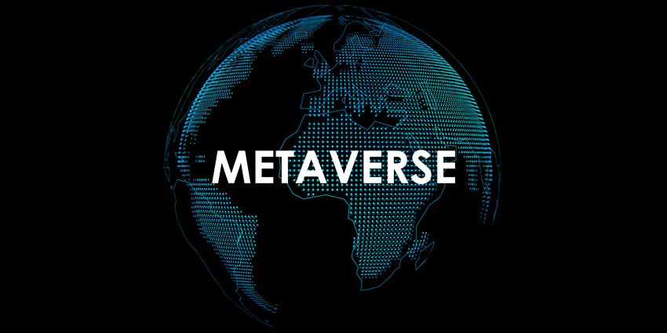

# 企业如何在元宇宙交易？

继去年 10 月Facebook更名为 Meta Platforms 引发全球虚拟太空竞赛后，摩根士丹利很快宣布Metaverse交易将成为“下一个重大投资主题”。

15 年前，软件即服务 (SaaS) 和云在市场上引发了类似的转变。这导致许多公司的价值飙升，同时迅速加剧了垂直行业之间的竞争。

目前，企业正在考虑许多新的智能产业的迅速崛起。公司也在考虑元界是否是一个可行的、可持续的商业和经济增长平台。

预计在不到十年的时间里将有 1 万亿美元的收入机会，企业必须开始为虚拟世界主导的未来做准备。

# 元宇宙与产业

元宇宙被定义为一个结合空间计算和互联网的平台，它使用沉浸式技术模拟物理世界。这些体验旨在为用户同时和单独地提供丰富的交互式体验。

Meta Platforms、Microsoft、Decentraland、Epic Games、Unity、Pico Interactive、NVIDIA 甚至 Autodesk等众多公司都在开发平台以促进 Metaverse。

他们的新工具将为企业提供大量的业务用例]。许多公司已经转向扩展现实 (XR) 进行培训、技能提升、评估、协作以及在沉浸式平台上展示其内容。

耐克、麦当劳、温迪斯、阿迪达斯、古驰、讴歌等许多大型公司也进入了数字前沿，与同事和客户进行交互。世界各地的娱乐公司也将沉浸式技术用于游乐设施、音乐会和互动游戏。

# NFT、加密和区块链的作用

区块链是为去中心化元界提供动力的基础技术之一，没有单一实体会构建、拥有或支持它。

这需要基于区块链的底层架构，用于 Decentraland、Insomnia Labs 和 Sandbox 等平台。这些平台中的房地产是可交易的、基于区块链的资产。

用户可以使用加密货币和作为 NFT 出售的财产进行交易，确保资产保持不可互换并保持其价值，从而为业务运营带来三个主要用例：

**提供服务**：元界将为企业提供自己的产品和服务，即协作平台。例如，用户可以购买数字资产来为 VR 平台个性化和装扮他们的 3D 化身。主题公园和博物馆也可以利用数字人类作为导游。

**将元资产作为 NFT 出售**：NFT 允许买家买卖与区块链相关的数字内容。一种越来越流行的数字资产类别，人们将它们作为推文、模因、GIF 和艺术品出售。

**宣传 Phygital Goods**：VR 广告和营销还可以通过虚拟协作空间中的数字广告牌到 VR 游戏中的产品展示等解决方案推动业务增长。此外，耐克等公司已开始在其位于韩国首尔的概念店生产 phygital 产品，将运动鞋从数字 NFT 转换为实体产品，反之亦然。

# 监管 Metaverse 中的贸易

尽管未来充满希望，但元界商业和贸易将面临重大挑战，这对监管机构来说是一项艰巨的任务]。与不稳定的加密货币价值相关的问题可能需要在当前和不久的将来采取特殊措施来保护投资者。

反垄断法和元界中未经授权的广告也可能给大品牌和市场领导者带来风险。

一些人推测，大公司的举措可能会使小型和新兴品牌难以腾出空间。近年来，有关产品许可和技术纠纷的指控已经袭击了元平台和字节跳动。

最终，元界有望成为自由市场的下一个迭代。它将有类似的风险和机会，导致监管干预以确保良好的交易行为。

为行业制定标准的组织，包括Metaverse 标准论坛、IEEE、XR 协会和Khronos Group以及 O3DF 等，继续团结全球科技行业，以建立互操作性、安全性、安全性、道德和隐私基准未来的用户。
