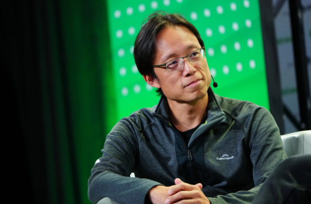
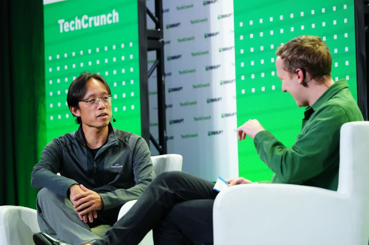

# 根据 Animoca Brands 的 Yat Siu 的说法，Meta 的 10B 美元元宇宙投资“还不够”

Animoca Brands的联合创始人兼执行主席萧逸对元宇宙有很多想法。那是因为他的公司拥有The Sandbox，并投资了许多不同的 web3 公司，例如 OpenSea、Dapper Labs 和 Axie Infinity。在TechCrunch Disrupt上，他分享了他对 Meta 对元宇宙的看法。

> 他们说他们将每年花费 100 亿美元来让虚拟世界运转起来。好吧，事情就是这样——我们认为 100 亿美元不足以让 Facebook 取得成功。数十亿美元在开放的 Metaverse 空间中进行交易——当您考虑可替代代币时，实际上更多。大部分价值都归最终用户所有，那么当我必须将其中的一半提供给平台时，我为什么要在 Meta 之类的东西上进行交易——不管它的视觉效果如何？
>
> 而如果我使用沙盒，我会得到 95%。从经济上讲，这样做对我来说没有任何意义。而且由于已经以公开的方式产生了数十亿美元的价值，我为什么要放弃这个价值？因此，Facebook 将不得不花更多的钱来激励人们进入其平台。

但这并不意味着扎克伯格是领导这个项目的错误人选。“我会说，扎克伯格在建设方面确实做得对。记住，他试图推出 Libra，对吧？......所以他了解区块链，”Yat Siu 说。

但元宇宙到底是什么？很多人还在为此争论不休。有些人认为它是在线宇宙，而另一些人则认为它涉及虚拟现实。Yat Siu 认为，让虚拟世界成为真正的虚拟世界的关键是产权。

“正如乔治华盛顿所说，你基本上不能拥有没有财产权的自由，我们认为数字化也是如此。没有数字财产权，你就不能拥有数字自由。所以我们对开放元宇宙的看法是，它必须从所有权的基础开始。这就是沙盒脱颖而出的地方，”他说。

Animoca Brands 比 The Sandbox 大得多。集团和投资组合中有 380 家公司。其中三十家是子公司。Animoca Brands 在技术上是一家澳大利亚公司，总部设在香港，员工近千人。

总结 Animoca Brands 的策略很容易。该公司正在投资 web3 生态系统，因为存在一些强大的网络效应。它押注于可以掀起所有船只的 web3 涨潮。

“围绕汽车拥有量的经济活动远大于汽车销售量，”萧逸说。他提到优步、Lyft 和洗车公司是不卖车的企业的例子。

“例如，当我们对 OpenSea 进行第一次检查时，它在 2018-2019 年的估值非常低，并不是因为我们希望 OpenSea 成为十角兽，”他说。“我们这样做是因为 OpenSea 有大量的 NFT 工作和相对较好的 NFT 量。我们将帮助推动这一点，我们将拥有自己的 NFT 销售，我们投资的每家公司都可以在 OpenSea 上销售。”

换句话说，如果 web3 成为一个巨大的东西，很明显 Animoca Brands 有能力成为该领域的关键参与者。

