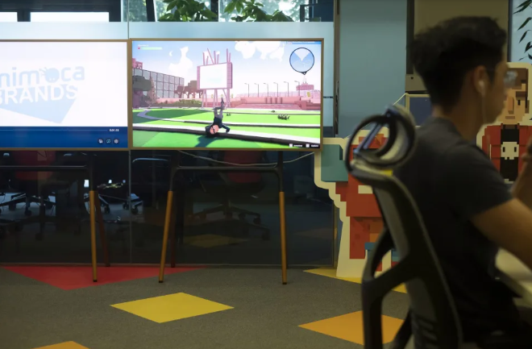

# Metaverse游戏支持者Yat Siu说低用户数不是最好的衡量标准

对于考虑以超过 40 亿美元估值筹集资金的 The Sandbox 来说，如此低的用户数量将令人震惊。肖周四在旧金山举行的 TechCrunch Disrupt 会议上接受彭博社采访时表示，CoinDesk 报告使用的数据仅关注区块链交易。他说，这些交易可能包括以不可替代的代币为代表的虚拟土地的销售，并不能反映对该平台的整体参与，特别是考虑到更多用户持有他们的 NFT 以便在游戏中使用它们，而不是出售它们.

他说，查看这个指标相当于声称“华尔街有多少人交易就是美国人口的规模”。

他说，沙盒每月有超过 20 万活跃用户。Siu 表示，其他指标，例如平台上创造的工作数量以及游戏产生的收入，是平台上用户参与度的更准确衡量标准。

“Sandbox 中的每个土地所有者都有一个 50 万到 200 万美元的钱包，”他说。

Siu 还讨论了另一个由 Animoca 支持的虚拟游戏：Axie Infinity。由游戏开发商 Sky Mavis 创建的基于区块链的平台，允许玩家繁殖和战斗以 NFT 为代表的怪物，在 3 月份面临 6.2 亿美元的黑客攻击，并且已经看到了游戏中使用的加密代币的价格及其用户在数字资产市场低迷期间，数字急剧下降。该游戏还面临着对其玩家体验的抱怨。

Siu 表示，尽管有这些挫折，但许多游戏公司可能会羡慕 Axie Infinity 的地位，尤其是考虑到其数十亿美元的资金。尽管如此，他还是将 Axie Infinity 与 2010 年代初人气飙升的芬兰手机游戏愤怒的小鸟进行了比较。虽然 Axie Infinity 展示了区块链游戏的潜力，就像愤怒的小鸟在移动游戏中所做的那样，但他认为 Axie Infinity 并不代表区块链游戏的未来。

总体而言，Siu 表示，与其他加密行业相比，加密寒冬对区块链游戏的影响没有那么严重。虽然其他加密公司正在以较低的估值进行融资，但 Siu 表示，Animoca 最近的 1.1 亿美元融资是平顺的一轮融资，淡马锡控股私人有限公司、博裕资本和 GGV 资本参与其中。他还指出，香港新的监管发展可能有助于该行业。

“我认为在一两周内，他们将推出一项全面的加密货币和数字资产政策，这应该是非常进步的，”他说，并指出他应该帮助在即将到来的香港推出该政策金融科技周。

“大概，如果这将是坏消息，他们不会要求我上台，所以我很乐观，”他说。
