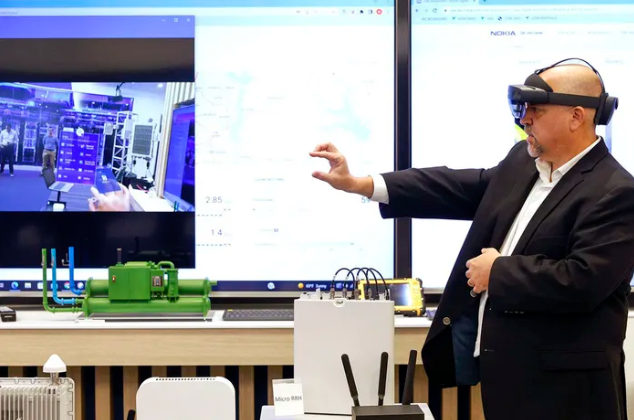
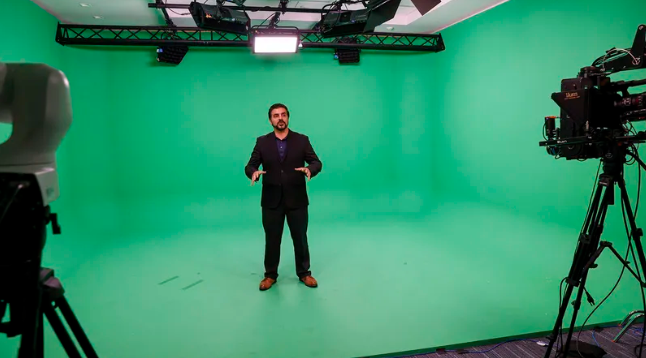
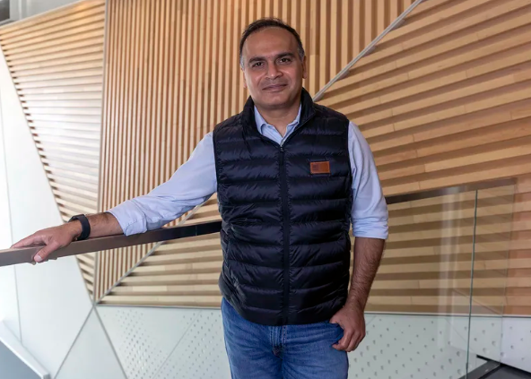

# 诺基亚的未来愿景是虚拟世界取代智能手机

位于 Coppell 的诺基亚执行体验中心的演示解决方案架构师 Michael Kelly 演示了 Microsoft 的 HoloLens 使用诺基亚技术的实际用途。

很难想象一个没有手机束缚的世界。除非你为诺基亚工作。

这家电信巨头认为，在本世纪末，元宇宙将成为一种消费性技术，取代智能手机成为主要的通信形式。

“我们的信念是，该设备将在本世纪下半叶被虚拟世界体验所取代，”其首席战略和技术官 Nishant Batra 在最近一次访问北德克萨斯时说。

在很大程度上，这将取决于这家总部位于芬兰的公司在赛普拉斯水域开发中工作的 1,700 名员工，才能将这一雄心勃勃的目标变为现实。

诺基亚将其达拉斯地区的根源追溯到 1950 年代。该公司现在在距离达拉斯/沃斯堡国际机场不远的庞大企业开发项目中租赁了 250,000 平方英尺的空间。

诺基亚以开发第一个全自动蜂窝电话系统而闻名，此后已发展成为一家成熟的技术公司，开发用于某些机场的面部识别或协助电力公司保持电网安全。美国的七个主要电网由该公司的网络供电。

诺基亚去年的销售额超过 210 亿美元，业务遍及 130 多个国家，员工总数接近 88,000 人。为实现宏伟计划，诺基亚预计未来几年将在北德克萨斯州招聘新员工，因为元宇宙获得采用。

诺基亚数字客户旅程演示负责人 Ali Emam 在公司的执行体验中心演示绿屏技术。

### 什么是元宇宙？

简而言之，下一代技术将塑造我们的日常生活。

南卫理公会大学杰出教授、该学院位于达拉斯的 AT&T 虚拟化中心主任 Sukumaran Nair 表示，元宇宙可以被认为是在一个桶中组装的新技术的汇编。

“定义这一点的一种方法是 AR 和 VR 的扩展，具有从互联网不同部分收集实时数据的潜力，”Nair 说，他提到了增强现实和虚拟现实技术，这是元界的典型心理画面——手持设备，耳机，眼镜。

扩展该技术的使用可能意味着对各种行业有很多不同的事情。它可能涉及从扩展互联网的使用方式到开发学习技能的新方法等方方面面。

元宇宙的概念似乎是最近才出现的，近年来，当社交媒体平台 Facebook 更名为 Meta 时，它获得了关注。创始人马克扎克伯格希望这家有影响力的公司专注于下一个数字前沿，即元界。

但奈尔说，元宇宙并不新鲜。在 1992 年的小说《*雪崩》*中，作家尼尔·斯蒂芬森（Neal Stephenson）创造了“*元*宇宙”一词，人类将在 3D 空间中相互交互，并使用现实世界的隐喻进行软件交互。

虚拟世界中经常使用的短语是“数字双胞胎”。据研究公司 IBM 称，将它们视为跨越其生命周期的对象或系统的虚拟表示，使用实时数据进行更新，并使用模拟、机器学习和推理来辅助决策。

诺基亚首席技术和战略官 Nishant Batra 表示：“如果支持多种用途，例如游戏、社交互动和虚拟旅行，成功就会到来。”

### 2030年会是什么样子？

当诺基亚展望 2030 年时，情况与今天的现实有很大不同。

该公司认为这个世界如何形成的三个主要影响：社会经济学和地缘政治；技术，以及用户在任何特定时间需要什么。诺基亚的愿景是实现概念：人类增强和数字物理融合。

人类增强是指使人们能够与数字世界或虚拟现实耳机和增强现实眼镜等设备进行交互的技术。但未来，Batra 说，界面将更加个性化和独特。

数字物理融合处理数字世界中代表的现实世界对象、系统和过程。

在消费者虚拟世界中，人们互动的虚拟空间的收入将取决于消费者的吸引力。根据诺基亚的估计，货币化将是分散的，增长到 2026 年。Batra 说，如果有多种用途的支持，例如游戏、社交互动和虚拟旅行，成功就会到来。

“公司和消费者对这项技术的广泛采用对于它真正起飞至关重要，这也将取决于价格合理、符合人体工程学的无线连接 VR 和 AR 设备的可用性，”Batra 说。

包括办公室和学校在内的企业元世界充满了模拟和无限工作空间等东西，并将根据企业从中获得的价值而发展。考虑潜力的一种方法是 Batra 所说的“建筑和工程公司的数字绘图表”。

诺基亚将受元界启发的设备和解决方案创新视为业务增长机会。

在工业虚拟世界中，数字双胞胎和模拟可以用于工厂生产线或采矿作业。可以通过使用虚拟现实耳机来教授工业机械工作。

Batra 指出，航空航天公司如何在数字世界中制造发动机和机身，以准确模拟飞机的飞行方式，而包括诺基亚自己的工厂在内的工厂在数字世界中的存在与在物理世界中的存在一样多。

诺基亚赛普拉斯沃特世办事处每天都在使用下一代技术。可以使用虚拟现实耳机，用户可以尝试在虚拟世界中探索或工作。有一个绿色屏幕房间，用户可以放置在煤矿等位置，技术可以检测是否有人穿着安全装备。

Batra 说，元宇宙如何使企业受益的一个例子是基础设施，帮助工程师更好地了解交通模式、随时间推移的磨损以及如何使道路更安全。

到 2030 年，诺基亚预计 6G 世界将迎来计算机视觉、生物传感器、数字双胞胎以及沉浸式 AR 和 VR 等先进技术。这种演变还将为攻击者创造更多潜在的切入点。

Batra 说，诺基亚也在为此做准备。诺基亚于 5 月在德克萨斯州科佩尔成立了一个网络安全实验室，该实验室被誉为美国首个将 5G 保护提升到新水平的端到端实验室。

### 还有谁在推广元宇宙？

总部位于达拉斯的 Match Group 在 4 月份以 17 亿美元收购了一家韩国社交网络初创公司 Hyperconnect，该公司允许用户在虚拟环境中建立关系。

零售巨头沃尔玛通过被称为“沃尔玛乐园”和“沃尔玛游戏世界”的 Roblox 游戏体验进入了虚拟世界。Walmart Land 以时尚、美容和娱乐产品为特色，而 Walmart 的 Universe of Play 则展示玩具。

消费者也对这些可能性感兴趣。贸易刊物 MarTech Today 报道了消费者最想要的虚拟世界体验：

- 68% 想体验音乐。
- 58% 旅游观光。
- 53% 的购物和虚拟故事。
- 53% 的现场活动。

虽然进入诺基亚的未来世界需要时间和教育，但 Batra 表示，一代又一代的数字原生代已经为这项技术做好了准备。

“每一代人的采用速度都比前一代快，不仅仅是一点点，”巴特拉说。“这是指数级的不同。”
