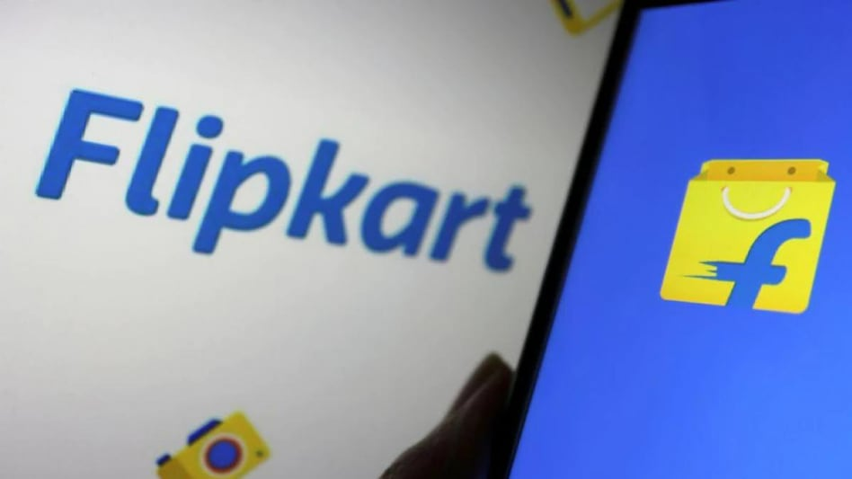

# 排灯节在元宇宙购物！如何进入和在 Flipkart 的 Flipverse 上购物

随着排灯节临近，每个人都忙于购物，但如果我们在这个节日告诉您，您可以直接从元宇宙购物！

没错，电商平台 Flipkart 推出了 Flipverse，一款面向安卓用户的元宇宙购物体验。这就是你可以开始的方式。

**如何进入 Flipverse**

\1. 在您的台式机或笔记本电脑上打开 Flipkart 的 Firedrops，然后单击“进入 Flipverse”。
\2. 用手机扫描看到的二维码。
\3. 这将打开 FireDrops 应用程序。
\4. 选择 Flipverse，然后为自己选择用户名和头像
\5. 您已进入 Flipverse。

**Flipverse 中可用的品牌**

Flipkart 已与多个品牌合作开发这种 web3 购物体验。购物者可以从 Puma 购买鞋子和其他运动装，从 Noise 购买可穿戴设备，从 Nivea 购买美容产品，从 Lavie 购买包包，甚至从电视购买两轮车。

展示其产品的其他品牌包括 Campus、VIP、Himalaya、Ajmal Perfumes、Butterfly India 和 Tokyo Talkies。

**Flipkart 对 Flipverse 的未来计划**

当 Business Today 联系到 Flipkart 并详细询问 Flipverse 的未来计划时，该公司回应说他们渴望全面推出 Flipverse。

Flipkart Labs 副总裁兼产品战略和部署负责人 Naren Ravula 告诉《今日商业》，“我们的目标是让数百万用户体验 Flipverse，并在虚拟和身临其境的环境中改善他们的购物体验。我们渴望探索 Flipverse 的推出全面展开。”

他进一步补充说：“我们致力于印度电子商务生态系统的发展，Web 3.0 将区块链等最新技术中最好的用于现实世界的用例，可以对像我们这样的企业进行数字化转型。一些使用 -沉浸式商务、NFT 相关用例等案例非常有前景。”

**回顾翻转宇宙**

**在用户体验和整体性能方面，我们觉得**产品可以再改进一点。 
首先，Flipverse 仅与 Android 手机兼容，因此 iPhone 用户将不得不跳过这种虚拟世界购物体验。
 
此外，在手机上加载需要相当长的时间，从而影响了整体用户体验。

整个元节体验也不是很身临其境，如果你向我们保证一个元节，我们希望它更加身临其境。

总之，在探索了 Flipverse 之后，我们得出的结论是，这是一个不错的实验，但需要进行许多升级才能像 Gucci、可口可乐或 Zara 提供的虚拟世界购物体验一样。

Flipverse 从 10 月 16 日开始向所有人开放，并将在 10 月 23 日结束。
