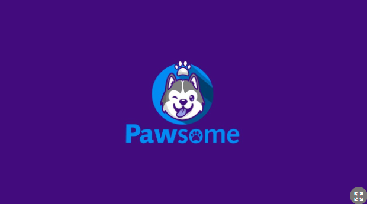
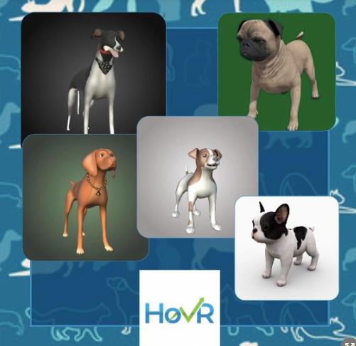

# PAWSOME 3D NFT 元宇宙游戏在 Dogtober 的 Qi 区块链上启动

英国伦敦，2022 年 10 月 23 日 (GLOBE NEWSWIRE) -- 游戏产业比音乐和电影产业加起来还要大。在发现 NFT 之前，用户无法拥有他们的游戏内物品或在二级市场上进行交易。因此，一旦玩家失去兴趣，任何游戏内购买都没有价值。NFT 开启了一个全新的游戏机会世界。用户现在可以转售他们的游戏内物品或付费出租给其他玩家。这就是新发布的游戏 PAWSOME 3D 所提供的，以及充满乐趣的游戏体验。

[Pawsome](https://www.globenewswire.com/Tracker?data=yKvyp0HoVfSBR8dbRpma-LOcU49j76W-3fq1hhGthrYjp6shII4Z6S7Ryx9nOP-ThEzz2v3CHEj9e8OkriwOZA==)是一款基于 Qi（发音为 Chie）区块链和原生货币 QIE 构建的 3D 动画元宇宙游戏。Pawsome 允许用户在区块链上铸造 10,000 只独特的第一代狗，每只狗都有独特的属性。用户可以通过在游戏内宠物商店购买物品并挑战朋友或其他玩家在在线比赛中争夺 QIE 加密货币来增加这些属性。每只狗都是 QI 区块链上唯一的不可替代令牌或 NFT，并且不能复制，就像 NFT 的性质一样。通过将这 10,000 只独特的第 0 代狗与 10 个初始物种进行繁殖，用户可以使用先进的算法创建狗，并获得具有最佳 DNA 的狗以进行比赛。

在 Pawsome 上铸造这些狗后，玩家可以在 Hovr NFT 市场上买卖这些狗。每只狗 NFT 的铸造都是随机的，所以它们的惊喜元素总是存在的。球员们不知道他们会得到下一个奥运冠军，还是喜欢躺在电视机前的胖子。找到具有所需属性的正确品种是这里的关键。

在一场比赛中，击败所有其他狗的前 3 名获得 QIE。Pawsome 采用独特的算法来根据属性进行育种和确定比赛结果。因此，建议通过培育最优质的狗进行比赛并在市场上交易以获得可观的利润来创造有价值的狗。

选择 Qi 区块链对于PAWSOME的成功和长期可持续性至关重要。以太坊无法处理大量的 Cryptokitties，但 QI 区块链已被设计为可扩展。所以，在这个未来游戏中唯一的交易方式就是 QIE，元界中的原生货币！此外，Qi 允许 NFT 的分散所有权，这确保了相对透明度并完全消除了欺诈事件。

**如何通过 5 个简单的步骤进行 PAWSOME：**

\1. 连接你的 metamask 钱包

2.购买最好的狗并收集尽可能多的狗

3.培育完美的DNA

4.在线比赛

5.赚取QIE加密货币

Pawsome 可以看作是 Cryptokitties 的高级版本，它曾一度负责以太坊上超过 25% 的总交易。以下是玩家最喜欢的功能：

- Pawsome 与世界上最受欢迎的动物——狗有关
- Pawsome 是 3 维的
- 用户可以通过玩 Pawsome 来赚取加密货币
- 收集的狗有一个目的，就是在元界游戏中竞速
- 为确保稀缺性和增加价值而创建的第 0 代狗减少了 5 倍
- Pawsome 建立在 Qi 区块链之上，因此收取的交易费用比 Cryptokitties 低 100 倍

对于爱狗或想快速赚钱的玩家来说，PAWSOME 将是一个绝佳的机会！

**Pawsome狗的例子：**

