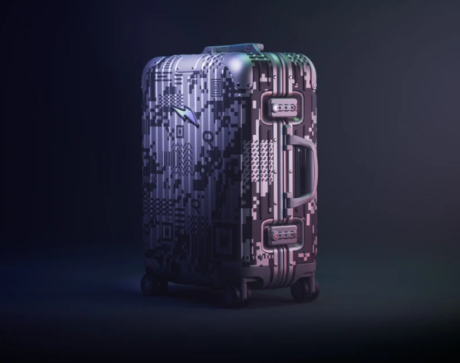
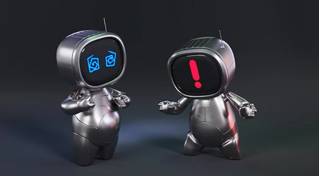
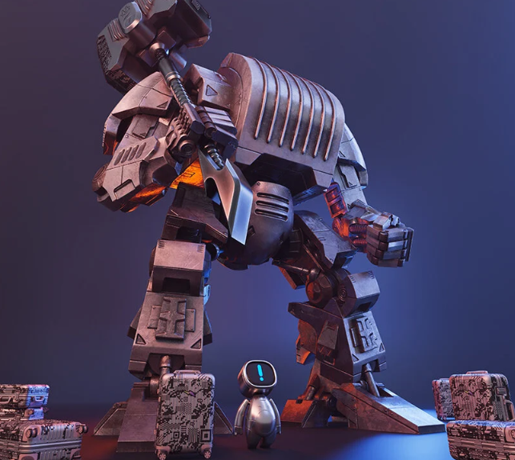
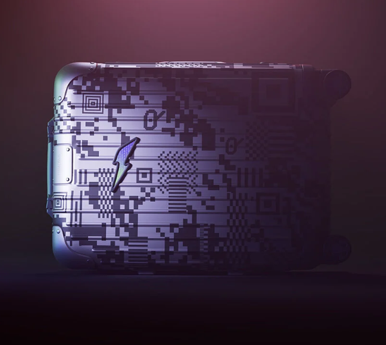
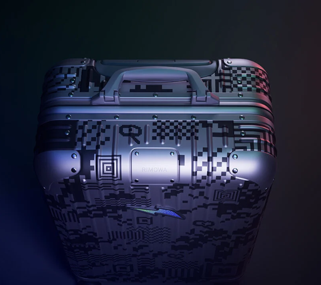
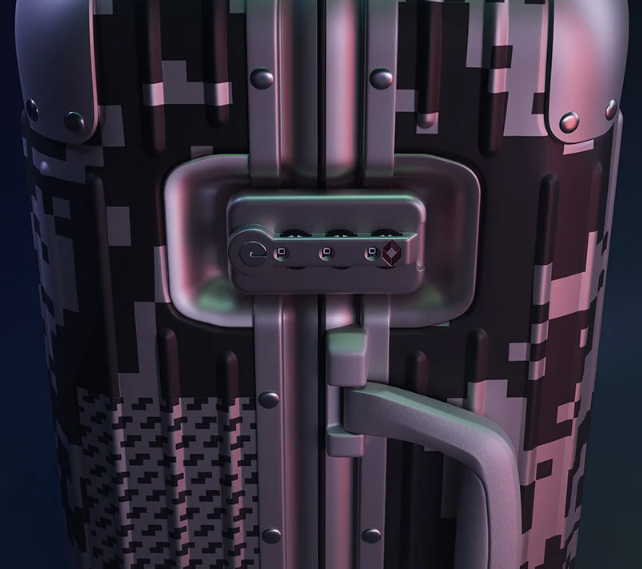

# RIMOWA 进入 Metaverse 推出带有 RTFKT 的 phygital 行李箱和 NFT

## 实体工艺进入数字领域

RIMOWA长期以来一直通过跨学科合作推进其创新——现在，这个奢侈箱包品牌正与NIKE 旗下的数字时尚品牌 RTFKT合作进入元宇宙。

该集团的发音为“神器”，庆祝自去年 12 月被耐克收购以来首次与 LVMH 品牌的合作。结果结合了物理工艺和数字艺术。两个创作，一个实体手提箱和一个 NFT，诞生于一个游戏化的 RIMOWA x RTFKT 世界，并拥有自己的传说和角色。

2022 年 10 月 27 日，限量版 Original Cabin 行李箱将推出，仅生产 888 件。正如团队指出的那样，这个数字通常与密码宇宙中的运气有关。行李箱将以实物和数字形式提供。作为合作的一部分，将发布2,222 个“WorkerBot” NFT的集合。

RTFKT x RIMOWA 'Meta Artisan' 原装机舱行李箱

 

## RIMOWA 和 RTFKT 打造的新虚拟宇宙

RIMOWA 和 RTFKT 的新虚拟世界讲述了一个空间站车间的“工人机器人”感染了病毒的故事。这个世界——其故事可以在团队的[**网站上全面探索——将**](https://rimowa.rtfkt.com/)[**虚拟品牌**](https://rtfkt.com/)的虚拟世界愿景与[**箱包设计师**](https://www.rimowa.com/us/en/home)的传统和工艺融为一体。

该版本将带来挑战，因为数字平台经常邀请其社区参与解锁对掉落和物品的访问。这一次，一场互动活动呼吁社区共同解决挑战，以发现被黑的 RIMOWA x RTFKT 空间站。这个虚拟空间站必须重新激活才能铸造限量版 NFT。

挑战结束后，NFT 持有者将能够伪造他们的资产，在独家数字活动中兑换实体版行李箱。**'Meta Artisan' Original Cabin 的售价为 2.3 ETH**（撰写本文时为 3,081 美元），而 WorkerBot NFT 的售价为 0.08 ETH（107 美元）。

RTFKT x RIMOWA WorkerBots，“开始探索元宇宙的完美化身”

 

## “META ARTISAN”原创随身行李箱

RTFKT x RIMOWA 'Meta Artisan' Original Cabin 行李箱将采用经典的铝制外壳，这次采用像素化图案。在这款“Wandersmith” Anti-FUD 图案印花中，可以解读出两人肖像的反复出现。

该设计借鉴了匿名和假名的元素，这些元素定义了大部分数字领域，尤其是在元节中。

**RIMOWA首席营销官 Emelie de Vitis 告诉设计邦：“在 RIMOWA 突破界限并不是我们回避的事情，** ”所以*我们*很高兴能与 RTFKT 合作，创造出既可以在元界也可以在物理世界。这是一个以新方式展示我们的德国工艺并真正与 Web3 社区互动的机会。

Wandersmith，一位在 RTFKT x RIMOWA 空间站工作坊中创造赋能装备的“工匠机械师”

**RTFKT 联合创始人 Benoit Pagotto 继续说道：** “*与像 RIMOWA 这样的标志性品牌合作并将它们带入我们的世界是一次了不起的体验。旅行通常仅限于现实世界的目的地，但在元宇宙中，它是无限的。您可以探索许多世界并创造独特的故事，品牌可以以全新的方式与他们的受众互动*。

'*我相信，我们与 RIMOWA 在设计、讲故事、体验和铸造机制方面共同创造的东西，将成为所有愿意认真对待 Web3 社区的品牌的标杆*。

“*此外，这款实体行李箱非常棒，向我们对赛博朋克、匿名和我们的传奇故事的热爱致敬，如果你看到有人拿着它，你就会知道它是未来的一部分。”*

像素化的“Wandersmith Anti-FUD 图案印花”以限量版包裹着 Original Cabin

'Meta Artisan' 作品将仅推出 888 次迭代

作品由高端阳极氧化铝制成，设计时考虑到了使用寿命
