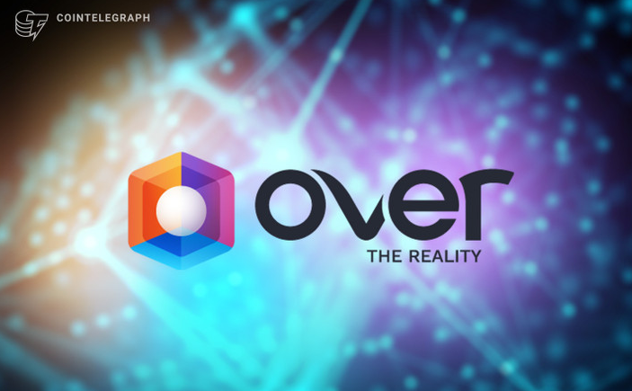

# OVER 宣布第 7 版 ARwards 用于最具标志性的 Metaverse 环境

[OVER](https://www.overthereality.ai/)是一个开放的、支持 AR 的 Metaverse 的去中心化基础设施，它宣布了第 7 版经过全面改造的 OVER ARwards，称为 Venue Design Contest。比赛邀请 3D 创作者和设计师在 OVER Metaverse 中构建环境，从四个不同的类别中进行选择：商店、艺术画廊、音乐室和陈列室。30,000 美元的 OVR 代币奖池将分配给最令人印象深刻的参赛作品。 

OVER 与[Landvault](https://landvault.io/)、[Metahood](https://metahood.xyz/)、[MetaMondo](https://www.metamundo.co/)、[PangeaDAO](https://www.pangeadao.org/)、[Parcel](https://parcel.so/)、[SandStorm](https://sandstorm.co/)和[SpacesDAO](https://spacesdao.xyz/)合作组成大陪审团，负责评审参赛作品。所采用的投票系统基于去中心化的社区治理框架，OVER 社区将确定第六至第十名的位置，而前五名的排名则由大陪审团决定。分数评估考虑了技术实力、艺术原创性和创造性视野。

从 10 月 4 日到 12 月 15 日，创作者有 10 周的时间来设计和上传他们的项目，最终排名将于 2023 年 1 月 11 日公布。结束比赛将是首届 OVER Digital ARwards 盛会，定于于 2023 年 1 月 25 日举行。 

OVER 联合创始人兼首席运营官 Diego Di Tommaso 表示：“ARwards 的回归对于 OVER 社区的每个人来说都是非常令人兴奋的。比赛不仅鼓励创意社区释放增强现实的全部潜力，还揭开了元界的神秘面纱，帮助更广泛的观众轻松过渡到 Web3。我们很高兴看到今年的活动将出现什么样的新想法和高水准的 AR 环境。” 

## 关于 OVER

[OVER](https://www.overthereality.ai/)正在构建第一个增强现实开放元界。OVER 预示着元宇宙的新曙光，它使用户能够创建独特的地理定位体验，弥合我们的物理世界和数字世界之间的差距。利用一流的、社区驱动的 3D 地图，OVER 为用户和建设者提供了拥有 AR Metaverse 房地产、绘制当地地图以赚取 OVR 代币并以前所未有的方式探索 Web3 的机会。

致力于跨平台互通，OVER支持实时增强现实

能力、AI avatar 动作捕捉交互和超现实 NFT 资产，这些资产将及时在 Metaverses 之间传输。OVER 拥有超过 923,000 名活跃参与者，正在为 Web3 中的去中心化 AR 生态系统设定标准。
