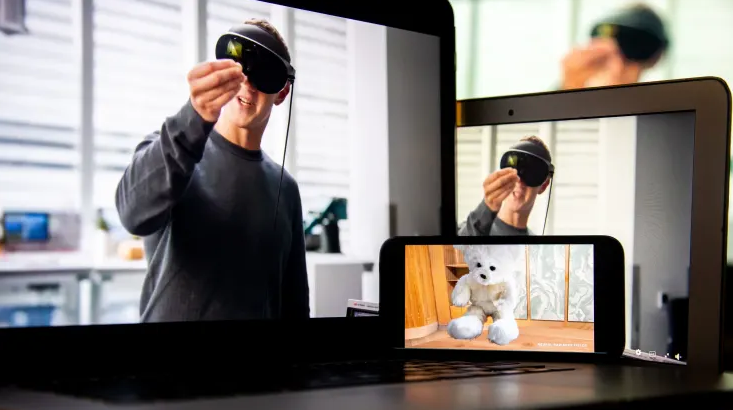

# Meta 计划在其广告业务萎缩的情况下损失更多资金来构建 Metaverse

元宇宙投资者对其公司在线广告业务的健康状况感到担忧，首席执行官马克扎克伯格重申了他将花费数十亿美元开发虚拟世界的承诺。

作为 Meta[第三季度收益报告](https://www.cnbc.com/2022/10/26/facebook-parent-meta-earnings-q3-2022.html)的一部分，在与分析师的电话会议上，扎克伯格和其他 Meta 高管回答了分析师提出的一些问题，分析师们对公司不断上升的成本和支出感到越来越沮丧，该公司的成本和支出同比增长 19%，达到 221 亿美元。季度。

Meta 股价下跌 19%，此前该公司公布的第四季度业绩指引低于分析师的预期。这家 Facebook 母公司第三季度的收入同比下滑 4% 至 277 亿美元，而利润同比暴跌 52% 至 44 亿美元。

Meta 的 Reality Labs 部门负责开发虚拟现实和相关的增强现实技术，为尚未建成的虚拟世界提供支持，该部门在 2022 年迄今已亏损 94 亿美元。该业务部门的收入同比下降近 50%。年增至 2.85 亿美元，Meta 首席财务官 Dave Wehner 将其归因于“Quest 2 销售额下降”。

“我们确实预计 Reality Labs 2023 年的运营亏损将同比大幅增长，”Meta 在一份声明中表示。“在 2023 年之后，我们预计将加快 Reality Labs 的投资步伐，以便我们能够实现从长远来看增加公司整体营业收入的目标。”

Jefferies 的分析师 Brent Thrill 在财报电话会议上表示，投资者可能会觉得“有太多的实验性赌注与经过验证的核心赌注相比”，并询问为什么 Meta 认为像元宇宙这样的实验性赌注会得到回报。

扎克伯格回应说：“我只是认为，实验性的东西和不知道它最终会变得多好是有区别的。” “但我认为，我们在整个应用程序系列中所做的很多事情，我们都非常有信心它们会奏效并且会很好，”他补充说，并引用了该公司改进其类似 TikTok 的工作。 Reels 短视频服务、其内容推荐算法、商业消息功能和在线广告技术。

尽管扎克伯格说他“现在不能告诉你它们的规模会有多大”，但每一次改进都是“朝着正确的方向发展”。

扎克伯格说，“显然，元宇宙是我们正在努力的一系列长期努力”，他认为“这最终也会奏效。”

扎克伯格听上去大吃一惊，他说：“现在在商业和世界上发生了很多事情，所以很难有一个简单的‘我们要做这件事，这将解决所有问题'"

扎克伯格解释说，Meta 面临着许多挑战，例如经济不景气、Apple 2021 年 iOS 隐私更新的挥之不去的影响使 Meta 更难将广告定位到用户，以及来自 TikTok 等玩家的竞争。

他说，对元界的长期投资“将随着时间的推移提供更大的回报”。

扎克伯格说：“我认为我们将在不同的时间段内解决这些问题，我感谢大家的耐心，我认为那些有耐心并与我们一起投资的人最终会得到回报。”

扎克伯格承认，他的公司开发虚拟宇宙的部分原因是为了确保它在未来拥有一个不会受到其竞争对手（如苹果）的决定产生不利影响的平台. 但扎克伯格开发虚拟宇宙的更大原因是，科技公司在构建支撑计算平台的软件和硬件时可以更具创新性，他说。

“其中很多只是你可以通过自己控制更多堆栈来构建新的和创新的东西，”扎克伯格说。
