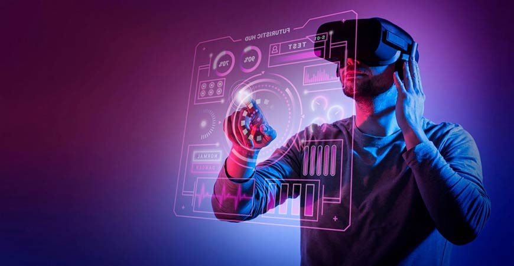

# 元界标准论坛的目的是什么？

*元界标准论坛真的是它所描述的一切吗？*

6 月 22 日，非营利性标准组织 Khronos Group宣布成立一个名为 Metaverse 标准论坛 (MSF) 的协作机构。许多主要的 Metaverse 玩家，如 Meta、Microsoft、Epic Games、Adobe 和 Nvidia，都作为MSF 的 创始成员加入了 Khronos Group。

该论坛旨在确保跨不同元节的互操作性（交换信息的能力），以使开发人员更容易跨各种平台进行构建。因此，任何人都可以免费加入无国界医生组织。让我们更深入地了解 WSF 的目标，它对 Metaverse 领域的公司意味着什么，以及它是否能够真正实现这些目标。 

## **无国界医生希望达到什么目标？**

**企业携手共进**

MSF 的主要目标之一是创建一个开放和包容的元宇宙。目前，我们以一种公司特有的方式来理解元宇宙。例如，我们知道无国界医生组织的创始成员之一 Nvidia 有一个名为Omniverse的工程师元宇宙，而游戏平台[Roblox](https://www.jumpstartmag.com/the-first-game-metaverses/)本身就是一个元宇宙。然而，元界并不意味着是特定公司“拥有”的个人虚拟空间，其中一个人无法与另一个人交流。它最终应该属于每个人，因为所有虚拟世界都是相互关联的。

“没有人真正知道元宇宙的最终形态，但有些事情已经很清楚了。当然，许多不同的技术需要协同工作才能使所有不同的领域发挥作用，” Khronos 集团总裁 Neil Trevett 说 。

创始成员 Meta 同意 Trevett 的说法。在一篇博文中，Meta 的全球事务总裁 Nick Clegg 写道：“……metaverse 将是技术、平台和产品的集合。它不会由任何一家公司或机构建造、运营或管理，”将其比作拼布被子。 

**定义元节**

我们上面提到的特定于公司的元节清楚地表明，“元节”一词的定义并不像应有的那样明确。今天，许多大公司已经创造了 3D 体验，这些体验可能属于也可能不属于元宇宙的范围。只需进行简单的 Google 搜索，您就会看到大量关于元节是什么和不是什么的文章。构建元节是什么或应该是什么的标准可以帮助我们更接近于定义它。 

为此，MSF旨在致力于实现原型设计、黑客马拉松和开源工具，以开发定义元界和相关技术的术语，并加快创建和部署指南的速度。尽管名称中有“元宇宙”一词，但 MSF 打算为元宇宙空间内的其他技术制定标准，如增强现实、虚拟现实、地理空间系统和交互式 3D 图形。尽管所有这些都将有助于以更清晰的术语定义元界，但 MSF 更多地专注于为开发人员提供必要的工具来走出去并设计虚拟空间，而不是定义术语“元界”。 

## **无国界医生对元宇宙的未来意味着什么** 

通过使空间开放和包容，MSF 将使元界技术发展得更快，从而加速该空间内所有公司的整体增长。随着公司的合作，开发元界技术的总体成本也可以大大降低。 

为实现这一切，无国界医生需要业内所有大玩家齐心协力，同意共享资源。然而，扩展现实空间（创造沉浸式虚拟世界体验的关键部分）中的一些知名人士，如 Apple 和字节跳动，却没有出现在无国界医生的成员名单中。 

其他大型联盟公司，如 Niantic（Pokémon Go 的创建者）、Roblox、Decentraland 和 The Sandbox， 也没有签约成为会员。这些公司的缺席让人很难想象无国界医生将如何促进开放的元宇宙。专家还表示，MSF 很难实现其开放的元宇宙的目标，因为 Web 2.0 公司（如 Meta）严重依赖用户数据，因此他们的商业模式与开放、去中心化的元宇宙不兼容。 

无国界医生是否真的能够实现其任何目标还有待确定。希望有更多的成员加入论坛，公司将调整他们的业务，以更好地适应无国界医生对元界的开放和去中心化愿景。 
