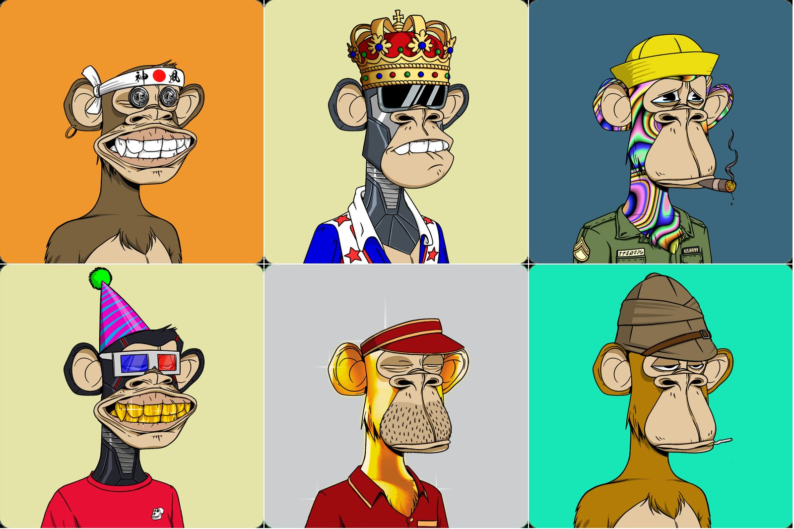

# Mighty Jaxx 通过 Spooky season 将品牌影响力扩展到虚拟世界

[Mighty Jaxx](https://mightyjaxx.com/)是一家总部位于新加坡的综合未来文化平台，设计和生产数字和 phygital 收藏品，周三宣布其与 MightyVerse Presents: Spooky Season 的首次 IP 合作进入虚拟世界。

Mighty Jaxx 在一份声明中说，增强的品牌体验将在 10 月 28 日至 11 月 11 日的万圣节期间在 The Sandbox 上免费供所有人享受，并作为 12 月 10 日至 11 日与新加坡动漫展一起推出的完整体验的前奏。

Spooky Season，Mighty Jaxx 第一次进入虚拟世界将为恐怖（和休闲）粉丝提供独特的体验和跨界平台，使他们能够在现实生活中与他们心爱的收藏品进行数字互动。

这种体验的推出也展示了 Mighty Jaxx 在元宇宙中提供主题体验的能力。

除了作为 Mighty Jaxx 将实体收藏品带入生活的跨界平台之外，MightyVerse 还创造了玩家之间互动的新方式。

此次扩展将更大的收藏爱好者社区聚集在一起，共同玩耍和分享他们对艺术的热情，同时为 Mighty Jaxx 继续为粉丝提供收藏品和新颖体验铺平道路。

与全球收藏品巨头 Sideshow Collectibles 合作设计，虚拟空间的一个主要亮点是独家体验，粉丝有机会与死神一起跳舞，死神是死神法庭的主要角色之一。

Mighty Jaxx 和 Sideshow Collectibles 之间的这种卓越体验和合作伙伴关系突显了他们的共同愿景和战略重点，即为收藏品粉丝创造机会在不同平台上融合，从而实现跨多个粉丝群的社区发展。

他们对通过平台方法构建真正的混合“phygital”产品的统一承诺为未来的合作伙伴关系奠定了基础，并推出了重新构想所有粉丝的完整体验之旅，从而为他们创造更强大的价值。

元宇宙将在这里发挥巨大作用。以创新和社区建设为 Mighty Jaxx 的 MightyVerse 计划的核心，虚拟空间将重新构想收藏品的体验，将传统的物理世界带入数字未来。

随着人们能够以第一人称体验潜入数字世界，与元宇宙巨头 The Sandbox 一起推出的虚拟空间将为 Mighty Jaxx 及其合作伙伴提供一个专用空间，他们可以不断扩展、重塑和改进以超越定制体验，并在实体活动之外更广泛地激活粉丝群。

“不可否认，收藏品的未来将是数字化的。我们知道，大多数粉丝已经在虚拟世界中花费了大量时间，这为我们提供了通过 MightyVerse 为我们的粉丝创造无与伦比的体验的机会，这是我们为技术支持的收藏品提供的专有平台，”Mighty Jaxx's，Mighty Meta 负责人 Darryl Tan 说.

“重要的是，我们不仅仅是在虚拟世界中重现粉丝的现实。我们的重点是为品牌和社区打造一个空间，让他们聚集在一起并与超越季节的体验互动，

“随着我们继续发展 MightyVerse 作为提升现有和新 IP 的平台，这项 MightyVerse 试点计划 Spooky Season 是我们为粉丝和现代数字收藏家提供的许多令人兴奋的体验的一部分，”他补充道。

Spooky Season 将由 CHXMP（Mighty Jaxx 在 Metaverse 中的第一位员工）主持，他将作为 Spooky Season 体验的指南。CHXMP 还领导了 Mighty Labs，这是该领域的主要社交中心，它将连接未来所有的元宇宙体验，也是所有玩家进入 Mighty Jaxx 的 MightyVerse 的起点。

对于万圣节特别版，CHXMP 还将伴随着 Creepy Cuties，这是 Mighty Jaxx 以图腾为灵感的专有恐怖图标，灵感来自 Krampus、Chupacabra、裂口女人和饥饿的幽灵等经典神话人物，玩家还将获得独家预览Mighty Jaxx 即将推出的 Creepy Cuties 跨界系列与 DGPals 的可互操作多游戏、多类型平台进一步加强了 Mighty Jaxx 如何利用不同的 IP 为粉丝创造真正的 phygital 体验。

